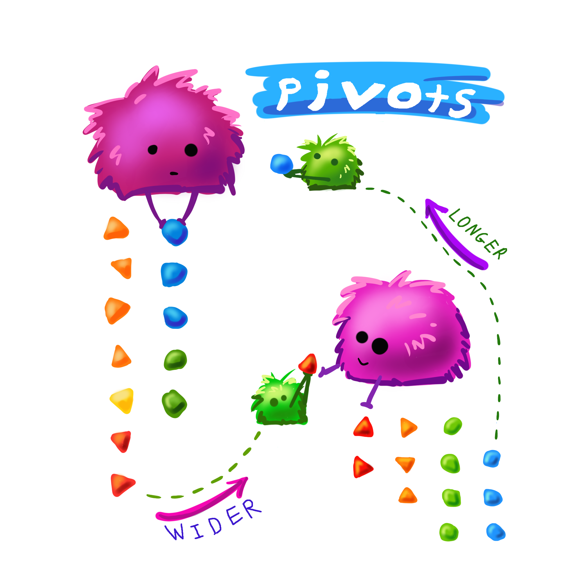
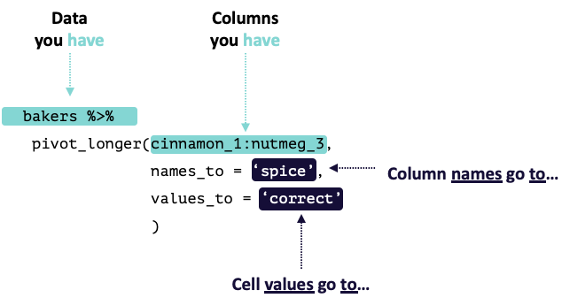
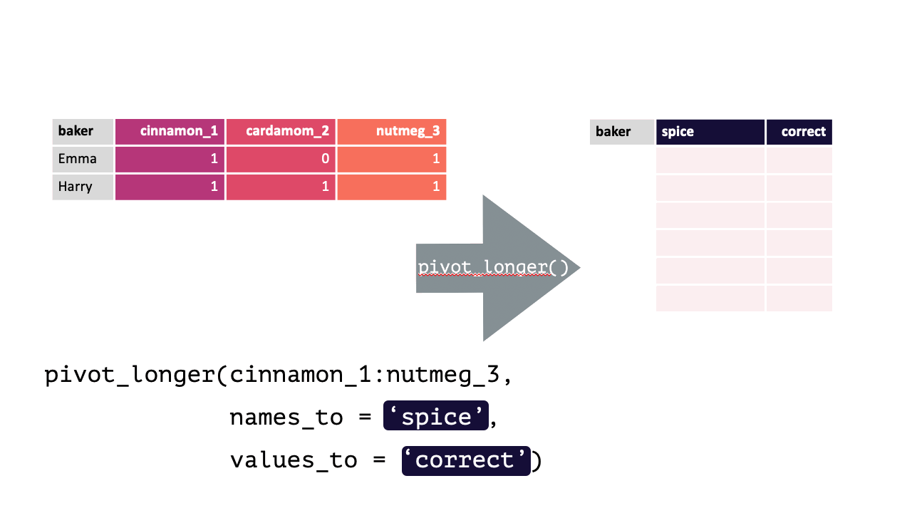
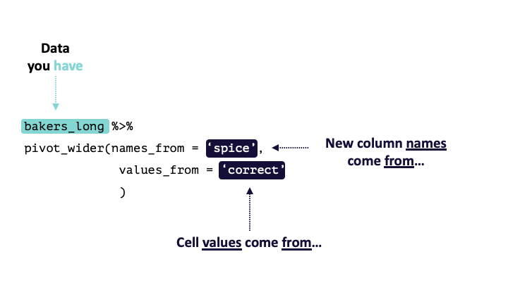
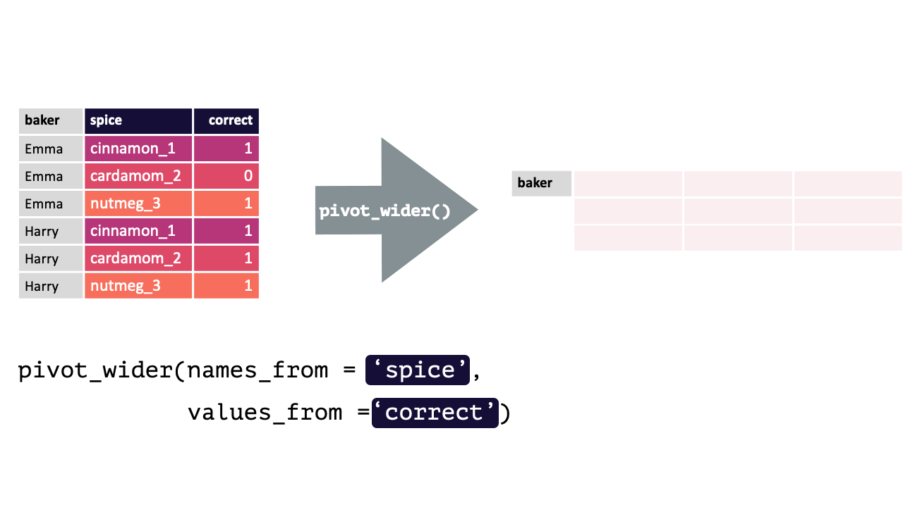
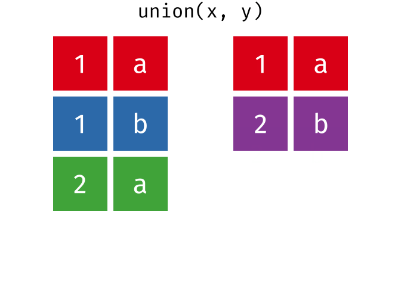
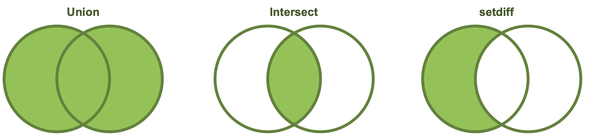

# Data Transformation

```{r setup, include=FALSE}
knitr::opts_chunk$set(strip.white = TRUE)
```

```{r message=FALSE, warning=FALSE}
library(tidyverse) # Load tidyverse packages
```

<!-- <a href="exercises/Exercise_Transformation.Rmd" download>Exercise Sheet</a> -->

Up to this point you have been working with data that, while sometimes needed cleaning, was already in [tidy](#Tidy-Data) format. While you want to work with tidy data, it is not always the case that the data you get will be tidy! Also, sometimes you will need to make data *not* tidy for certain statistical analyses. Further, your data may not even all be in a singular object, and may be contained across several! This section is going to cover the most common data transformations you will have to implement.

## Pivots

If your data does happen to all be in the same object, how can you reshape the structure that data? The two main functions to do this are `pivot_longer()` and `pivot_wider()`.

{width=100%}
<p style="font-size:6pt">Artwork by @allison_horst (with slight modification)</p>

### pivot_longer()

From the [source documents](https://tidyr.tidyverse.org/reference/pivot_longer.html):<br>

`pivot_longer()` "lengthens" data, increasing the number of rows and decreasing the number of columns. 

This is accomplished by collapsing multiple columns into new columns (usually one with the old column names and one with the cell values). You specify the specific **col**umn**s** you want to collapse, what the new column for the **names** should be named, and what the new column for the **values** should be named.

`pivot_longer()` calls take the following form: `pivot_longer(cols, names_to, values_to)`. There are other arguments that can be used as well to help make the function even more flexible / powerful.

Consider the following df with data from contestants on a baking show (where they had to guess a spice from a blind taste test):

```{r echo=FALSE}
bakers = tribble(
  ~ "baker", ~"cinnamon_1", ~"cardamom_2", ~"nutmeg_3",
  "Emma", 1, 0, 1,
  "Harry", 1, 1, 1,
  "Ruby", 1, 0, 1,
  "Zainab", 0, NA, 0
  )
```

```{r}
bakers
```

Each row contains 3 unique observations (there just happens to be multiple measurements from the same participants). Observe how `pivot_longer()` can transform this df so that each row is a unique observation:

<!-- ```{r} -->
<!-- bakers %>%  -->
<!--   pivot_longer(cinnamon_1:nutmeg_3, -->
<!--                names_to = "spice",  -->
<!--                values_to = "correct" -->
<!--                ) -->

<!-- #' split the current column names into two columns using names_to + names_sep -->
<!-- bakers %>%  -->
<!--   pivot_longer(-baker, -->
<!--                names_to = c("spice", "order"),  -->
<!--                names_sep = "_", -->
<!--                values_to = "correct" -->
<!--                )  -->
<!-- ``` -->

{width=100%}
<p style="font-size:6pt">Modified from [teachthat](https://github.com/apreshill/teachthat/tree/master/pivot)</p>

{width=100%}
<p style="font-size:6pt">Modified from [teachthat](https://github.com/apreshill/teachthat/tree/master/pivot)</p>

<p class="text-info"> **<u>Note:</u> When specifying the columns to pivot, you are literally `select()`'ing them. Thus, regular `select()` rules and helper functions can be used! e.g., Here, all columns except `baker` should be pivoted, `!baker` could have been written instead of `cinnamon_1:nutmeg_3`. Likewise, `matches("[[:digit:]]")`, since all columns have a number.**</p>

<!-- <br> -->
<!-- <div class="panel panel-success"> -->
<!--   <div class="panel-heading">**EXERCISE 1**</div> -->
<!--   <div class="panel-body"> -->
<!-- Use `pivot_longer()` to transform the data found in `tidyr::table4a` (`table4a`). -->
<!-- </div> -->
<!-- </div> -->

### pivot_wider()

From the [source documents](https://tidyr.tidyverse.org/reference/pivot_wider.html):<br>

`pivot_wider()` "widens" data, increasing the number of columns and decreasing the number of rows.

This is accomplished by spreading the unique values of each cell in a column into their own new column. You specify where the new column **names** are *from* and where the **values** for those new columns are **from**.

`pivot_wider()` calls take the following form: `pivot_wider(names_from, values_from)`. `pivot_wider()` is the opposite of `pivot_longer()`. Thus, the pivoted df from above can be returned to its original form by using `pivot_wider()`.

```{r}
bakers_long = bakers %>% 
  pivot_longer(cinnamon_1:nutmeg_3,
               names_to = "spice", 
               values_to = "correct"
               )
bakers_long
```

{width=100%}
<p style="font-size:6pt">Modified from [teachthat](https://github.com/apreshill/teachthat/tree/master/pivot)</p>

{width=100%}
<p style="font-size:6pt">Modified from [teachthat](https://github.com/apreshill/teachthat/tree/master/pivot)</p>

To verify this is true:

```{r}
bakers_long %>%
  pivot_wider(names_from = spice, 
              values_from = correct)

bakers # Original df
```

<!-- <br> -->
<!-- <div class="panel panel-success"> -->
<!--   <div class="panel-heading">**EXERCISE 2**</div> -->
<!--   <div class="panel-body"> -->
<!-- Use `pivot_wider()` to transform the data found in `table2` (specifically, the `type` column). -->
<!-- </div> -->
<!-- </div> -->

## Relational Data

In simple cases, the data needed to answer questions of interest will all be in a single object (df, table, etc.). At scale, you will often by working with data spread across a number of separate objects. Processes that involve working with data in multiple objects are referred to as **relational data**, as it is the relationship between that data which is important.

### `bind_rows()`

Imagine you get a new set of data from contestants on the second day of the show:

```{r echo=FALSE}
bakers2 = tribble(
  ~ "baker", ~"cinnamon_1", ~"cardamom_2", ~"nutmeg_3",
  "Lamar", 0, 0, 1,
  "Natalia", 1, 1, 1,
  "Mark", 1, 0, NA,
  "Diana", 1, 1, 0
  )
```

```{r}
bakers2
```

It has the exact same form as the data in `bakers` (before any transformations). To be able to work with all the data together, you'd just need to append `bakers2` to the end of `bakers`. This is precisely what `bind_rows()` does! It will *bind* all the *rows* of the objects passed to it. Columns in each object will automatically be matched by their names, so it is critical that the common column names are identical!

```{r}
bind_rows(bakers, bakers2)
```

Viola!

If one object contains columns the other does not, those values will be filled with `NA`. In this way, `bind_rows()` is very flexible as it can accommodate situations where the dfs may contain different data.

```{r}
bakers %>%
  mutate("cumin_4" = c(1,1,0,0)) %>%
  bind_rows(bakers2)
```

::: {.rmdimportant}
**This code used `mutate()` to add a new column to `bakers` that did not exist in `bakers2`. This new, modified, version of `bakers` was then piped to a `bind_rows()` call that contained `bakers2` as an argument. This binds the rows of the new, modified, `bakers` with `bakers2`. As you can see, all the rows from `bakers2` have `NA` values in this new column, because it did not exist in the original df!**
:::

<!-- <div class="panel panel-success"> -->
<!-- <div class="panel-heading">**EXERCISE 3**</div> -->
<!-- <div class="panel-body"> -->
<!-- 1. Use `bind_rows()` to combine the `penguins1` and `penguins2` dfs.<br> -->
<!-- 2. Then, pipe that result to combine with `penguins3`. -->
<!-- </div> -->
<!-- </div> -->

<!-- ### bind_cols() -->

<!-- When column-binding, rows are matched by position, so all data frames must have the same number of rows. -->

<!-- ```{r} -->
<!-- bakers %>%  -->
<!--   select(c(1:3)) %>% -->
<!--   bind_cols(bakers[,c(1,4)]) -->

<!-- # bakers %>% -->
<!-- #   select(1, 4) -->


<!-- ``` -->

<!-- To match by value, not position, see mutate-joins. -->


However, you likely will not always get so lucky and your individual dfs may not have identical columns. In such instances, your aim is to combine the individual dfs (`x` and `y`) into a single df that you can use in your visualizations and summaries. Specifically, you will need to make sure that, even if they appear in different orders, the observations from `x` are matched to the corresponding observation in `y` (usually by the values of some ID columns appearing in both).

There are a series of specific relational data functions in R designed to help with exactly this process. Below, two will be covered: **mutating joins** and **set operations**.

## Mutating Joins

Mutating Joins are named as such because, like `mutate()`, they add new columns to a dataframe. These new columns just happen to come from another another dataframe with matched observations. There are several types of mutate joins, which all result in different new data structures.

### inner_join()

`inner_join()` will return a df containing all observations (rows) in `x` that have a matched observation in `y`, for all columns in `x` and `y`. Any observations in `x` or `y` that do not have a matched in the other dataset are dropped.

{width=100%}
<p style="font-size:6pt">Source: [tidyexplain](https://github.com/gadenbuie/tidyexplain)</p>

<!-- <div class="panel panel-success"> -->
<!--   <div class="panel-heading">**EXERCISE 4**</div> -->
<!--   <div class="panel-body"> -->
<!-- Using dfs `x` and `y`, write some code that will return a new df that contains only the observations common in both. -->
<!-- </div> -->
<!-- </div> -->

### left_join()

`left_join()` will return a df containing all observations (rows) in `x` and all columns from `x` and `y`. Any observation (row) in `y` that does not have a match in `x` will be dropped, and any observations (rows) in `x` that do not have a match in `y` will have an `NA` value in the new column.

{width=100%}
<p style="font-size:6pt">Source: [tidyexplain](https://github.com/gadenbuie/tidyexplain)</p>

<!-- <div class="panel panel-success"> -->
<!--   <div class="panel-heading">**EXERCISE 5**</div> -->
<!--   <div class="panel-body"> -->
<!-- Using dfs `x` and `y`, write some code that will return a new df that contains all variables across both dfs, but only from observations in `x`. -->
<!-- </div> -->
<!-- </div> -->

### right_join()

`right_join()` is basically the same as `left_join()` except swap `x` with `y`.

{width=100%}
<p style="font-size:6pt">Source: [tidyexplain](https://github.com/gadenbuie/tidyexplain)</p>

<!-- <div class="panel panel-success"> -->
<!--   <div class="panel-heading">**EXERCISE 6**</div> -->
<!--   <div class="panel-body"> -->
<!-- Using dfs `x` and `y`, write some code that will return a new df that contains all variables across both dfs, but only from observations in `y`. -->
<!-- </div> -->
<!-- </div> -->

### full_join()

`full_join()` will return a df containing all observations (rows) from both `x` and `y` regardless of whether or not they have matches. In the cases where there are is not a corresponding observation, an `NA` value will be generated in the new cell. `full_join()` is the only mutate join that will contain all the original data from both `x` and `y` in the new df.

{width=100%}
<p style="font-size:6pt">Source: [tidyexplain](https://github.com/gadenbuie/tidyexplain)</p>

<!-- <div class="panel panel-success"> -->
<!--   <div class="panel-heading">**EXERCISE 7**</div> -->
<!--   <div class="panel-body"> -->
<!-- Using dfs `x` and `y`, write some code that will return a new df that contains all variables and observations from both dfs. -->
<!-- </div> -->
<!-- </div> -->

### Join Summary

Below is an oversimplified but handy graphic to illustrate what the different mutate joins return from `x` and `y`.

{width=100%}
<p style="font-size:6pt">Source: [r4ds](https://r4ds.had.co.nz/relational-data.html#relational-data)</p>

## Set operators

Set operations, like `bind_rows()` expect both `x` and `y` to have the same variables. They are a quick and easy way to filter for different *sets* of observations.

For example, you have just been given some new data (`bakers3`) containing information about the contestants on an all-star version of this baking show. It contains winners from previous episodes, and you want to compare these contestants to the contestant data you have from the previous two episodes.

```{r echo=FALSE}
bakers3 = tribble(
  ~ "baker", ~"cinnamon_1", ~"cardamom_2", ~"nutmeg_3",
  "Emma", 1, 0, 1,
  "Jack", 0, 0, 1,
  "Donna", 1, NA, NA,
  "Natalia", 1, 1, 1
  )
```

```{r}
bakers_combined = bind_rows(bakers, bakers2)

bakers3
```

### union()

`union()` returns a df containing all the unique observations (rows) in `x` and `y`. This will drop repeats so there is only a single entry for each unique observation.

{width=100%}
<p style="font-size:6pt">Source: [tidyexplain](https://github.com/gadenbuie/tidyexplain)</p>

```{r}
union(bakers_combined, bakers3)
```

<!-- <div class="panel panel-success"> -->
<!--   <div class="panel-heading">**EXERCISE 8**</div> -->
<!--   <div class="panel-body"> -->
<!-- Using dfs `penguins_set1` and `penguins_set2`, write some code that will return a new df that contains all unique observations from both samples. -->
<!-- </div> -->
<!-- </div> -->

### intersect()

`intersect()` will return a df containing only the observations (rows) that are in **both** `x` AND `y`, and only include unique values (no duplicates).

{width=100%}
<p style="font-size:6pt">Source: [tidyexplain](https://github.com/gadenbuie/tidyexplain)</p>

```{r}
intersect(bakers_combined, bakers3)
```

<!-- <div class="panel panel-success"> -->
<!--   <div class="panel-heading">**EXERCISE 9**</div> -->
<!--   <div class="panel-body"> -->
<!-- Using dfs `penguins_set1` and `penguins_set2`, write some code that will return a new df that contains only the observations that appeared in both samples. -->
<!-- </div> -->
<!-- </div> -->

### setdiff()

`setdiff()` will return a df containing only the observations (rows) in `x` that **do NOT** appear in `y`.

{width=100%}
<p style="font-size:6pt">Source: [tidyexplain](https://github.com/gadenbuie/tidyexplain)</p>

```{r}
setdiff(bakers_combined, bakers3)
```

While the order of `x` and `y` does not matter for `union()` and `intersect()`, it *does* for `setdiff()`. Compare the output above to the output below!

```{r}
setdiff(bakers3, bakers_combined)
```


<!-- <div class="panel panel-success"> -->
<!--   <div class="panel-heading">**EXERCISE 10**</div> -->
<!--   <div class="panel-body"> -->
<!-- Using dfs `penguins_set1` and `penguins_set2`, write some code that will return a new df that contains only the unique observations in `penguins_set1`. -->
<!-- </div> -->
<!-- </div> -->

### Summary

{width=100%}

<!-- ```{r join_practice} -->
<!-- x = tribble( -->
<!--   ~ "name", ~"age", ~"total", ~"fan_rating", -->
<!--   "Natalia", 22, 28, 4.75, -->
<!--   "Emma", 33, 27, 4.5, -->
<!--   "Jack", 37, NA, NA, -->
<!--   "Donna", 42, 24, 3.25, -->
<!--   "Zheng", 26, 25, 3.75 -->
<!--   ) -->

<!-- y = tribble( -->
<!--   ~ "name", ~"age", ~"total", ~"judge_average", -->
<!--   "Emma", 33, 27, 9.25, -->
<!--   "Jack", 37, NA, NA, -->
<!--   "Donna", 42, 24, 7.5, -->
<!--   "Natalia", 22, 28, 9.5, -->
<!--   "Carla", 29, 26, 8.25 -->
<!--   ) -->
<!-- ``` -->


## Extra Resources

* [pivoting vignette](https://tidyr.tidyverse.org/articles/pivot.html)
* [tidyexplain animated illustrations](https://github.com/gadenbuie/tidyexplain)
* [r4ds relational data](https://r4ds.had.co.nz/relational-data.html#relational-data)
* [more relational data](https://rstudio-education.github.io/tidyverse-cookbook/transform-tables.html#joins)

## References