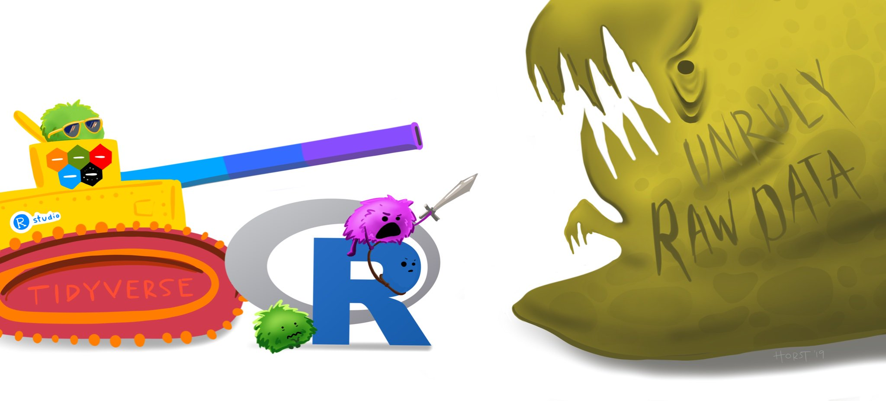

# (PART\*) Data Manipulation {-}

# Control Flow

```{r setup, include=FALSE}
knitr::opts_chunk$set(strip.white = TRUE)
```

```{r message=FALSE, warning=FALSE}
library(tidyverse)
library(palmerpenguins)
```

<!-- <a href="exercises/Exercise_Manip1.Rmd" download>Exercise Sheet</a> -->

## If/Else statements

### Traditional

Sometimes, you will want your code to perform different actions depending on something's value. In these circumstances, it is useful to implement `if...else` statements. `if` statements work as such: 

**if** some test/condition evaluates to `TRUE`, execute some specific code. 

Other tests/conditions can be appended with `else` statements, which specify what to do when the original test/condition evaluates to `FALSE` and is based on subsequent tests/conditions. The syntax of a basic `if` statement is as follows:

```{r eval=FALSE}
if(some test/condition to evaluate) {
  code for what to do if that test/condition evaluates to true
}
```

For example:

```{r}
x = 4

if(3 < x) {
  print("The condition evaluated TRUE")
}
```

`x` was set equal to 4. R evaluates the test `3 < x` in the `if` statement, here equivalent to `3 < 4`, which evaluates to `TRUE`. Since the `if` condition evaluates `TRUE`, it runs the code in the curly brackets. 

`x` may not always be 4 though. What if `x` was not 4? What if you do not know what `x` is? If the test in the `if` statement evaluates to `FALSE`, nothing happens. If nothing at all happens, you may not know if there was an error in the code or the test just evaluated to `FALSE`. Considering this, it is always good practice to set up an alternative for when the test evaluates to `FALSE`. That is where `else` statements come in.

The code below will change `x` to be a random value, so its actual value will be unknown.

```{r}
x = sample(c(1:6), 1) # From the values 1 to 6, sample 1 value

if(3 < x) {
  print("The condition evaluated TRUE")
} else {
  print("the condition evaluated FALSE")
}
x
```

This code specifies what to do depending on whether the test evaluates to `TRUE` or if it evaluates to `FALSE`.

You can get more specific and link several conditions together. You may not want just 2 options -- e.g., something to do if a test is `TRUE` and something else done in **all** other cases. Instead of using `else`, you use `else if()` and specify another test. 

```{r}
x = sample(c(1:6), 1)

if(4 < x) {
  print("The first condition evaluated TRUE")
} else if (2 < x & x < 5) { 
  print("The second condition evaluated TRUE")
} else {
  print("Neither the first or second condition evaluated TRUE.")
}

x
```

Writing `if` statements like this is most useful when the code you want to run executes a function. As you will note above, in all instances the `print()` function was the code being executed (what is in the curly brackets). An infinite number of `if` conditions can be chained together in an `if...else` chain.

<!-- <div class="panel panel-success"> -->
<!--   <div class="panel-heading">**EXERCISE 1**</div> -->
<!--   <div class="panel-body"> -->
<!--   1. define a variable `z` that will randomly sample a value from `1:100`.<br> -->
<!--   2. Write an `if` statement that will `print()` "My first R if" if `z` is less than 20. Run all the code in the cell.<br> -->
<!--   3. Add an `else` condition to your `if` statement that will print, "Still my first R if, but z is not less than 20." Run all the code in the cell.<br> -->
<!--   4. Between your `if` and `else` conditions, add an `else if` that will print "The else if evaluated TRUE!" when z is greater than 40 but less than 80. Run all the code in the cell.<br> -->
<!--   5. Try running all the code in the cell and see how often each string gets printed. -->
<!--   </div> -->
<!-- </div> -->


There are two alternative ways to write `if...else` statements. 

### ifelse()

`ifelse()` is most useful when you need to *return values* rather than execute some other code/function (like printing a character string).

`ifelse()` statements take the form:

`ifelse(test, the value to return if the test evaluates *TRUE*, the value to return if the test evaluates *FALSE*)`

Multiple `ifelse()` statements can be chained together, akin to an `else if` by adding a nested `ifelse()` call in place of the `FALSE` argument.

The examples below demonstrates this:

```{r}
x = sample(c(1:6), 1)

ifelse(4 < x, "The first condition evaluated true.",
       ifelse(2 < x & x < 5, "The second condition evaluated true.", 
              "Neither the first or second condition evaluated true."))

x
```

<!-- <div class="panel panel-success"> -->
<!--   <div class="panel-heading">**EXERCISE 2**</div> -->
<!--   <div class="panel-body">Reformat your code from Exercise 1 to use the `ifelse()` syntax.</div> -->
<!-- </div> -->


### case_when() {#case_when}

`case_when()` is just a different way to formulate `ifelse()` strings, and is most useful when you have many nested tests/conditions to specify.

```{r}
x = sample(c(1:6), 1)

case_when(
  x < 4 ~ "The first condition evaluated true.",
  2 < x & x < 5 ~ "The second condition evaluated true.",
  TRUE ~ "Neither the first or second condition evaluated true."
)

x
```

<!-- <div class="panel panel-success"> -->
<!--   <div class="panel-heading">**EXERCISE 3**</div> -->
<!--   <div class="panel-body">Reformat your code from Exercise 1 to use the `case_when()` syntax.</div> -->
<!-- </div> -->


**In sum:**

- Traditional `if...else` statements are useful when you need the result to execute some code.
- `ifelse()` and `case_when()` are useful when you need the result to be a specific value and are often used to create new data or variables.

## Loops

Loops are used to repeat certain code iteratively, for example when you want to apply the same code to each element in a sequence (e.g., columns in a dataframe, elements in a vector, etc). The basic syntax of a for loop is as follows:


```{r eval=FALSE}
for (val in sequence) 
  {code to be executed}
```

The `for` initiates the for loop, `val` is completely arbitrary and can be replaced with any character string. Conventionally it is just the letter `i`, and subsequently `j` then `k` if you are doing nested for loops (loops within loops).

For a simple use case, imagine the following scenario:

You are a UGIA and are helping the professor with an exam. You have a series of exam scores `c(1:10)`. The professor was feeling generous and wants to curve the scores by 1 point. It would be pretty annoying to have to try and manually change each value. Instead, you can do this automatically with a `for` loop!

```{r}
x = c(1:10) # Exam scores

for (i in 1:length(x)) {
  x[i]= x[i] + 1 # Set the ith X to be equal to itself + 1
  # This will be iterated through each value in x
}

x # Look at output to verify changes
```

Breaking down the code above step by step: First a `for` loop was initiated, saying you wanted to iterate over each element in the sequence 1 to `length(x)`. The `length()` function returns the number of elements in the object you pass it. Then it was specified that the ith element of `x` should be replaced with the value resulting from the sum of that value + 1 (`x[i] + 1`). The value of `i` will change in each iteration of the loop. It starts with 1 (because that is what the code tells it to do with the `1:` part), and increments by 1 each iteration, iterating `length(x)` times. 

::: {.rmdcaution} 
**`1:length(x)` was used instead of just 10 (the number of elements in the vector x) above to keep the code dynamic. This illustrates an important coding principle: <u>soft coding</u> vs <u>hard coding</u>. Hard coding is static and unchanging, whereas soft coding is dynamic. What does this mean? Well, `x` may not always have 10 exam scores. Maybe you have some students who take their exams with OSD, and you have to wait a few days to get their exams back. You want to be able to run the same code without making any modifications. If `1:10` is used in the `for` loop, then when the new exam scores are added to `x`, the code won't run on all exams! The `for` loop is specificed to explicitly iterate over the range 1:10. However, by using `1:length(x)`, `length(x)` will always be replaced by the exact number of elements in the vector `x`! This way, the same code can be used no matter how many exam scores you have! Generally speaking, you <u>always</u> want to soft code and make your code dynamic.**
:::


<!-- <div class="panel panel-success"> -->
<!--   <div class="panel-heading">**EXERCISE 4**</div> -->
<!--   <div class="panel-body">Use a `for` loop to to subtract 2 from all values in vector `v`.</div> -->
<!-- </div> -->

`for` loops are often combined with `if` statements to apply conditional code iteratively through your data. 

{width=100%}
<p style="font-size:6pt">Artwork by @allison_horst</p>

Imagine that instead of needing to add a bonus point to every exam, you need to give *particular* students a bonus if they completed a SONA experiment for extra credit.

This can be accomplished by adding an `if` statement to the code executed executed in each iteration:

```{r}
y = data.frame("Exam" = c(1:4), 
               "Score" = c(88,90,77,98), 
               "Student" = c("Dave", "Ally", 
                             "Tyreek", "Jeanie"), 
               "Sona" = c(0,1,1,0))

y

for (i in 1:nrow(y)) { 
    # Use nrow for a dataframe
  if(y$Sona[i] == 1){ 
    # $ to index -- You want the y dataframe, 
    # the Student column, and the ith row. 
    y$Score[i] = y$Score[i] + 5 
          # For every row in the Score column of 
          # the y dataframe, if the condition y$Sona[i] == 1 
          # evaluates to TRUE, that value is going to be 
          # equal to what is currently there + 5.
  }
}
```

The same task can be accomplished using `ifelse()`, since the goal here is to return values:

```{r}
y = data.frame("Exam" = c(1:4), 
               "Score" = c(88,90,77,98), 
               "Student" = c("Dave", "Ally", 
                             "Tyreek", "Jeanie"), 
               "Sona" = c(0,1,1,0))

for (i in 1:nrow(y)) {
  y$Score[i] = ifelse(y$Sona[i] == 1, # Test
                      y$Score[i]+5, # What to do if TRUE
                      y$Score[i]) # What to do if FALSE
}

y
```

You can see that only Ally and Tyreek's scores, the students who completed the SONA extra credit, have changed.


<!-- <div class="panel panel-success"> -->
<!--   <div class="panel-heading">**EXERCISE 5**</div> -->
<!--   <div class="panel-body"> -->
<!--   1. Use a `for` loop to give a 1.5x bonus only to the employees in dataframe `work_df` who worked overtime.<br> -->
<!--   2. Rewrite your code using `ifelse()` syntax to accomplish the same goal.</div> -->
<!-- </div> -->

# Tidy Data and Tidyverse

## Tidy Data {#Tidy-Data}

You can represent the same data in many different ways. In almost all cases, the best way to do so is to make sure your data is **tidy**. In tidy data, each row corresponds to a unique observation, each column is a variable, and each cell contains the value for a particular observation and variable.

The series of illustrations below helps explain the concept of tidy data and why it is useful!

What is tidy data?

{width=100%}

Tidy data are like families.

{width=100%}

Since you know all sets of tidy data will have the same structure, the same tools can be used across different datasets.

{width=100%}

This enables universality with the tools being used, rather than all different people trying to accomplish the same task in different ways.

{width=100%}

This makes your own life better by making it easier for automation & iteration across your projects and datasets.

{width=100%}

It also makes all other tidy datasets seem more welcoming!

{width=100%}

{width=100%}
<p style="font-size:6pt">Illustrations from the Openscapes blog Tidy Data for reproducibility, efficiency, and collaboration by Julia Lowndes and Allison Horst.</p>

## Tidyverse

tidyverse is a collection of packages that all "share an underlying design philosophy, grammar, and data structure" of tidy data. The tidyverse packages and functions are the tools you will use to fill your R workbench, and they will help with every step of your workflow.

{width=100%}
<p style="font-size:6pt"> Updated from Grolemund & Wickham's classis R4DS schematic, envisioned by Dr. Julia Lowndes for her 2019 useR! keynote talk and illustrated by Allison Horst.</p>

This illustrates the Social/Data Science workflow that the tidyverse suite of packages are designed to help you accomplish:

* **Import** -- get data into R

* **Tidy** -- clean and format the data

* **Transform** -- select variables, create new ones, group and summarize

* **Visualize** -- look at the data in different ways

* ~~**Model**~~ -- ~~answer questions about the data~~
  + *modeling and statistics are not covered in this course*

* **Communicate** -- write reproducible research reports

The majority of the remaining course content will build your arsenal with tidyverse tools to help manage unruly raw data, as it will almost certainly be the case that the data you get initially will be very messy and need lots of cleaning and prepping!

{width=100%}
<p style="font-size:6pt">Artwork by @allison_horst</p>

## Investigating Data

One of the first things you should do when working with a new dataset is to actually look at it. This might seem obvious and simple, but it is very important because it allows you to get a sense of what type of wrangling and manipulation you may need to apply to be able to work with that data.

### View Full

You can view a data object by using the `View()` function. To inspect the `penguins` object you can run `View(penguins)` or click on the object itself in your RStudio's global environment panel.

### glimpse

Often times datasets are very large and it is impractical to try and comb through the whole file. It would be much more helpful if there was a way to quickly glimpse at your data to get an overall impression of it. There is a very appropriately named function for this: `glimpse()`!

```{r}
glimpse(penguins)
```

From this one function alone, you can learn a lot about your data:

1. The names of the variables (columns), which you also can get with `names()`.

2. The number of observations (rows, `r nrow(penguins)`) and variables (columns, `r ncol(penguins)`). You can also get this information with the `nrow()` and `ncol()` functions.

3. These variables are saved as either "fct" (factors), "dbl" (double-precision), or "int" (integers).

<!-- <div class="panel panel-success"> -->
<!--   <div class="panel-heading">**EXERCISE 6**</div> -->
<!--   <div class="panel-body"> -->
<!--   1. Use `glimpse()` to exam the `msleep` dataset.<br> -->
<!--   2. What information have you learned about this dataset from the output?</div> -->
<!-- </div> -->

### head

`glimpse()` gives you a high level snapshot of your data, but it can also be useful to look at some actual rows of data. Looking at all of them at once is silly though. You really just want to look at a few observations to see if you can recognize anything that may need to be corrected. The `head()` function can be used for this. It will print the first few rows of data in the argument you pass it to. 

```{r}
head(penguins)
```

You can specify the exact amount of rows you want to print by passing a second argument to `head()` that specifies the number of rows. E.g.,

```{r}
head(penguins, 10)
```

<!-- <div class="panel panel-success"> -->
<!--   <div class="panel-heading">**EXERCISE 7**</div> -->
<!--   <div class="panel-body"> -->
<!--   1. Use `head()` to exam the `msleep` dataset.<br> -->
<!--   2. Modify your `head()` call to look at the first 7 rows of data.</div> -->
<!-- </div> -->

<!-- You will see `head()` used in several of the examples below to help make the output more digestible. -->

