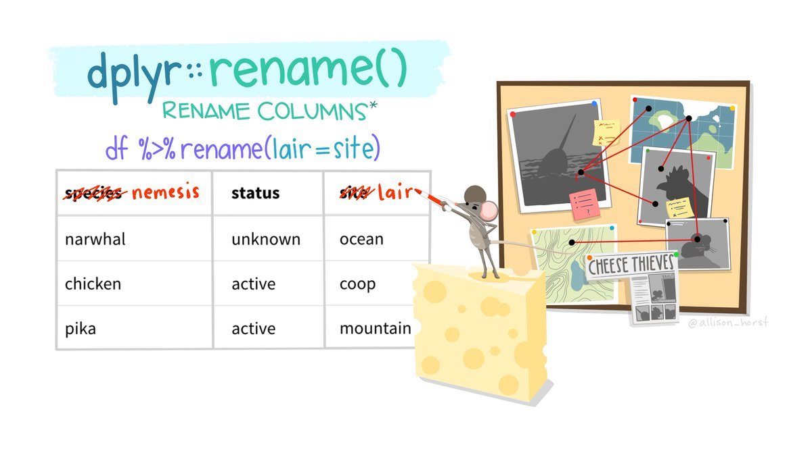

# Basic Wrangling

```{r setup, include=FALSE}
knitr::opts_chunk$set(strip.white = TRUE)
```

```{r message=FALSE, warning=FALSE}
library(tidyverse) # Load tidyverse packages
```

```{r echo = FALSE, message=FALSE, warning=FALSE}
library(kableExtra)
library(knitr)
library(palmerpenguins)
```

```{r echo = FALSE}
mtcars2 = rownames_to_column(mtcars, "model") %>% # Create example df
  slice(26:32) %>%
  select(-c(qsec, vs, am, carb, drat)) %>%
  mutate(mpg = round(mpg),
         wt = round(wt, 2),
         disp = round(disp))
```

<!-- <a href="exercises/Exercise_Manip2.Rmd" download>Exercise Sheet</a> -->

{width=100%}
<p style="font-size:6pt">Artwork by @allison_horst</p>

::: {.rmdimportant}
**Throughout this page, explanations for the code above will appear in blocks like this one!**
:::

When wrangling your data, you will be performing a series of actions to clean and prepare it for whatever task you have. Whether you are creating visualizations, performing statistical analyses, or doing anything else, you will likely need to change your data object in some way. Below, several of the most fundamental and basic data manipulation functions will be outlined. You will notice that the function names are all verbs, denoting that they are performing some action on the data object.

## Arrange

`arrange()` orders the rows of a data frame by the values of selected columns. By default this will be ascending, where the lowest values are in the first few rows.

```{r eval=FALSE}
mtcars2 %>%
  arrange(wt)
```

```{r echo=FALSE, message=F, warning=F}
arrangeTemp = mtcars2 %>%
  #slice(26:32) %>%
  mutate(ID = 1:nrow(.)) %>%
  arrange(wt) %>%
  mutate(colcol = RColorBrewer::brewer.pal(nrow(.), "Reds")) %>%
  arrange(ID) #%>%

arrTable1 = arrangeTemp %>%
  kbl() %>%
  kable_paper(full_width = F) %>%
  #  column_spec(2, color = spec_color(mtcars$mpg[1:6])) %>%
  column_spec(1:ncol(arrangeTemp), color = "white") %>%
  column_spec(6, color = "white",
              background = arrangeTemp$colcol) %>%
   kable_styling(bootstrap_options = c("striped", "hover", "condensed", "responsive")) %>%
    row_spec(0, bold = T, underline = T, color = "white", align = "c") %>%
    #remove_column(c(2:5, 7:ncol(arrangeTemp)))
  remove_column(c(8:ncol(arrangeTemp)))

arrangeTemp2 = mtcars2 %>%
  #slice(26:32) %>%
  arrange(wt) %>%
  mutate(colcol = RColorBrewer::brewer.pal(nrow(.), "Reds"))

arrTable2 = arrangeTemp2 %>%
  kbl() %>%
  kable_paper(full_width = F) %>%
#  column_spec(2, color = spec_color(mtcars$mpg[1:6])) %>%
  column_spec(1:ncol(arrangeTemp2), color = "white") %>%
  column_spec(6, color = "white",
              background = arrangeTemp2$colcol) %>%
  row_spec(0, bold = T, underline = T, color = "white", align = "c") %>%
   kable_styling(bootstrap_options = c("striped", "hover", "condensed", "responsive")) %>%
    #remove_column(c(2:5, 7:ncol(arrangeTemp2)))
  remove_column(c(8:ncol(arrangeTemp2)))

tempTable3 <- data.frame(
  test = c("","","","")
) %>%
  kbl(booktabs = T) %>%
  kable_paper(full_width = F) %>%
  column_spec(1, image = spec_image(
    c("figures/blank.png", "figures/blank.png", 
      "figures/blank.png", "figures/arrow.png"), 200, 100)) %>%
  row_spec(0, font_size = 0)

kables(list(arrTable1, tempTable3, arrTable2))
```

::: {.rmdimportant}
**This code changes the order of the rows in `mtcars2` by the values in the `wt` column, with the lowest at the top.**
:::

To get rows arranged in a descending order, with highest values at the top, wrap variable names in `desc()` within the `arrange()` call. If a second column is passed, the rows with identical values on the first variable will be arranged by the values on the second.

<!-- <div class="panel panel-success"> -->
<!--   <div class="panel-heading">**EXERCISE 1**</div> -->
<!--   <div class="panel-body"> -->
<!--   1. Use `arrange()` to order the `msleep2` dataset by `bodywt`.<br> -->
<!--   2. Modify your `arrange()` call to order the `bodywt` column from greatest to least.<br> -->
<!--   3. What is the largest animal recorded in this dataset?</div> -->
<!-- </div> -->

## Rename

{width=100%}
<p style="font-size:6pt">Artwork by @allison_horst</p>

Columns in a dataframe can be named poorly in several ways. They could have a name that is not meaningful or interpretable, they could have a name that is too long, or they could have a name that includes special characters or is otherwise difficult to work with (e.g., including spaces). 

You can rename columns by using the `rename()` function. This function takes the following form:

```{r eval=FALSE}
df %>%
  rename("new_column_name" = "old_column_name")
```

In the `mtcars2` object, several variable names are shorthand or abbreviations that may not make sense to someone who is not already familiar with the dataset. `rename()` can be used to change these:

```{r}
mtcars2 %>%
  rename("weight" = "wt", "horse_power" = "hp",
         "cylinders" = "cyl", "displacement" = "disp") %>%
  head()
```

<p class="text-info"> **<u>Note:</u> You do not have to address variables in the order they appear in the df. The variable names will be mapped regardless of their position!**</p>

<!-- <div class="panel panel-success"> -->
<!--   <div class="panel-heading">**EXERCISE 2**</div> -->
<!--   <div class="panel-body"> -->
<!--   Both of the weight columns in this dataset are measuring in kilograms. Use `rename()` to give those variables more informative names.</div> -->
<!-- </div> -->

### Saving Changes

The code above using `rename()` changed some of the variable names in the `mtcars2` dataframe. However, if you look at the `mtcars2` dataframe...

```{r}
mtcars2 %>%
  head()
```

The variable names are the same as before, the the `rename()` code seems like it did not work! Look carefully at the code though:

```{r eval=FALSE}
mtcars2 %>%
  rename("weight" = "wt", "horse_power" = "hp",
         "cylinders" = "cyl", "displacement" = "disp") %>%
  head()
```

When this code is executed it just prints the results. They are not saved anywhere! If you actually wanted to update your dataframe, you need to save these results:

```{r eval=FALSE}
mtcars2 = mtcars2 %>%
  rename("weight" = "wt", "horse_power" = "hp",
         "cylinders" = "cyl", "displacement" = "disp")
```

Saving over an object is a permanent change, though. You should be very careful when doing so. It is good practice to first make sure the code runs and does what you intend it to do. Once you have verified that, you can overwrite an object if you would like:

```{r eval=FALSE}
mtcars2 %>%
  rename("weight" = "wt", "horse_power" = "hp",
         "cylinders" = "cyl", "displacement" = "disp") %>%
  head()

mtcars2 = mtcars2 %>%
  rename("weight" = "wt", "horse_power" = "hp",
         "cylinders" = "cyl", "displacement" = "disp")
```

<p class="text-info"> **<u>Note:</u> `head()` is used here for pedagogical purposes, but in your own code you would only want to use this when testing changes in your data. When modifying your dataframe, you would not want to accidentally overwrite it with only the first 5 rows of your new output!**</p>

A good rule of thumb is that if you need to use the object in its current state again or make significant changes to it, particularly if you change its structure, you should create a new object (e.g., mtcars3) rather than overwrite/update the existing one.

## Clean Names

{width=100%}
<p style="font-size:6pt">Artwork by @allison_horst</p>

The `clean_names()` function from the `janitor` package is a powerful tool to change all your column names at once to a specific naming convention. This can be used to easily convert all variable names to one of the naming conventions mentioned in the [Coding Best Practices](#naming-convention) section:

* snake (snake_case)
* lower_camel (lowerCamel)
* upper_camel (UpperCamel)
* screaming_snake (SCREAMING_SNAKE)

As well as many others! You can access a particular function from a package by first specifying the package name, then two colons, then the function name. As demonstrated in the illustration above, using `janitor::clean_names()` is saying you want to use the `clean_names()` function as defined in the `janitor` package.

::: {.rmdcaution} 
**Why would you ever want to do this? Well, it is worth recognizing that functions are just variables. Instead of a value, they are defined by a series of code. Two variables of the same name cannot co-exist in your global environment. R would not know which to use! When you define `x = 4` and then `x = 6`, the original `x = 4` is overwritten.**

**Different packages may use the same variable names for the functions they contain. When you load a package with `library()`, that may overwrite some functions loaded by other packages. Thus, you may want to use a function from a particular package, but not load the entire package contents and override other functions!**
:::

## Relocate

`relocate()` can be used to reorder the columns in your dataframe. With `relocate()`, you specify which column(s) you want to move, and what they should come *.before* or *.after*.

{width=100%}
<p style="font-size:6pt">Artwork by @allison_horst</p>

```{r eval=FALSE}
mtcars2 %>%
  relocate(wt, .after = model)
```

```{r echo=FALSE, message=F, warning=F}
Temp = mtcars2 #%>%
  #slice(26:32) #%>%
  #select(1:6)

tempTable1 = Temp %>%
  kbl() %>%
  kable_paper(full_width = F) %>%
  column_spec(1:ncol(Temp), color = "white") %>%
  column_spec(6, color = "white",
              background = "lightgreen") %>%
   kable_styling(bootstrap_options = c("striped", "hover", "condensed", "responsive")) %>%
    row_spec(0, bold = T, underline = T, color = "white", align = "c") #%>%
    #remove_column(c(2:6, 8:13))

Temp2 = mtcars2 %>%
  #slice(26:32) %>%
  #select(1:6) %>%
  relocate(wt, .after = model)

tempTable2 = Temp2 %>%
  kbl() %>%
  kable_paper(full_width = F) %>%
#  column_spec(2, color = spec_color(mtcars$mpg[1:6])) %>%
  column_spec(1:ncol(Temp2), color = "white") %>%
  column_spec(2, color = "white",
              background = "lightgreen") %>%
  row_spec(0, bold = T, underline = T, color = "white", align = "c") %>%
   kable_styling(bootstrap_options = c("striped", "hover", "condensed", "responsive"))

kables(list(tempTable1, tempTable3, tempTable2))
```

::: {.rmdimportant}
**This code moves the `wt` column *after* the `model` column.**
:::

`relocate()` can also move multiple columns simultaneously when passed a vector of column names.

```{r eval=FALSE}
mtcars2 %>%
  relocate(c(disp, drat), .after = model)
```

```{r echo=FALSE, message=F, warning=F}
Temp = mtcars2 #%>%
  #slice(26:32) #%>%
  #select(1:6)

tempTable1 = Temp %>%
  kbl() %>%
  kable_paper(full_width = F) %>%
  column_spec(1:ncol(Temp), color = "white") %>%
  column_spec(c(4,6), color = "white",
              background = "lightgreen") %>%
   kable_styling(bootstrap_options = c("striped", "hover", "condensed", "responsive")) %>%
    row_spec(0, bold = T, underline = T, color = "white", align = "c") #%>%
    #remove_column(c(2:6, 8:13))

Temp2 = mtcars2 %>%
  #slice(26:32) %>%
  #select(1:6) %>%
  relocate(c(disp, wt), .after = model)

tempTable2 = Temp2 %>%
  kbl() %>%
  kable_paper(full_width = F) %>%
#  column_spec(2, color = spec_color(mtcars$mpg[1:6])) %>%
  column_spec(1:ncol(Temp2), color = "white") %>%
  column_spec(c(2,3), color = "white",
              background = "lightgreen") %>%
  row_spec(0, bold = T, underline = T, color = "white", align = "c") %>%
   kable_styling(bootstrap_options = c("striped", "hover", "condensed", "responsive"))

kables(list(tempTable1, tempTable3, tempTable2))
```

<!-- <div class="panel panel-success"> -->
<!--   <div class="panel-heading">**EXERCISE 3**</div> -->
<!--   <div class="panel-body"> -->
<!--   1. Move the `order` column to be positioned before the `vore` column.<br> -->
<!--   2. Move the `sleep_total` column to be positioned after the `sleep_cycle` column.<br> -->
<!--   3. Move both wt columns to be positioned after `genus`.</div> -->
<!-- </div> -->

## Select {#select}

<!-- select(c(columns_of_interest)) - returns the selected columns. You can select by actively choosing which columns you want, or choosing which columns you DON’T want (negate with a `!` in front of the vector of column names) -->

Above, you used `head()` when you wanted to output a preview of your dataframe. There will be many times like this when you want to **subset** your data (cutting it to show only subsets of it -- which contain or exclude specific variables/observations).

There are two primary subsetting functions. The first is `select()`, which selects and returns only the specified columns (passed to as a vector of column names).

`select(c(columns_of_interest))`

```{r eval=FALSE}
mtcars2 %>%
  select(c(cyl, gear))
```

```{r echo=FALSE, message=F, warning=F}
Temp = mtcars2 #%>%
  #slice(26:32)

tempTable1 = Temp %>%
  kbl() %>%
  kable_paper(full_width = F) %>%
  column_spec(1:ncol(Temp), color = "white") %>%
  column_spec(c(3,7), color = "white",
              background = "blueviolet") %>%
   kable_styling(bootstrap_options = c("striped", "hover", "condensed", "responsive")) %>%
    row_spec(0, bold = T, underline = T, color = "white", align = "c")

Temp2 = mtcars2 %>%
  #slice(26:32) %>%
  select(c(cyl, gear))

tempTable2 = Temp2 %>%
  kbl() %>%
  kable_paper(full_width = F) %>%
  column_spec(1:ncol(Temp2), color = "white") %>%
  column_spec(c(1,2), color = "white",
              background = "blueviolet") %>%
  row_spec(0, bold = T, underline = T, color = "white", align = "c") %>%
   kable_styling(bootstrap_options = c("striped", "hover", "condensed", "responsive"))

kables(list(tempTable1, tempTable3, tempTable2))
```

Just as the `:` could be used to generate all the values in a range of numbers (e.g., `1:4` would return: 1,2,3,4), you can also use a `:` to return all the values in a range of *columns*. For example:

```{r eval=FALSE}
mtcars2 %>%
  select(c(cyl:hp))
```

```{r echo=FALSE, message=F, warning=F}
Temp = mtcars2 #%>%
  #slice(26:32)

tempTable1 = Temp %>%
  kbl() %>%
  kable_paper(full_width = F) %>%
  column_spec(1:ncol(Temp), color = "white") %>%
  column_spec(c(3:5), color = "white",
              background = "blueviolet") %>%
   kable_styling(bootstrap_options = c("striped", "hover", "condensed", "responsive")) %>%
    row_spec(0, bold = T, underline = T, color = "white", align = "c")

Temp2 = mtcars2 %>%
  #slice(26:32) %>%
  select(c(cyl:hp))

tempTable2 = Temp2 %>%
  kbl() %>%
  kable_paper(full_width = F) %>%
  column_spec(1:ncol(Temp2), color = "white") %>%
  column_spec(c(1:3), color = "white",
              background = "blueviolet") %>%
  row_spec(0, bold = T, underline = T, color = "white", align = "c") %>%
   kable_styling(bootstrap_options = c("striped", "hover", "condensed", "responsive"))

kables(list(tempTable1, tempTable3, tempTable2))
```

::: {.rmdimportant}
**This selects the `cyl` column, the `hp` column, and all columns in between the two!**
:::

<!-- <div class="panel panel-success"> -->
<!--   <div class="panel-heading">**EXERCISE 4**</div> -->
<!--   <div class="panel-body"> -->
<!--   1. Subset the `name` and `vore` columns.<br> -->
<!--   2. Subset the `genus` and `order` columns.<br> -->
<!--   3. Subset all the sleep related columns.</div> -->
<!-- </div> -->

`select()` can also be used to *get rid of columns* you do **NOT** want by negating the vector of column names using a `!`.

```{r eval=FALSE}
mtcars2 %>%
  select(!c(cyl, gear))
```

```{r echo=FALSE, message=F, warning=F}
Temp = mtcars2 #%>%
  #slice(26:32)

tempTable1 = Temp %>%
  kbl() %>%
  kable_paper(full_width = F) %>%
  column_spec(1:ncol(Temp), color = "white") %>%
  column_spec(c(3,7), color = "white",
              background = "blueviolet") %>%
   kable_styling(bootstrap_options = c("striped", "hover", "condensed", "responsive")) %>%
    row_spec(0, bold = T, underline = T, color = "white", align = "c")

Temp2 = mtcars2 %>%
  #slice(26:32) %>%
  select(!c(cyl, gear))

tempTable2 = Temp2 %>%
  kbl() %>%
  kable_paper(full_width = F) %>%
  column_spec(1:ncol(Temp2), color = "white") %>%
  row_spec(0, bold = T, underline = T, color = "white", align = "c") %>%
   kable_styling(bootstrap_options = c("striped", "hover", "condensed", "responsive"))

kables(list(tempTable1, tempTable3, tempTable2))
```

::: {.rmdimportant}
**This selects all columns *except* `cyl` and `gear`.**
:::

<!-- <div class="panel panel-success"> -->
<!--   <div class="panel-heading">**EXERCISE 5**</div> -->
<!--   <div class="panel-body"> -->
<!--   1. Use `select()` to get rid of the `awake` column.<br> -->
<!--   2. Get rid of all columns related to the animal's weight.</div> -->
<!-- </div> -->

When you specifically want to move a variable (or variables) to the front of your df, there is an easy way to do so using `select()` instead of `relocate()`:

```{r}
mtcars2 %>%
  select(wt, everything())
```

The `everything()` function selects... everything! It will select all the variables in a df. So this is first selecting the `wt` variable, and then everything else. The result is still all the variables in the df, but `wt` is at the front.

## Filter

<!-- filter(columnToSubset == valueOfInterest) - returns rows that meet specified condition(s). Can use single conditions or string together multiple tests with logical operators -->

The second primary subsetting function is `filter()`, which returns rows that meet specified condition(s). Each condition is a logical test performed on a column. This will results in a vector of `TRUE` and `FALSE` values, and only the rows where the test evaluates to `TRUE` will be returned!

{width=100%}
<p style="font-size:6pt">Artwork by @allison_horst</p>

As you see in the illustration above, only the rows with a check mark (where the logical test resulted in `TRUE`) would be returned from that `filter()` call!

```{r eval=FALSE}
mtcars2 %>%
  filter(gear == 4)
```

```{r echo=FALSE, message=F, warning=F}
Temp = mtcars2 #%>%
  #slice(26:32)

tempTable1 = Temp %>%
  kbl() %>%
  kable_paper(full_width = F) %>%
  column_spec(1:ncol(Temp), color = "white") %>%
  row_spec(c(1,7), background = "goldenrod") %>%
   kable_styling(bootstrap_options = c("striped", "hover", "condensed", "responsive")) %>%
    row_spec(0, bold = T, underline = T, color = "white", align = "c")

Temp2 = mtcars2 %>%
  #slice(26:32) %>%
  filter(gear == 4)

tempTable2 = Temp2 %>%
  kbl() %>%
  kable_paper(full_width = F) %>%
  column_spec(1:ncol(Temp2), color = "white") %>%
  row_spec(c(1,2), background = "goldenrod") %>%
  row_spec(0, bold = T, underline = T, color = "white", align = "c") %>%
   kable_styling(bootstrap_options = c("striped", "hover", "condensed", "responsive"))

kables(list(tempTable1, tempTable3, tempTable2))
```

::: {.rmdimportant}
**This filters the dataframe to return only rows where `gear` has a value of 4.**
:::

Any evaluative operator can be used in the conditions. The test conditions only need to result in `TRUE` or `FALSE`:

```{r eval=FALSE}
mtcars2 %>%
  filter(disp > 300)
```

```{r echo=FALSE, message=F, warning=F}
Temp = mtcars2 #%>%
  #slice(26:32)

tempTable1 = Temp %>%
  kbl() %>%
  kable_paper(full_width = F) %>%
  column_spec(1:ncol(Temp), color = "white") %>%
  row_spec(c(4,6), background = "goldenrod") %>%
   kable_styling(bootstrap_options = c("striped", "hover", "condensed", "responsive")) %>%
    row_spec(0, bold = T, underline = T, color = "white", align = "c")

Temp2 = mtcars2 %>%
  #slice(26:32) %>%
  filter(disp >300)

tempTable2 = Temp2 %>%
  kbl() %>%
  kable_paper(full_width = F) %>%
  column_spec(1:ncol(Temp2), color = "white") %>%
  row_spec(c(1,2), background = "goldenrod") %>%
  row_spec(0, bold = T, underline = T, color = "white", align = "c") %>%
   kable_styling(bootstrap_options = c("striped", "hover", "condensed", "responsive"))

kables(list(tempTable1, tempTable3, tempTable2))
```

::: {.rmdimportant}
**This filters the dataframe to return only rows where the `gear` column has a value of 4.**
:::

The values specified in your tests do not have to be numbers, they can be text strings as well!

```{r eval=FALSE}
mtcars2 %>%
  filter(model == "Lotus Europa")
```

```{r echo=FALSE, message=F, warning=F}
Temp = mtcars2 #%>%
  #slice(26:32)

tempTable1 = Temp %>%
  kbl() %>%
  kable_paper(full_width = F) %>%
  column_spec(1:ncol(Temp), color = "white") %>%
  row_spec(c(3), background = "goldenrod") %>%
   kable_styling(bootstrap_options = c("striped", "hover", "condensed", "responsive")) %>%
    row_spec(0, bold = T, underline = T, color = "white", align = "c")

Temp2 = mtcars2 %>%
  #slice(26:32) %>%
  filter(model == "Lotus Europa")

tempTable2 = Temp2 %>%
  kbl() %>%
  kable_paper(full_width = F) %>%
  column_spec(1:ncol(Temp2), color = "white") %>%
  row_spec(c(1), background = "goldenrod") %>%
  row_spec(0, bold = T, underline = T, color = "white", align = "c") %>%
   kable_styling(bootstrap_options = c("striped", "hover", "condensed", "responsive"))

kables(list(tempTable1, tempTable3, tempTable2))
```

::: {.rmdimportant}
**This filters the dataframe to return only rows where the `model` column has the value "Lotus Europa".**
:::

<!-- <div class="panel panel-success"> -->
<!--   <div class="panel-heading">**EXERCISE 6**</div> -->
<!--   <div class="panel-body"> -->
<!--   Filter the data to show only the observations where...<br> -->
<!--   1. The animals are of Rodentia order.<br> -->
<!--   2. The animals have a body weight of 5 or greater.<br> -->
<!--   3. The animals are not herbivores. -->
<!--   </div> -->
<!-- </div> -->

Multiple conditions can be strung together using logical operators:

```{r eval=FALSE}
mtcars2 %>%
  filter(cyl != 4 | hp < 100)
```

```{r echo=FALSE, message=F, warning=F}
Temp = mtcars2 #%>%
  #slice(26:32)

tempTable1 = Temp %>%
  kbl() %>%
  kable_paper(full_width = F) %>%
  column_spec(1:ncol(Temp), color = "white") %>%
  row_spec(c(1:2, 4:6), background = "goldenrod") %>%
   kable_styling(bootstrap_options = c("striped", "hover", "condensed", "responsive")) %>%
    row_spec(0, bold = T, underline = T, color = "white", align = "c")

Temp2 = mtcars2 %>%
  #slice(26:32) %>%
  filter(cyl != 4 | hp < 100)

tempTable2 = Temp2 %>%
  kbl() %>%
  kable_paper(full_width = F) %>%
  column_spec(1:ncol(Temp2), color = "white") %>%
  row_spec(c(1:nrow(Temp2)), background = "goldenrod") %>%
  row_spec(0, bold = T, underline = T, color = "white", align = "c") %>%
   kable_styling(bootstrap_options = c("striped", "hover", "condensed", "responsive"))

kables(list(tempTable1, tempTable3, tempTable2))
```

::: {.rmdimportant}
**This filters the dataframe to return only rows where `cyl` does not have a value of 4 OR `hp` is less than 100.**
:::

When multiple logical tests are strung together they get evaluated from left to right. You must be mindful about the order of operations and using parentheses to make sure the conditions are evaluated as you intended. For example, say you wanted to filter for observations that were either 4 cylinder or less than 200 horse power, and also had 5 gears. In other words, cars with 4 cylinders and 5 gears or cars with less than 200 horse power and 5 gears:

`filter(cyl == 4 | hp < 200 & gear == 5)` would be evaluated as:<br>
`filter(cyl == 4 | (hp < 200 & gear == 5))`
<br>
which is different than:<br>
`filter((cyl == 4 | hp < 200) & gear == 5)`.

<!-- <div class="panel panel-success"> -->
<!--   <div class="panel-heading">**EXERCISE 7**</div> -->
<!--   <div class="panel-body"> -->
<!--   Filter the data to show...<br> -->
<!--   1. The animals who sleep for over 14 hours total and weigh less than 3<br> -->
<!--   2. The carnivores who spend over 10 hours awake, then subset only the `awake`, `vore`, and `sleep_total` columns.<br> -->
<!--   3. All animals with a brain weight greater than 0.1 or spend less than 1 hour in rem, **except those who are herbivores**, then subset only the `brainwt`, `sleep_rem`, and `name` columns, and arrange the results by `awake` from greatest to least. -->
<!--   </div> -->
<!-- </div> -->


### %in%

Stringing together multiple tests of text patterns would be very cumbersome (e.g., `model == "Lotus Europa" | model == "Ferrari Dino" | ...`). Fortunately, there is an alternative with the `%in%` operator. As a reminder, this will check to see if the value of one variable is in a vector of possible values. Test conditions using the `%in%` operator are used the same way as all test conditions using all other operators: you must specify the variable to search within and what values to return (those in the vector).

```{r eval=FALSE}
mtcars2 %>%
  filter(model %in% c("Lotus Europa", "Ferrari Dino", "Volvo 142E"))
```

```{r echo=FALSE, message=F, warning=F}
Temp = mtcars2 #%>%
  #slice(26:32)

tempTable1 = Temp %>%
  kbl() %>%
  kable_paper(full_width = F) %>%
  column_spec(1:ncol(Temp), color = "white") %>%
  row_spec(c(3,5,7), background = "goldenrod") %>%
   kable_styling(bootstrap_options = c("striped", "hover", "condensed", "responsive")) %>%
    row_spec(0, bold = T, underline = T, color = "white", align = "c")

Temp2 = mtcars2 %>%
  #slice(26:32) %>%
  filter(model %in% c("Lotus Europa", "Ferrari Dino", "Volvo 142E"))

tempTable2 = Temp2 %>%
  kbl() %>%
  kable_paper(full_width = F) %>%
  column_spec(1:ncol(Temp2), color = "white") %>%
  row_spec(c(1:3), background = "goldenrod") %>%
  row_spec(0, bold = T, underline = T, color = "white", align = "c") %>%
   kable_styling(bootstrap_options = c("striped", "hover", "condensed", "responsive"))

kables(list(tempTable1, tempTable3, tempTable2))
```

::: {.rmdimportant}
**This filters the dataframe to return only rows where the value of `model` is "Lotus Europa", "Ferrari Dino", or "Volvo 142E".**
:::


As `%in%` is an operator, it can also be combined with other operators!

```{r}
mtcars2 %>%
  filter(hp > 300 | model %in% c("Lotus Europa", "Ferrari Dino", "Volvo 142E"))
```

::: {.rmdimportant}
**This filters the dataframe to return only rows where the value of `hp` is greater than 300 OR the value of `model` is "Lotus Europa", "Ferrari Dino", or "Volvo 142E".**
:::

<!-- <div class="panel panel-success"> -->
<!--   <div class="panel-heading">**EXERCISE 8**</div> -->
<!--   <div class="panel-body"> -->
<!--   Filter the data to show...<br> -->
<!--   1. Animals in the "Cetacea", "Cingulata", or "Pilosa" order, who sleep for a total of anywhere between 5 and 10 hours.<br> -->
<!--   2. Modify the code from above to show only the `name`, `order`, `sleep_total`, and `brainwt`. <br> -->
<!--   3. Modify the code from above to arrange by brain weight from least to greatest. -->
<!--   </div> -->
<!-- </div> -->

### Pattern Matching

For any number of reasons there may be times you do not want to search for an exact string match. Rather, you want to filter based on whether a value *contains* a certain string. This can be accomplished with `grepl()`, which takes the form:

`grepl(pattern_to_search_for, where_to_search)`

```{r}
mtcars2 %>%
  filter(grepl("Porsche", model))
```

::: {.rmdimportant}
**This filters the dataframe to return only rows where `model` contains the string "Porsche" in its value.**
:::

<!-- <div class="panel panel-success"> -->
<!--   <div class="panel-heading">**EXERCISE 9**</div> -->
<!--   <div class="panel-body"> -->
<!--   Filter the data to show...<br> -->
<!--   1. The animals who sleep for over 14 hours total and weigh less than 3<br> -->
<!--   2. The carnivores who spend over 10 hours awake, then subset only the `awake`, `vore`, and `sleep_total` columns.<br> -->
<!--   3. All animals with a brain weight greater than 0.1 or spend less than 1 hour in rem, **except those who are herbivores**, then subset only the `brainwt`, `sleep_rem`, and `name` columns, and arrange the results by `awake` from greatest to least. -->
<!--   </div> -->
<!-- </div> -->

## Indexing

Indexing dfs was introduced [previously](#Indexing-dfs), but will often need to be done throughout a pipe chain. There are two functions to help with this: `pull()` and `pluck()`.

### pull()

`pull()` will extract a variable from a df. This can be done by the variable's name or its numeric position (using name is always preferred). `pull()` is like using the `$` operator to index.

```{r}
mtcars2 %>%
  pull(cyl)
```

The result is a vector, as variables are just vectors! This is helpful because it allows the result to then be piped to a number of functions that require a vector rather than a df. For example:

```{r error=TRUE}
mtcars2 %>% 
  select(cyl) %>% 
  mean()

mtcars2 %>%
  pull(cyl) %>%
  mean()
```

By using `select()`, the result is a dataframe with one column. When trying to pass this to `mean()`, you get an `NA` and an error:

<p style="color:#A79BF0"> **Warning message: In mean.default(.) : argument is not numeric or logical: returning NA.**</p>

By using `pull()`, the result is a vector and can be passed to `mean()` without issue.

<!-- <div class="panel panel-success"> -->
<!--   <div class="panel-heading">**EXERCISE 10**</div> -->
<!--   <div class="panel-body"> -->
<!--   1. Index the `sleep_total` variable from `msleep2`.<br> -->
<!--   2. Find the mean of `sleep_total`.<br> -->
<!--   3. Subset the data to only include carnivores, index the `bodywt` column, and find the average value. Do the same for herbivores. Which has a higher average body weight? -->
<!--   </div> -->
<!-- </div> -->

### pluck()

`pluck()` allows you to index elements from an object, and can also be done by name or numeric position. Above, the `cyl` column was indexed from `mtcars2`. Say you wanted the 4th observation from that column:

```{r}
mtcars2 %>%
  pull(cyl) %>%
  pluck(4)
```

<!-- <div class="panel panel-success"> -->
<!--   <div class="panel-heading">**EXERCISE 11**</div> -->
<!--   <div class="panel-body"> -->
<!--   1. Subset the data for primates who spend more than 13 hours awake, arrange the `awake` column from greatest to least, index it, and the 2nd value from the resulting vector.<br> -->
<!--   2. Using a process similar to the one above, write some code that will result in the value for the 2nd lowest brain weight for omnivores who spend less than 2 hours in rem. -->
<!--   </div> -->
<!-- </div> -->

<button class="btn btn-primary" data-toggle="collapse" data-target="#BlockName"> Advanced </button>  
<div id="BlockName" class="collapse">  

`pluck()` is extremely useful for indexing deeply into nested data structures. These will not be covered in this course, but as a brief demonstration you can consider a df to be a nested object. Each vector is an 1st level element and then values within vectors are 2nd level elements. To get the 4th value in the 3rd vector (the previous code string), you would do the following:

```{r}
mtcars2 %>%
  pluck(3,4)
```

This can also be done with named positions.

```{r}
mtcars2 %>%
  pluck("model", 2)
```

In short, each argument in `pluck()` is a position to index. `x %>% pluck(2, 2)` == `x[[2]][[2]]`
</div>

## Unique Entries {#Unique-Entries}

When working with larger dfs, it is difficult to get a sense of the unique values a particular variable may contain. You can get this using `distinct()`.

```{r}
mtcars2
mtcars2 %>%
  distinct(cyl)
```

The way this works is by keeping the row that corresponds with the first entry of a unique value from that particular column. This becomes clear by using the `.keep_all` argument

```{r}
mtcars2 %>%
  distinct(cyl, .keep_all = TRUE)
```

To get the *number* of unique values you can use `n_distinct()`, which takes a vector of values as input.

```{r}
mtcars2 %>%
  pull(cyl) %>%
  n_distinct()
```

<!-- <div class="panel panel-success"> -->
<!--   <div class="panel-heading">**EXERCISE 12**</div> -->
<!--   <div class="panel-body"> -->
<!--   Write some code to get:<br> -->
<!--   1. The unique values in the `vore` column.<br> -->
<!--   2. The *number* of unique values in the `vore` column. -->
<!--   </div> -->
<!-- </div> -->

## Adding Variables

To add new variables to your dataframe, you use the `mutate()` function.

{width=100%}
<p style="font-size:6pt">Artwork by @allison_horst</p>

`mutate()` takes the form:

`mutate("new_col_name" = content_for_that_column)`

The new column's name will be whatever is passed on the left, its contents will be the result of the R expression assigned to it. For example:

```{r wt}
mtcars2 %>%
  mutate(wt_lbs = wt * 1000)
```

::: {.rmdimportant}
**This creates a new variable showing the weight of each observation (car) in pounds.**
:::

Recall that all variables in a dataframe are each vectors. There are two consequences of this:

1. All new variables must be the same length as the existing columns in the dataframe.
2. The R expression must return a vector, and so computations over vectors can be used!
    + In the example above, `wt` is a vector. The R expression was a computation over a vector! Each value in the `wt` vector (column) was multiplied by 1000. This is essentially the same thing as seen in the section where vectors were first [introduced](#Vectors).

Multiple new columns can be created simultaneously within the same `mutate()` call:

```{r}
price_of_gas = 6.25

mtcars2 %>%
  mutate(cost_per_mile = price_of_gas / mpg,
         wt_lbs = wt * 1000)
```

::: {.rmdimportant}
**In addition to the weight in pounds variable, this code also creates a variable showing the cost of traveling 1 mile for each observation (car) considering the current price of gas.**
:::

<!-- <div class="panel panel-success"> -->
<!--   <div class="panel-heading">**EXERCISE 13**</div> -->
<!--   <div class="panel-body"> -->
<!--   1. The sleep variables are all measured in hours. Create a new variable called `sleep_total_m` that measures total **minutes** of sleep.<br> -->
<!--   2. Create a new variable that represents the proportion of total sleep spent in rem, move that column to come after `sleep_rem`, filter to show only observations with a ratio of 0.25 or greater, arrange the new column from greatest to least, and index the `bodywt` of the animal with the highest ratio. -->
<!--   </div> -->
<!-- </div> -->

### Conditional Values

You may want a variable to have a value based on some different conditions. `case_when()` was [introduced](#case_when) as a way to string together a number of ifelse type statements and return some values. This can be extremely useful when creating new variables!

<!-- [case_when()] -->

{width=100%}
<p style="font-size:6pt">Artwork by @allison_horst</p>

```{r}
mtcars2 %>%
  mutate(fuel_efficiency = case_when(
    mpg <= 19 ~ "Poor",
    mpg >= 20 & mpg <= 25 ~ "Average",
    TRUE ~ "Great"
  ))
```

::: {.rmdimportant}
**This creates a new variable called `fuel_efficiency`. Each observation's value for this variable depends on its value for `mpg`, and differs based on different conditions.**
:::

In more simple instances, [ifelse()] can be used:

```{r}
mtcars2 %>%
  mutate(power = ifelse(hp >=200, "High", "Low"))
```

::: {.rmdimportant}
**This creates a new variable called `power`. Each observation's value for this variable depends on its value for `hp`. If `hp` is greater than 200, it is "High" powered, if lower than 200 then "Low" powered.**
:::

<!-- <div class="panel panel-success"> -->
<!--   <div class="panel-heading">**EXERCISE 14**</div> -->
<!--   <div class="panel-body"> -->
<!--   1. Find out what the average total sleep is for all animals, then use `case_when()` to create a new column that has the value "sleepyhead" if the animal has a `sleep_total` higher than average, "wide-awake" if lower than average, and "average" if exactly average.<br> -->
<!--   2. Use `ifelse()` to create a new column just indicating whether the animal had a "higher" or "lower" `sleep_total` than average. -->
<!--   </div> -->
<!-- </div> -->

### Position

By default `mutate()` adds the new variable(s) to the end of the dataframe. However, you can specify what existing column you want the new column to appear `.before` or `.after`.

```{r}
price_of_gas = 6.25

mtcars2 %>%
  mutate(cost_per_mile = price_of_gas / mpg, .after = "mpg")
```

::: {.rmdimportant}
**This specifies that the new `cost_per_mile` variable should be created after `mpg`.**
:::

<p class="text-info"> **<u>Note:</u> The `.before` and `.after` specifications apply to ALL new variables created by the particular `mutate()` call. If you want to create multiple new variables and have them added in different places in your dataframe, you will need to separate them into different `mutate()` calls.**</p>

### NAs {#NAs}

When performing vector computations, you have to be mindful of `NA` values in your data. `NA` values can cause major issues. For example:

```{r}
4 + NA + 2
mean(c(4,5,3,NA))
```

As you can see, any time you have `NA` as part of your computation, the results are `NA`. It is because of this that NAs are thought to be **contagious**. In these instances, you get around this by utilizing functions like `na.omit()`, `drop_na()`, or the `na.rm` argument set to `TRUE`.

`na.omit()` will remove all NAs. When used on a dataframe, this will remove an entire row of data if it has an `NA` value for ***any*** column.

`drop_na()` is used specifically for dataframes, and will remove an entire row of data if it has an `NA` value for ***specific*** column(s) that you select. If you do not pass any specific columns, it will function similarly to `na.omit()` and remove an entire row if it as an `NA` value for ***any*** column.

```{r}
c(4, 5, 3, NA) %>%
  na.omit() %>% 
  mean()

mean(c(4,5,3,NA), na.rm = TRUE)
```

```{r}
ex_df = data.frame(A = c(NA, 1, 4), 
           B = c(1, NA, 4), 
           C = c(1,4,5))
ex_df

ex_df %>%
  na.omit()

ex_df %>%
  drop_na()

ex_df %>%
  drop_na(A)
```

<!-- <div class="panel panel-success"> -->
<!--   <div class="panel-heading">**EXERCISE 15**</div> -->
<!--   <div class="panel-body"> -->
<!--   1. Use `drop_na()` to remove all observations with an `NA`.<br> -->
<!--   2. Only get rid of observations with an `NA` for `brainwt`. -->
<!--   </div> -->
<!-- </div> -->

## Modifying Existing Variables {#Modifying-Existing-Variables}

`mutate()` can also be used to modify existing variables! This is done by passing a column name that already exists in the dataframe. For example:

```{r}
mtcars2 %>%
  mutate(wt = wt * 1000)
```

By tweaking the code above, instead of creating a new one, the existing `wt` variable is modified.

<p class="text-info"> **<u>Note:</u> You will generally not want to overwrite a variable if you are changing it in some meaningful way (as is the case in the example above). Instead, you should create a new variable.**</p>

### Change Variable Types

One of the ways in which it *is* appropriate to modify a variable is when you need to change the *type* of data it contains. In R, you can change data type by using the `as.*` function. For example, `as.logical()` changes the passed values to be *logical.* The one exception is that when changing something to a *factor*, you should use `factor()` (more on this below.)

```{r}
mtcars2 %>%
  mutate(mpg = as.character(mpg),
         cyl = factor(cyl)) %>%
  glimpse()
```

::: {.rmdimportant}
**This modifies the data in the `mpg` column to be of *character*, and the data in the `cyl` column to be a factor. The output of this is then piped to `glimpse()` so the types of each column will be displayed.**
:::

You can see from this output that all the numbers in `mpg` have quotes around them. Also, it is labeled "<chr>" and not "<dbl>". While the raw data for `cyl` look unchanged, you can see it now says "<fct>".

<!-- <div class="panel panel-success"> -->
<!--   <div class="panel-heading">**EXERCISE 16**</div> -->
<!--   <div class="panel-body"> -->
<!--   1. As mentioned above, the weight columns are measured in kg. Change these columns so that they contain the weight in lbs (1kg = ~2.205 lbs). Arrange the new body weight column from least to greatest, and index the value for the lightest animal in the dataset.<br> -->
<!--   2. Change the `vore` column to be a *factor* instead of *character*, and the `awake` column to be a *character* instead of *numeric*. -->
<!--   </div> -->
<!-- </div> -->

### Factors

Factors are important, and can be a little tricky to work with, so they get their own section. Factors are categorical data that have a specific order, and by proxy a specific defined range of possible values (e.g., Months of the year). 

#### Factor Conversion

When working with factors, particularly when converting data to and from a factor, you have to be very careful. Consider the following:

```{r}
data.frame(test = factor(c("0", "1")))
```

This simple dataframe that has one column with data as a factor with the values 0 and 1. Say you want to change that data from a factor to numeric. Simple enough, just apply the appropriate `as.*` function (`as.numeric()`).

However, observe the output from doing so:

```{r}
data.frame(test = factor(c("0", "1"))) %>% 
  mutate(test = as.numeric(test))
```

This is obviously not what was intended. What is happening here is `mutate()` is taking the *level* of each value, with `0` being level 1 and `1` being level 2. Instead, you have to circumvent this issue by first converting the values to a *character*, and then a *number*:

```{r}
data.frame(test = factor(c("0", "1"))) %>% 
  mutate(test = as.character(test),
         test = as.numeric(test))
```

The take-home point is to always double check that your code is doing what you intend it to, especially when converting to and from a *factor*!

#### Reorder Levels

While the levels of a *factor* are ordered, you may at times want to change what that order is. One of the more common instances when this will occur is in visualizations. Consider the following:

```{r}
mtcars2 %>%
  mutate(cyl = factor(cyl)) %>%
  ggplot(aes(x = cyl, fill = cyl)) +
    geom_bar(position = "identity")
```

The x-axis has a sensible arrangement, but this 1. is a function of the fact that the factors happen to be numbers, 2. is not particularly aesthetically pleasing when looking at the actual bars. The bars themselves have an inherent ordering and it may make more sense to organize them as such. This can be accomplished using `fct_infreq()`, which will reorder the levels of a factor **in** their **freq**uency of occurrence (with highest frequency first).

```{r}
mtcars2 %>%
  mutate(cyl = factor(cyl) %>%
           fct_infreq()) %>%
  ggplot(aes(x = cyl, fill = cyl)) +
    geom_bar(position = "identity")
```

To order the levels with lowest frequency first, you can use `fct_rev()` for "**rev**erse **freq**uency". 

```{r}
mtcars2 %>%
  mutate(cyl = factor(cyl) %>%
           fct_infreq() %>%
           fct_rev()) %>%
  ggplot(aes(x = cyl, fill = cyl)) +
    geom_bar(position = "identity")
```

<p class="text-info"> **<u>Note:</u> Notice that the color mapping is changing as well. In the bottom graph, the blue bar is on the 4 cylinder bar, whereas on the preceding graph it was on the 6 cylinder bar. This is because color mappings correspond to factor levels!**</p>

Most of the time you will not be creating graphs to visualize counts of a single variable. Instead, you will be visualizing the relationship or comparison between two more more variables, like in the graph below:

```{r warning = FALSE}
mtcars2 %>%
  mutate(cyl = factor(cyl)) %>%
  ggplot(aes(y = mpg, x = cyl)) +
  stat_summary(fun.data = "mean_se", geom = "pointrange")
```

To reorder the levels of a factor by their relationship with another variable (instead of frequency of occurrence), you can use `fct_reorder()`. In `fct_reorder()`, you must specify the factor to reorder, and the other variable you wish to reorder the levels by.

```{r warning = FALSE}
mtcars2 %>%
  mutate(cyl = factor(cyl)) %>%
  ggplot(aes(y = mpg, x = fct_reorder(cyl, mpg))) +
  stat_summary(fun.data = "mean_se", geom = "pointrange")
```

<p class="text-info"> **<u>Note:</u> `fct_reorder()` was used in the ggplot call directly because this is a fairly particular reordering. It is unlikely that, outside of for the purpose of generating this specific visualization, you would want the levels of `cyl` to be ordered based on its level of `mpg`.<br><br>Also, you can combine `fct_reorder()` with `fct_rev()` to reverse the order of the levels.**</p>

<!-- <div class="panel panel-success"> -->
<!--   <div class="panel-heading">**EXERCISE 17**</div> -->
<!--   <div class="panel-body"> -->
<!-- Take 3-4 visualizations you created in the exercises from the data visualization lectures and reorder the factor levels so they are in a more sensible order. -->
<!--   </div> -->
<!-- </div> -->

<!-- Another type of reordering is useful when you are colouring the lines on a plot. fct_reorder2() reorders the factor by the y values associated with the largest x values. This makes the plot easier to read because the line colours line up with the legend. -->

<!-- The advantage to using `factor()` over `as.factor()` is that `factor()` includes extra helpful arguments. The two most important are: -->

<!-- 1. *levels* - allows you to set the level order of that factor by passing it a vector of the values in the preferred order. -->
<!-- 2. *labels* - allows you to change the labels of the values. -->

## Extras

* [Factors cheatsheet](https://github.com/rstudio/cheatsheets/blob/main/factors.pdf)

## References