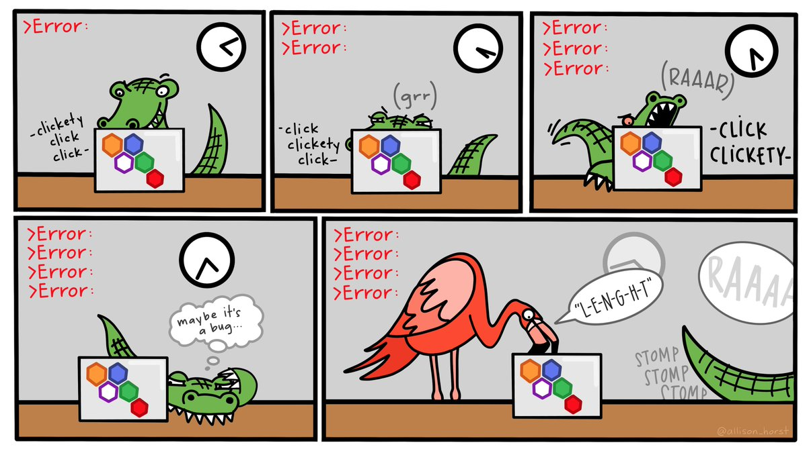

# R Coding Basics

```{r setup, include=FALSE}
knitr::opts_chunk$set(strip.white = TRUE)
```

<!-- <a href="exercises/Exercise1.Rmd" download>Exercise Sheet</a> -->

Okay so what is R?

## Operators

### Arithmetic Operators

While R is a programming language used for statistical modeling, data analysis, and visualization. At its core, it uses **operators** to evaluate different statements. The most basic form of this is using arithmetic operators to perform arithmetic operations:

```{r Arithmatic Operators, echo=FALSE, message=F, warning=F}
library(tidyverse)
kableExtra::kbl(data.frame("Operator" = c("`+`",
                                            "`-`",
                                            "`*`",
                                            "`/`",
                                          "`^` or `**`",
                                          "`%%`"), 
                           "Description" = c("Addition", 
                                             "Subtraction", 
                                             "Multiplication", 
                                             "Division", 
                                             "Exponentiate (raise to the power of)", 
                                             "Modulus (find the remainder of *X* divided by *Y*)")), align = "c") %>%
    #kableExtra::kable_paper("striped", full_width = T) %>%
    #column_spec(5:7, bold = T) %>%
    #kableExtra::row_spec(1, bold = T, color = "white", background = "grey")
  #kable_material(c("striped", "hover"))
    kableExtra::kable_styling(bootstrap_options = c("striped", "hover", "condensed", "bordered"), full_width = F, position = "center")


```


```{r simple arithmetic, strip.white=TRUE}
2 + 2

6 / 2

3^2

10 %% 4

3^2/2*5/2
```

<!-- <div class="panel panel-success"> -->
<!--   <div class="panel-heading">**EXERCISE #1**</div> -->
<!--   <div class="panel-body">Use each of the operators covered in a new expression.</div> -->
<!-- </div> -->

### Comparison Operators

Return `TRUE` or `FALSE` values (aka booleans):

```{r Comparison Operators, echo=FALSE, message=F, warning=F}
library(tidyverse)
kableExtra::kbl(data.frame("Operator" = c("<",
                                            ">",
                                            "<=",
                                            ">=",
                                          "==",
                                          "!="), 
                           "Description" = c("Less than", 
                                             "Greater than", 
                                             "Less than or equal to", 
                                             "Greater than or equal to", 
                                             "Exactly equal to", 
                                             "Not equal to")), align = "c") %>%
    #kableExtra::kable_paper("striped", full_width = T) %>%
    #column_spec(5:7, bold = T) %>%
    #kableExtra::row_spec(1, bold = T, color = "white", background = "grey")
  #kable_material(c("striped", "hover"))
    kableExtra::kable_styling(bootstrap_options = c("striped", "hover", "condensed", "bordered"), full_width = F, position = "center")
```

You can look at some simple test expressions to see how they evaluate:

```{r comparison examples}
6 > 4

(2+4) < (8+8)

2.5 <= 2.5
```

<!-- <div class="panel panel-success"> -->
<!--   <div class="panel-heading">**EXERCISE #2**</div> -->
<!--   <div class="panel-body">Use each of the operators covered in a new expression.</div> -->
<!-- </div> -->

### Logical Operators

```{r Logical Operators, echo=FALSE, message=F, warning=F}
library(tidyverse)
kableExtra::kbl(data.frame("Operator" = c("&",
                                            "|",
                                            "!",
                                            "%in%"), 
                           "Description" = c("And", 
                                             "Or", 
                                             "Not", 
                                             "Checks whether an element is in an object")),
                align = "c") %>%
    #kableExtra::kable_paper("striped", full_width = T) %>%
    #column_spec(5:7, bold = T) %>%
    #kableExtra::row_spec(1, bold = T, color = "white", background = "grey")
  #kable_material(c("striped", "hover"))
    kableExtra::kable_styling(bootstrap_options = c("striped", "hover", "condensed", "bordered"), full_width = F, position = "center")
```

Look at some more simple test expressions to see how they evaluate:

```{r logical tests}
TRUE & FALSE

TRUE | FALSE

!FALSE
```

`TRUE` also = 1, and `FALSE` also = 0.

```{r logical arithmatic}
TRUE < FALSE

TRUE + TRUE

TRUE + FALSE 
```

Programming languages often makes use of booleans (`TRUE` and `FALSE`), using these *logical operators* to do simple logical test to see if an expression evaluates to `TRUE` or `FALSE`. More on this in a bit!

<p class="text-info"> **<u>Note:</u> You must use ALL CAPS (when you spell the logical's name)**</p>

<!-- <div class="panel panel-success"> -->
<!--   <div class="panel-heading">**EXERCISE #3**</div> -->
<!--   <div class="panel-body">Use each of the operators covered in a new expression. Use each operator combined with at least one operator from exercise 1 or 2 as well.</div> -->
<!-- </div> -->


## Variable Assignment

You can also define objects (or variables) and save values or strings of code to them. Variables are how we store information so that we can access it later. In R, you assign a value to a variable with an assignment operator: `=` or `<-`:

`x = 4`

`x <- 4`

Think of `=` and `<-` to mean "gets". The statements above mean, "x gets 4".

*In R, conventionally, you will use `<-`. In most other languages, you use `=`. The main argument against using `=` is that sometimes you can run into trouble if you accidentally use `=` when you mean to use `==`. This is not as big of a deal in other languages where performing arithmetic is not at the core. I typically use `=` by default since I use more than one language, but I'd recommend using `<-` as a beginner.*

To reference or access the information stored in a variable, you "call" (type in the code) the variable's name:

```{r objects}
x = 4
x

x+2

x + x

y = x + 4
y

z = "Hello world"
z

myVar = 4
myVar
```

As R is a programming language, it is very specific and finicky. You must be <u>**precise**</u> with your code.

```{r eval=F}
myVar = 4
myvar
```

Running the code above would give you:

<p style="color:#A79BF0"> **Error: object 'myvar' not found**</p>

Small typos like the one above can cause big issues!

{width=100%}
<p style="font-size:6pt">Artwork by @allison_horst</p>

## Variable/Data modes (types)

R classifies all the data it works with into different *types* or storage *modes*, which can be organized into different categories:

{width=100%}
<p style="font-size:6pt">Artwork by @allison_horst</p>

A. Continuous

1. Numeric -- Whole numbers or decimals
  + Integers (**int**) - whole numbers
  + Double-precision (**dbl**) - real numbers (floating point numerical values)

B. Discrete

1. Character (**chr**) - a string of characters/text (can use " or ')
2. Logical (**lgl**) - a logical `TRUE` or `FALSE`
3. Factor (**fct**) - factors, which R uses to represent categorical variables with fixed possible values of discrete data. Useful when you have true categorical data, and when you want to override the ordering of character vectors to improve display

There are other data types too (e.g., **date**) that will largely be avoided here.

Variables are automatically and dynamically assigned one of these *modes* based on what is assigned to it. You can check the type of some data by using the `typeof()` function (more about functions later!).

```{r}
y

typeof(y)

z

typeof(z)
```

<!-- <div class="panel panel-success"> -->
<!--   <div class="panel-heading">**EXERCISE #4**</div> -->
<!--   <div class="panel-body">Define variables of each of the previous types. Use `typeof()` to verify the type.</div> -->
<!-- </div> -->
		
		
## Global environment		

Your workspace's global environment will contain all the objects that you have saved during your R session, including variables, functions, data, etc. You can print what is in your workspace with the code `ls()`. Previously the objects `x`, `y`, `z`, and `myVar` were saved. So `ls()` was ran, only those four objects should be seen.

```{r}
ls()
```

You can remove objects from your environment with the `rm()` command. 
```{r}
rm(x)

ls()
```

Notice that the `x` object is no longer there. `rm()` is **permanent**, so be careful!

You may have thought, "if `y = x + 2`, and you remove x, will there be an error?" This is a good question but the answer is no, because exact value `x` was is being saved as the variable `y`. `x` is not a dynamic value, but rather once you set `x = 4`, anytime R reads `x`, it will replace it with `4`. So `y` is set equal to `4 + 2`. In R, once a variable is declared (set with `=` or `<-`), its value does not change unless you explicitly overwrite it.

If you want to clear your entire workspace (which is good practice at the beginning of your script), type in `rm(list=ls())` -- which is saying to remove (rm) the objects in your workspace (ls()). 

## Data Objects

You obviously will want to do more than evaluate simple expressions with R. To that end, at some point you are going to need to save more than just a single value to a variable! There are many different types of *data objects*, or *structures* that can hold data. 2 in particular will be focused on: **vectors** and **data frames**.

### Vectors {#Vectors}

Often times you will want to work with a series of values (or elements). **(Atomic) Vectors** are exactly that! Each item in a vector is an element. You initiate a vector with `c()`:

```{r warning = FALSE, message = FALSE, vectors}
myVector = c(4,2,0,6,9)
myVector

# Can also store text, not just numbers.
y = "hello"
y
# Or strings of text
y = c("hello", "world")
y
```

Arithmetic and logical operations can be performed on a vector (which is one of the most computationally efficient ways to code):

```{r} 
myVector * 2

myVector > 4
```

Observe the output here. What do you notice?

```{r}
c(1, "hello")
```

All elements in a vector have to be the same type of data. R will automatically coerce (change) data types of elements in a vector to match each other. You have to be careful because this can often cause issues!

<!-- <div class="panel panel-success"> -->
<!--   <div class="panel-heading">**EXERCISE #5**</div> -->
<!--   <div class="panel-body">Create 3 vectors that each contain a different type of data. See which operations can be applied to each vector.</div> -->
<!-- </div> -->
		

#### Indexing Vectors

**"Indexing"** is a term used to refer to the process of selecting or pulling out specific elements from an object. You can index a vector by following the variable name with a set of brackets which specify the numerical position of the element you want.

```{r warning = FALSE, message = FALSE, vectors2}
# Here, select the second element in the vector. 
# Done so by putting 2 in brackets after the vector to 
# say: "index the second element of this object"
myVector[2] 
```

<!-- <div class="panel panel-success"> -->
<!--   <div class="panel-heading">**EXERCISE #6**</div> -->
<!--   <div class="panel-body">Index the first, middle, and last, element from each of the vectors you defined above. Save the first element from your first vector to a variable called `first_first`, and the last element from your last vector to one called `last_last`.</div> -->
<!-- </div> -->

### Dataframes

Most of the time you are going to be working with more than just one vector of values. Instead, you will have a set of different data (a dataset). The most common data structure used in R is a data frame (or df), which is used for datasets. The majority of your work in Social Sciences will be involving data frames. So, it is good to get used to them early!

You can think of a data frame like an excel spreadsheet: a series of equal length vectors, where each vector is treated as a column and elements of those vectors are the rows. Most of the time you will be using a data frame that is loading a dataset from an existing file. However, you can also create them from scratch:

```{r dataframes}
data.frame()
```

Column name in quotes, values as vectors

```{r}
data.frame("Exam" = c(1:4), 
           "Score" = c(88,90,77,98)) 
```

When only one value is specified, it will be repeated.

```{r}
data.frame("Exam" = c(1:4), 
           "Score" = c(88,90,77,98), 
           "Student" = c("Dave")) 
```

If two, it will cycle between the two.

```{r}
data.frame("Exam" = c(1:4), 
           "Score" = c(88,90,77,98), 
           "Student" = c("Dave", "Ally")) 
```


<!-- <div class="panel panel-success"> -->
<!--   <div class="panel-heading">**EXERCISE #7**</div> -->
<!--   <div class="panel-body">Create a dataframe that has information about your top 3 favorite animals. It should contain 3 columns: 1. That has the words, "first", "second", and "third". 2. That has the animals names. 3. That has a rating, on a scale of 1-10, of how likely you think it is you could beat that animal in a fight to the death.</div> -->
<!-- </div> -->

#### Indexing dfs

Again, isolating a specific part of an object is called *indexing*.

Below are a few ways to index different parts of a df.

```{r indexing DF}
df = data.frame("Exam" = c(1:4), 
                "Score" = c(88,90,77,98), 
                "Student" = c("Dave"))
df
```

`df[column]` (a single value in the brackets only selects columns)

For example, to get the second column from `df`

```{r}
df[2]
```

`df[row,column]` will select a single element (row/column combination) using numbers.

For example, to get the value in the 2nd row of the 1st column from `df`

```{r}
df[2,1]
```

Leaving one of the row or column sections of the bracket blank will select <u>all</u>.

For example, to get the value of the first row from **all** columns of `df`

```{r}
df[1,]
```

to get the value of the first column from **all** rows of `df`

```{r}
df[,1]
```

A common way to index columns in a data frame is using the `$` sign. If you wanted the `score` column from your data frame, you would use `df$Score`

```{r}
df$Score

df[2]
```

Note the difference between these two. When you index the column with brackets, you are pulling the entire column out. As this is a data frame, the output will be a list, which you cannot always use directly in functions. If you index with the `$`, however, the output is a vector of just the values, which can be used in many functions. A quick way to check an object's type is by using the `typeof()` function (common in other programming languages). For example, compare the types of these two objects and observe what happens if you try to find the mean of the scores:

```{r}
df[2]

typeof(df[2])

mean(df[2])

df$Score

typeof(df$Score)

mean(df$Score)
```

Since the output of `$` indexing is a vector, you can then index that to get any particular element you want, just as was done above!

```{r}
# Name of the second Student
df$Student[2] 
```

Instead of using the `$` to index by name, you can also use double brackets:

```{r}
df[["Student"]] # Same as before but using [[]] instead of $

df[["Student"]][2] # Same as above
```

This may be familiar if you have knowledge of other coding languages, but is a little more verbose.

<!-- <div class="panel panel-success"> -->
<!--   <div class="panel-heading">**EXERCISE #8**</div> -->
<!--   <div class="panel-body">Index the second row of your dataframe and save it to a variable called `df_second_row`. Index the name of your second favorite animal and save it to a variable called `second_fave`. Index the battle likelihood rating for your third favorite animal and save it to a variable called `third_rating`.</div> -->
<!-- </div> -->

<!-- ### Tibbles -->

<!-- There is another type of data object that you will often encounter when working with datasets: **Tibbles**. Tibbles are relatively new, and are the default data object created by many of the packages and functions we will use most often in this course. -->

<!-- Here is how Hadley Wickham (the dude who created tibbles, and much of the other code you will use) describes them: -->

<!-- > "Tibbles are data frames, but they tweak some older behaviors to make life a little easier. R is an old language, and some things that were useful 10 or 20 years ago now get in your way. It's difficult to change base R without breaking existing code, so most innovation occurs in packages.  -->
<!-- Tibbles are data.frames that are lazy and surly: they do less (i.e. they don't change variable names or types, and don't do partial matching) and complain more (e.g. they will generate a warning when a variable/column you are trying to index does not exist). This forces you to confront problems earlier, typically leading to cleaner, more expressive code." -->

