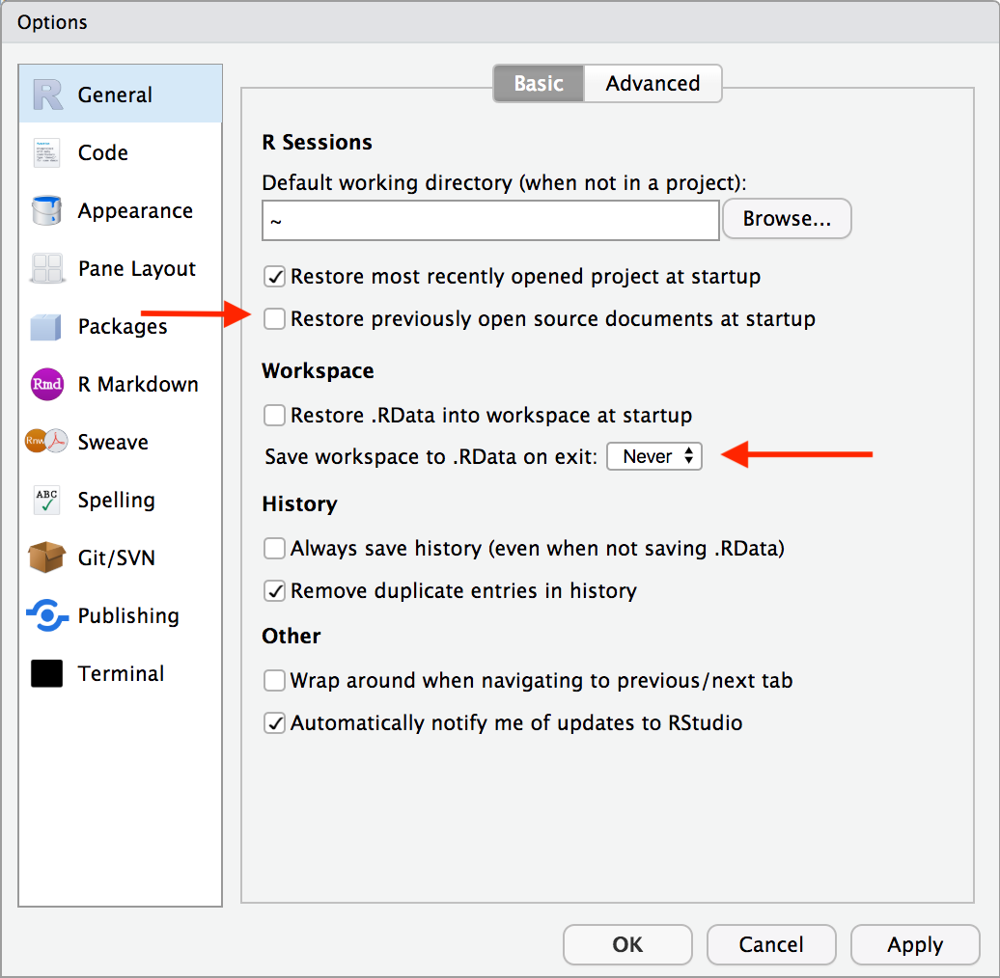
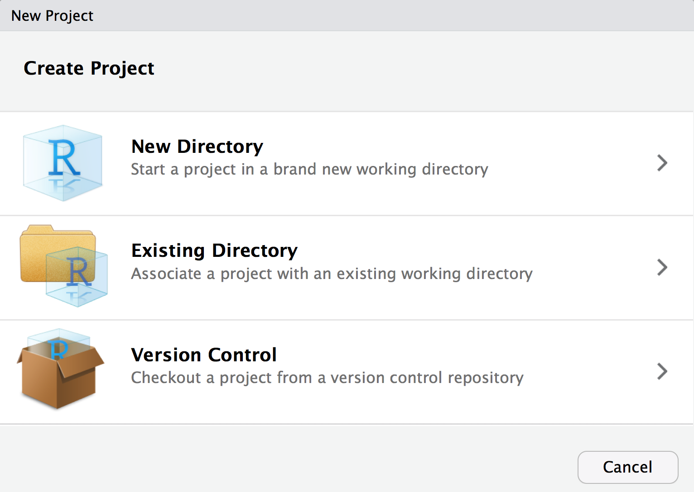
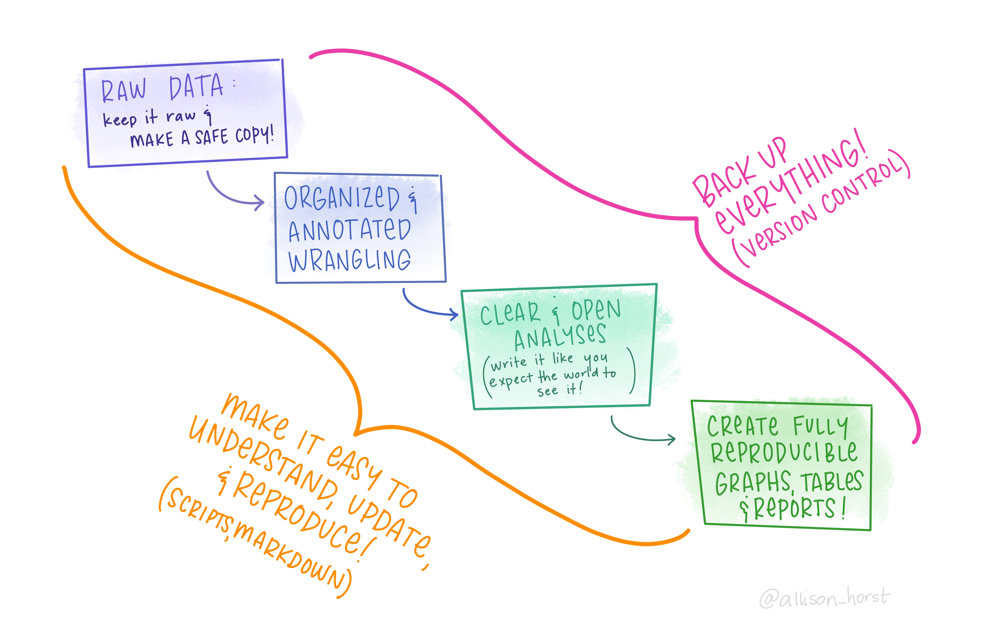

# Using R Effectively

```{r setup, include=FALSE}
knitr::opts_chunk$set(strip.white = TRUE)
```

<a href="exercises/Exercise2.Rmd" download>Exercise Sheet</a>

There are many things you can do to set yourself up for success and make your life easier (both now and in the future). It is really important to start implementing these good practices ASAP to establish good habits early on. It is much harder to break routines later. Both coding best practices in general as well as some things specific to R and RStudio will be covered below.

Remember the quote mentioned previously:

>**You are always working with at least one collaborator: Future you."<br>-Hadley Wickham**

Even if for selfish purposes only, and you ignore how this could impact anyone else, help future you. Do not put future you in a position where they are mad at present you!

## RStudio

### Settings

There are a number of settings tweaks that you will want to make to help force you into some good habits. 

{width=100%}

* "Restore .RData into workspace at startup" is <u>*unselected*</u>
  + This will make RStudio load the .RData file (if any) found in the initial working directory into the R workspace (global environment) at startup.
  
* "Save workspace to .RData on exit" is set to <u>*Never*</u>
  +  Ask whether to save .RData on exit, always save it, or never save it.
  
These basically just make it so that variables and other saved data floating around in your global environment get preserved and automatically loaded if R closes. This can create an over-reliance on things that just exist locally in your files. This is very much contra to the whole aim and benefit of reproducibility by using R! You should always be able to easily re-run your code and get anything you need. 

It can also cause weird behavior in between your R sessions because some things may still be saved in your workspace and you do not realize it.

It is thus best practice to not feel attached at all to the stuff in your workspace. If you need something, rerun your code to get it! If you have things that you think would be hard to replicate, that is a problem you need to fix!

Particularly because most of the time you cannot predict when things will go wrong...

{width=100%}
<p style="font-size:6pt">Artwork by @allison_horst</p>

The settings changes above help fix this. Something else that you can do yourself is to regularly restart R, clear all content, and re-run your code scripts (particularly if they are in development!). You can restart R from the *Session* menu, or the keyboard shortcut cmd/ctrl+shift+F10. You can clear your workspace and output by using the brooms!

```{r fig.align='center', out.width="500px", out.height="350px", echo = FALSE}
knitr::include_graphics("figures/fantasia_broom.gif")
```

* Upper right pane: click on environment tab, then click on the broom

* Lower left pane: in console tab (at the top right), click on the broom too

One other settings change to make is:

{width=100%}

* "Soft-wrap R source files" is *selected*
  + This will just make some of your written code easier to read, so you will not have to scroll horizontally. This only impacts working in RStudio, not your outputs!

Full explanation of the different RStudio settings can be found [here](https://support.rstudio.com/hc/en-us/articles/200549016-Customizing-the-RStudio-IDE).

## R Projects

Something that is strongly encouraged is creating a new R Project for every project you work on. There is a really great tutorial on R projects [here](https://alexd106.github.io/intro2R/project_setup.html). The section below will highlight and summarize a few key pieces of information from it.

### Why use them?

> "There’s nothing more frustrating than coming back to a project months (sometimes years) later and have to spend days (or weeks) figuring out where everything is, what you did and why you did it. A well documented project that has a consistent and logical structure increases the liklihood that you can pick up where you left off with minimal fuss no matter how much time has passed. In addition, it’s much easier to write code to automate tasks when files are well organised and are sensibly named. This is even more relevant nowadays as it’s never been easier to collect vasts amount of data which can be saved across 1000’s or even 100,000’s of separate data files. Lastly, having a well organised project reduces the risk of introducing bugs or errors into your workflow and if they do occur (which inevitably they will at some point), it makes it easier to track down these errors and deal with them efficiently."

### What are they?

> "An RStudio Project keeps all of your R scripts, R markdown documents, R functions and data together in one place. The nice thing about RStudio Projects is that each project has its own directory, workspace, history and source documents so different analyses that you are working on are kept completely separate from each other. This means that you can have multiple instances of RStudio open at the same time (if that’s your thing) or you can switch very easily between projects without fear of them interfering with each other."

### How do I make one?

You create a new project by going to *file -> new project*.

{width=100%}

> Once your new project has been created you will now have a new folder on your computer that contains an RStudio project file (which ends in `.Rproj`). This `.Rproj` file contains various project options and can also be used as a shortcut for opening the project directly from the file system (just double click on it). You can then access all the related files directly in RStudio under the ‘Files’ tab (see below).

{width=100%}
<div class="panel panel-success">
  <div class="panel-heading">**EXERCISE #1**</div>
  <div class="panel-body">Decide where you want your R and class files to live on your computer. Create a new project called "my_first_project" in that location. Open the .Rproj file and create and save a new RMarkdown file titled "notes".</div>
</div>

### File Paths

A file's path specifies where that file is located. It is like a map for your computer, giving it instructions on where to go to look for that specific file. When you download a file (e.g., **"dataset.csv"**), it likely would appear in your downloads folder. Thus, the full file specification would be:

For mac: `/users/user_name/Downloads/dataset.csv`

For windows: `C:\Users\user_name\Downloads\dataset.csv`

(Replacing "user_name" with whatever the user name on your machine is)

A file path is constructed by 2 parts: 

1. the file location: `/users/user_name/Downloads/` or `C:\Users\user_name\Downloads\`
2. the file name: `dataset.csv`

You do not have to specify the full file path if you change R's current *working directory*. Setting your working directory is basically telling R, "I'm going to be working in this specific place. So if you need to look for any files, they will be **here**. Also, if you create any files, create them **here**."

This can cause some issues though. If a file path tells your computer where to look for a file, and you set it to a folder in a specific place on your computer, then that code would not work if someone else tried to run it. Their computer could not access yours, and likely has a totally different file structure!

One of the best features of RStudio Projects is that it helps solve this issue! Instead of using **absolute** file paths like this (where it is fully specified), it will let you use **relative** file paths. In a **relative** file path, all file paths are *relative* to a particular directory. When you use an RStudio Project, upon opening a **.Rproj** file, it will automatically set your working directory to the location of that file! This way, if you want to share your project and analysis files with someone else, you just save and send the entire project directory. When they open it on their computer, the relative path will be appropriately set!

#### Here() {#here}

Kirill Müller has created an extremely useful R tool called `here`. 

{width=100%}
<p style="font-size:6pt">Artwork by @allison_horst</p>

The functions within the `here` package create paths relative to the top-level directory (aka the **root**). The top-level of the current project can be printed any time you call `here()`. For example, when I run `here()`, it will print out: `"/Users/ethan/Documents/Psyc193L"`, because my R Project folder is called **"Psyc193L"** and it's in my **Documents** folder.

You can also easily build a path relative to the top-level directory! Say for example that you made a "data" folder in your R Project directory (more about directory organization later), and put **"dataset.csv"** in there. You can use `here()` to get full relative file path like so:

`here("data", "dataset.csv")`

The output from this would be, `"/Users/ethan/Documents/Psyc193L/data/dataset.csv"`

These relative paths work regardless of where the associated file lives inside your project directory, and will work for anyone who downloads your project and runs that code on their own computer!

<div class="panel panel-success">
  <div class="panel-heading">**EXERCISE #2**</div>
  <div class="panel-body">Use `here()` to find the file path to your R Project and copy/paste it to the cell below. What would the `here()` command be to create the file path do your "notes" document? Include that below as well!</div>
</div>

### Introduction File

It is also a good practice to create a specific introduction file in the root of each project. Explain how to navigate the directory, where everything is, a synopsis of what the project/assignment is about, any of the materials needed to run the code you have, etc. Future you will thank you for doing this!

### TL;DR

* Create an RStudio Project for every data analysis project or assignment

* Keep all the files related to that project in that directory

* Save your outputs (plots and cleaned data) there as well

* Only ever use relative paths, not absolute paths
  + Specifically, use `here()`

* Create an introduction file for the project folder

## Literate Programming

Given the goals of reproducibility, one of the best things you can do is make sure your code is easy to understand and replicate. To do this, you should establish the routine of **literate programming**. 

Literate programming was originally proposed by Donald Knuth in 1984.

>"Let us change our traditional attitude to the construction of programs: Instead of imagining that our main task is to instruct a computer what to do, let us concentrate rather on explaining to humans what we want the computer to do."<br>
    — Donald E. Knuth, Literate Programming, 1984

In practice literate programming is a technique for mixing written text and chunks of code together, whereby you will annotate your code step-wise and explain what each part of your code is doing via comments throughout. This practice provides a much easier documentation of your code and the creation of written reports of your code and the results of your code.

### Markdown

R Markdown files were [previously](#file-types) introduced as the type of file you will mainly be using. Not only do they allow the combination of R code and text, but they also incorporate markdown syntax (which you can think of as its own mini language), HTML, and CSS! Thus, R Markdown files afford a powerful combination of languages to help create literate programming documents with easy to understand and reproduce analyses.

However, the true power comes from the ability to take markdown files and generate many different kinds of documents. When combined with some other packages (e.g., `knitr`), R Markdown files can be turned into:

* PDFs
* Microsoft Word documents
* Slideshows (like powerpoint or keynote)
* Web pages

In fact, this course website, all the course content, my personal website (and all parts of it), are all created in RStudio and written in a lot of R Markdown files!

#### Syntax

R Markdown syntax could be a whole course on its own, but there are a couple fundamental things worth knowing:

You can insert code chunks with the keyboard shortcut: ctrl+option+i on OSX or alt+i on Windows

```{r chunk_name, [options]}

## R code here

```

You should always name your chunks (part of literate programming), and there are a number of options you can set for them (that are chunk specific). Some include:

* Figure height and width
* Whether to **echo** (show) or **eval**uate (run) that code chunk in the final document (debugging tip! If you have a problem code chunk, set eval = `FALSE` so you can still knit, but leave yourself a note to fix it later!)
* Whether to show **warnings** and **messages**

You can see the full list of options [here](yihui.name/knitr/options/).

You can also write R code inline, or, without a chunk. You can do this by writing a set of backticks, r (lowercase) after the first, then a space and then your code. For example:

The mean is `` `r "\u0060r mean(x)\u0060"` ``.
    
When this document is generated, the R code will be evaluated and it will look as though "The mean is 14." (or whatever the mean of `x` happens to be) was written!

<div class="panel panel-success">
  <div class="panel-heading">**EXERCISE #3**</div>
  <div class="panel-body">Create a new code chunk in your R Markdown file. Name the code chunk "exercise 3", and copy/paste your file path from above.</div>
</div>

## Coding Best Practices

There are many best practices that are good to incorporate in your coding. Several of the main ones will be highlighted here, but a list of many others is included at the bottom.

### Develop a Naming Convention {#naming-convention}

One important thing to do initially is develop a naming convention. This is important both for objects AND your files.

Object names must start with a letter, and can only contain letters, numbers, `_` and `.`. File names require the same, but can also use `-`. However, you should avoid using `.` for both, and you should **never** use spaces! You want your names to be descriptive, so you will need a convention for multiple words. 

{width=100%}
<p style="font-size:6pt">Artwork by @allison_horst</p>

camelCase, where the first word is not capitalized and the first letter of each subsequent word is, is technically the most efficient in terms of keystrokes. You can run into some issues when using acronyms or singular letters (e.g., "RStudio" technically breaks this rule) though. More people have recently been recommending snake_case and arguing against the use of capital letters at all. Generally, only camelCase or snake_case are recommended.

You want to use names that are concise, unique, and meaningful (this is difficult!), avoiding terms that will be commonly repeated. This is also the case for your variable (column) and factor names as well. However, it IS helpful to develop a relatively consistent way of naming things for yourself. This helps make it easier to work with different projects (especially after some time). For example:

* x_df -- for dataframes
  + Where "x" is refers to the type of data or your experiment

* X_m -- for the mean of some data

* X_sd -- for the SD of some data

* X_se -- for the standard error of some data

<div class="panel panel-success">
  <div class="panel-heading">**EXERCISE #4**</div>
  <div class="panel-body">First, decide on a coding convention to use. Then, create a new code chunk named "coding convention". In it, save the name of your chosen coding convention as a string to a variable called "coding convention" that is formatted with that coding convention. For example, if you are going to use snake case, it would be called `coding_convention`.</div>
</div>

### Style and Syntax

> "Good coding style is like correct punctuation: you can manage without it, butitsuremakesthingseasiertoread."
<br>    - Hadley Wickham

Many of the following tips are highlights from the [tidyverse style guide](https://style.tidyverse.org/syntax.html). 

#### Spacing

In general, you want to aim to write your code to be legible. This is both for your sake AND others. R makes no difference between the following code:

```{r eval=FALSE}
#1
3*2/2*5/2

((3 * 2) / 2) * 5 / 2

#2
x=2+4

x = 2 + 4
```

* Always put a space after a comma, never before, just like in regular English:

```{r eval=FALSE}
# Good
df[, 1]

# Bad
df[,1]
df[ ,1]
df[ , 1]
```

* Do not put spaces inside or outside parentheses:

```{r eval=FALSE}
# Good
mean(x, na.rm = TRUE)

# Bad
mean (x, na.rm = TRUE)
mean( x, na.rm = TRUE )
```

* Place a space after () (used for function arguments):

```{r eval=FALSE}
# Good
function(x) {}

# Bad
function (x) {}
function(x){}
```

* Most operators (`==`, `+`, `-`, `<-`, etc.) should always be surrounded by spaces:

```{r eval=FALSE}
# Good
x + (3 * 4)

# Bad
x+(3*4)
```

#### Avoid Long Lines

Avoid writing code that takes up a lot of space horizontally. Use strategically placed line breaks and indentations, particularly after each argument/chunk of your code. You can use the keyboard shortcut cmd+i on OSX or ctrl+i on Windows to get R to automatically indent appropriately for you line-by-line!

```{r eval=FALSE}
# Good
do_something_very_complicated(
  something = "that",
  requires = many,
  arguments = "some of which may be long"
)

# Bad
do_something_very_complicated("that", requires, many, arguments,
                              "some of which may be long"
                              )
```

#### Misc.

* Use double quotes `"hello"`, not single quotes `'hello'`, for quoting text. The only exception is when the text already contains double quotes and no single quotes `"She said, 'hello.'"`.

* Use `TRUE` and `FALSE` over `T` and `F`

* Each line of a comment should begin with the comment symbol and a single space: 
`# `

* Index columns and subset rows by names or filtering, not numbers. Their order/position may change. Their name likely will not. 

* Pass named arguments into functions, not place. 

* DO NOT hardcode. Always softcode. It saves you from having to constantly update different sections of your code any time there is a change. 

<div class="panel panel-success">
  <div class="panel-heading">**EXERCISE #5**</div>
  <div class="panel-body">Clean up all the code below so that it follows the proper formatting guidelines listed above.</div>
</div>

### Document Organization

You want to organize your files and directory structure in a way that is easy to navigate. You may come back to files months or years later, and you want to make sure you will understand what you were doing and what files are where. Not to mention if you make your project files open and accessible to the public!

Some things that can help with this include:

* Separate your data cleaning and analysis codes. R Markdown files are helpful for this because you can abide by the separation of concerns principle and label your code sections. 

* Make text files for data if needed -- describing where it came from, coding the variables if needed, etc. 

* **Never** mess with your raw data (and keep backups). Try to touch it directly as little as possible.

* Use version control. Version control are systems that save changes as separate files. Using a system like git is helpful, and prevents you from having tons and tons of older versions of files on your computer.

As far as your markdown files themselves...

* All the needed packages should be loaded at the top of your document
* No package installations should be called/executed
* No warnings/messages should be printed when you load packages (turn on the options to hide these)
* Markdown formatting should be used to make your file easier to follow
* You should use relative file paths only, making use of the `here` package
* There should be no code chunks with errors!
* **NEVER EVER** print out an entire dataset (> 10 rows). This is *never* necessary.
* It is good to have a high text-to-code ratio!

### Visual Summary

{width=100%}
<p style="font-size:6pt">Artwork by @allison_horst</p>
