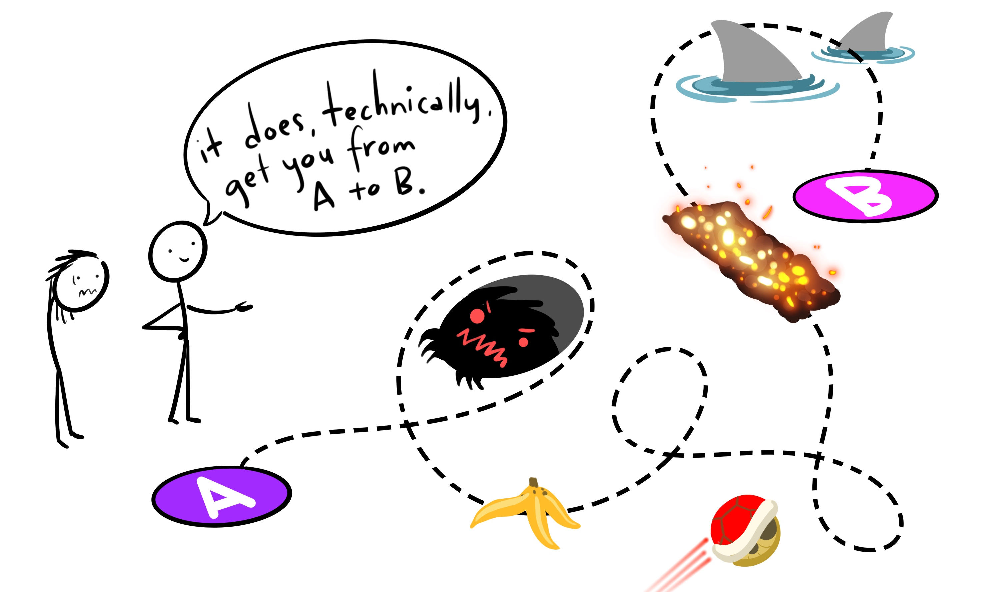

# Syllabus

## Basic Info

Psyc193L: Introduction to R for Social Sciences

Summer Session 2022

*Lecture:* MTuWTh 11:00a-11:50a

*Lab:* TuTh 12:00p-12:50p

## Course Description

  Whether in academia, industry, or clinical settings, if you are interested in social sciences or data science, you are going to have to work with data. You'll be using that data to perform analyses, make visualizations, and try to answer questions. Using programming languages and coding-based approaches are increasingly favored over GUI-based approaches (e.g., Excel, JMP, SPSS, etc.). The goal of this course is to provide an introduction to one such programming language, R.

## Course Objectives

There are 3 main sections of content in this course:

1. R Basics
2. Data Manipulation and Cleaning
3. Data Visualization


Along the way, you will learn how to use R to ...

* Import data for cleaning
* Wrangle and Prep data for analyzing
* Make publication-ready visualizations
  

Communicate what you have learned about your data ...

* In literate programming documents
* In an APA formatted written report


Contribute to open and reproducible science through ...

* Adopting good coding and project management practices
* Sharing your data and research reports online

This course is designed such that, by the end, you will be able to use R to successfully accomplish all the basic tasks you'll have to do in other classes or lab volunteering. Content was chosen specifically based on what other students have mentioned they do most often.

## What Kind of Preparation Is Expected For This Course?

None! There are no prerequisites for this course, nor do you need to have any prior knowledge or experience with coding. However, if you have such experience, you may find it useful. 

## Instruction Team

**Professor**

Name: [Ethan Hurwitz](https://www.ethanhurwitz.com/)

Email: ehurwitz@ucsd.edu

Office Hours: TBD

## “Lecture” vs. “Lab” Sessions 

  While the official schedule of classes specifies separate “lecture” and “lab” sessions for the course, do not take this distinction too seriously. “Lecture” sessions will not consist exclusively of traditional lecture, and “lab” sessions will not consist exclusively of traditional guided laboratory exercises. On any given day, you are likely to encounter some mix of brief lecture, group discussion, and/or hands-on activities.
  
## What Tools Will We Be Using In This Class?

All course materials are free. You have enough expenses, I am not interested in adding to them unnecessarily.

* **Computer with R and RStudio**
  + This is a programming course, it would be hard to get by without a computer! You will need to download R and RStudio.
  + You can download R [here](https://www.r-project.org/).
  + You can download RStudio [here](https://www.rstudio.com/products/rstudio/download/#download). You <u>must</u> download R **before** RStudio.
  + You can find a quick tutorial about getting R ready on your computer [here](http://web.cs.ucla.edu/~gulzar/rstudio/index.html).


* **Website**
  + You're looking at it right now! This website will be the main hub for course-related material. This is where I will be uploading lecture notes, information about assignments, etc.


* **Canvas**
  + Canvas will be used for posting grades. That's pretty much it!
  
  
<!-- * **[DataHub](https://datahub.ucsd.edu/hub/login)** -->
<!--   + Most of the R-based assignments will be completed through Jupyter notebooks on the UCSD  -->
<!-- DataHub website. -->
  
  
* **[Discord](https://discord.gg/ncbGmCEU38)**
  + We will use Discord as a central place to manage questions about the class, communicate with each other, and easily copy/paste code for sharing. 

  
* **[Zoom](https://ucsd.zoom.us/j/96247922618)**
  + Class will be remote, so all class periods and office hours will be held via Zoom!

## Grades

### What Are the Graded Assignments In This Class?

This class has **NO EXAMS**. Yes, that is right.

* Time constrained coding is not reflective of most real-world scenarios (at least those you'll initially find yourselves in).
* Exams would not do a good job of assessing whether you are learning what I want you to learn.

However, there must be ***some*** things to grade you on. They are the following:

**Attendance Activities**

* These are practice exercises done during lecture that apply the concepts/material I am introducing.
  + Forces you to engage with the material while it is being presented and provides some grade buffer with easy points.

**Practice Problem Sets**

* These will be similar in format to the practice exercises built into the lectures, but will be done on your own.
  + Provides you an opportunity to practice applying new skills and ideas on your own, but still in a directed, hand hold-y, way.

**Skills Challenges (3x)**

* There will be one skills challenge for each of the 3 main sections of content covered in this course.
  + Skills challenges will be similar to the practice question sets but may use different data.
  + They will also have some questions that are more abstract/conceptual, and require you really thinking about the data you are working with (similar to what you will be doing outside of this class).
  
**Data Science Vignettes**

* These will be completed towards the end of the course and are brief case studies of actual data science projects undertaken in Social Science fields. These will be an opportunity to see how all the skills you have learned in this course can be directly applied in various fields of Social Sciences.

<!--SUMMER ONLY-->
**Feedback Forms**

* This is a new course, using all brand new material made largely from scratch, and the first time it is being offered. I am particularly interested in getting feedback on... everything! What works, what does not, what was engaging, what was boring, what was helpful, etc. There will be very brief feedback surveys about all the material that will be graded only for completion.

<!--SUMMER ONLY-->

**Final Project**

There are two options, one that is more directed and one that is more open.

For the <u>directed</u> option, you will choose a dataset that has specific questions that you must investigate and try to answer. For the <u>open</u> option, you will choose a dataset and come up with your own question(s) to investigate and try to answer.

In both options, you will:

* Include a brief literature review to provide sources which help justify and provide rationale for your hypothesized answers to those questions. 
* Clean/change/modify/whatever the data to get it in the form you need, then create visualizations and summary statistics that try to test your hypotheses.
  + This will be reminiscent of what a Results section would look like from a peer-reviewed journal article.
* The paper will largely be explaining what you have done. 
  + What does the data contain? 
  + What are your questions? 
  + What are the possible answers? 
  + What are your predictions and why?
  + What would you expect to see if your predictions are accurate? If they are not accurate?
  + What did you do (explain your code in words)? 
  + Show the visualizations and summary statistics and explain/interpret them.
* The other thing you will do is create a literate programming document for your project. We will expound on this more later, but the code document you create will be thoroughly annotated for others' understanding.
* More information about this will be posted later.

### How Does Grading Work?

Graded assignments will be downloaded and submitted on Canvas. For each assignment, you will submit a knit .html document and the source .Rmd document (more on this in lecture).

This course is designed to facilitate your *engagement* and *effort* with the material. What is going to help you learn and develop R skills the most is to actually **practice doing** coding... a lot. It is thus, in my view, counter-productive to have a single heavily weighted assignment (exam) or for there to be high amounts of pressure to find the correct answer to every problem.

In service of this, there will be no exams. Additionally, the Practice Problem Sets, Skills Challenges, and Data Science Vignettes, will be graded 50% for completion and 50% for accuracy. To earn the completion portion of the credit, you must demonstrate that you were actually engaging with the material in a meaningful way and trying your best. You will not earn this credit by just copy/pasting the same bit of code, or writing, "I don't know," for each question. I will check this.

### Is Code Graded For Quality?

NO!

{width=100%}
<p style="font-size:6pt">Artwork by @allison_horst</p>

This is an intro course that assumes no prior knowledge. As long as your code ultimately gives you what you want, and you aren't cheating or breaking any rules, it doesn't matter how circuitous or un-glamorous that code is!

### Grade Breakdown

The full grade breakdown is as follows:

```{r Grade Breakdown, echo=FALSE, message=F, warning=F}
library(tidyverse)
kableExtra::kbl(data.frame("Assignment" = c("Attendance Activities",
                                            "Practice Problem Sets",
                                            "Skills Challenges +\n Vignettes",
                                            "Final Project",
                                            "Feedback Forms"), 
                           "Total Percentage" = c("20", "20", "30", "25", "5")#,
                           #"Breakdown" = c("<b>test</b>", "*test*", "**test**", "`test`")
                           ), col.names = c("Assignment", "Total %")) %>%
    #kableExtra::kable_paper("striped", full_width = T) %>%
    #column_spec(5:7, bold = T) %>%
    #kableExtra::row_spec(1, bold = T, color = "white", background = "grey")
  #kable_material(c("striped", "hover"))
    kableExtra::kable_styling(bootstrap_options = c("striped", "hover", "condensed", "responsive"), position = "center")
```

Final letter grades in the course will be assigned according to the following percentage scale: 

```{r Grade Range, echo=FALSE, message=F, warning=F}
library(tidyverse)
kableExtra::kbl(data.frame("A" = c("A+", "A", "A-"), 
                           "A2" = c("TBD", "93.00+ ", "90.00-92.99"),
                           "B" = c("B+", "B", "B-"),
                           "B2" = c("87.00-89.99",
                                    "83.00-86.99",
                                    "80.00-82.99"),
                           "C" = c("C+", "C", "C-"),
                           "C2" = c("77.00-79.99",
                                    "73.00-76.99",
                                    "70.00-72.99"),
                           "Other" = c("D", "F", ""),
                           "Other2" = c("60.00-69.99",
                                        "00.00-59.99",
                                        "")), col.names = NULL) %>%
    #kableExtra::kable_paper("striped", full_width = T) %>%
    #column_spec(5:7, bold = T) %>%
    #kableExtra::row_spec(1, bold = T, color = "white", background = "grey")
  #kable_material(c("striped", "hover"))
    kableExtra::kable_styling(bootstrap_options = c("striped", "hover", "condensed", "responsive"), position = "center")
```

  Grades will be rounded to the nearest hundredth of a point and the stated letter grade cutoffs will be applied without exception. There is no plan to “curve” grades in this course. Your instructor reserves the right to adjust all students’ grades up by a set value if deemed appropriate, and grades will not be adjusted down under any circumstances.  
 
  To earn an A+ in this course, you must do work of truly outstanding quality. A+ grades will be awarded at my discretion (there is no set grade percentage to earn this grade). 

## Course Policies and Other Information

### Academic Integrity

  All students are expected to adhere to standards of academic integrity. Cheating of any kind on any assignment will not be tolerated. It is disrespectful to your peers, the university, and to me. Especially considering this course is designed with a grading scheme that rewards effort and engagement and does not disproportionately favor correctness.

  If you are unsure what might constitute a violation of academic integrity, consult me and/or the [UCSD website on academic integrity](http://academicintegrity.ucsd.edu). Any evidence of academic misconduct will be reported to the Academic Integrity Office. Consequences for academic misconduct may include a failing grade in the course and official action by the University. <u>**Please, do not make me have to do this.**</u> If you are struggling with the course content or anything else, **reach out to me**.

### Attendance

  Attendance is <u>strongly encouraged</u>, and the decision to hold the course remotely was made in order to maximize the ability for students to attend synchronously, but is not required. Participation is based on activity completion, which can be completed asynchronously. However, it is much more difficult to do so this way.

### Extensions

  Most assignments have due dates that give you a fair amount of time to complete them. Granted, it is a Summer Session course, so things move at an accelerated pace. That said, I am a pretty reasonable person and will grant extensions under *reasonable* circumstances (being stressed will not warrant an extension). Please reach out to me if you are struggling or any unique situations arise.

### Email/Discord DMs

  If you would prefer to ask a question privately, you may DM me on Zoom, email me, send me a DM on discord, or come to my office hours. My preference would be a Zoom DM or Discord DM, as I will check those more frequently. If you choose to email, please include “PSYC 193L” in the subject line of your emails. Doing this will make sure I see your message in a timely manner. 

### OSD Accommodations

  Any student with a documented disability will be accommodated according to University policy. For details, please consult the Office of [Students with Disabilities (OSD)](http://disabilities.ucsd.edu). If you require accommodation for any component of the course, please provide me with documentation from OSD as soon as possible. ***Please note that accommodations cannot be made retroactively under any circumstances***. For example, if you submit a Skills Challenge and afterward provide documentation that you require extra time, you will receive accommodation only on subsequent assignments and not on the one that you have already taken. 

### Extra Credit

  You may earn up to 2 points of extra credit which will be added to your overall grade in the course. One of those points can be earned by completing SONA participation credits (worth 0.5 points each). To sign up for an experiment, go to the [SONA website](https://ucsd.sona-systems.com). To earn the full point of extra credit in the class, you must complete 2 SONA credits.
 
  The second extra credit point can be earned by completing the CAPEs for our course as well as an additional survey sent out at the end of the quarter. If 80% of the class completes both surveys, the entire class will earn 1 extra credit point. 

## What We Expect From You

### Values We Share:

  We are genuinely committed to equality, diversity, and inclusion in this course. Consistent with the [UC San Diego Principles of Community](https://ucsd.edu/about/principles.html), we aim to provide an intellectual environment that is at once welcoming, nurturing and challenging, and that respects the full spectrum of human diversity in race, ethnicity, gender identity, age, socioeconomic status, national origin, sexual orientation, disability, and religion. We sincerely hope that you will share our commitment to actively creating and maintaining a safe environment founded on mutual respect and support. To be clear, this course affirms people of all gender expressions and gender identities. If you prefer to be called a different name than what is indicated on the class roster, please let me know. Feel free to correct me on your preferred gender pronoun. If you have any questions or concerns, please do not hesitate to contact me.

### Code of Conduct:

  You do not need to become friends with all of your fellow students in class, but you are expected to treat me and them with courtesy and respect. This class should be a harassment-free learning experience for everyone regardless of gender, gender identity and expression, sexual orientation, disability, physical appearance, body size, race, age, or religion. Harassment of any form will not be tolerated. If someone makes you or anyone else feel unsafe or unwelcome, please report it to me as soon as possible. If you are not comfortable approaching me, you may also contact the [UC San Diego Office of the Ombuds](https://ombuds.ucsd.edu/).

## What Will We Learn?

This is a brand new course, and the first time it is being offered. When designing a new course, there is a lot of content you could potentially cover!

{width=100%}
<p style="font-size:6pt">Artwork by @allison_horst</p>

In choosing what content to include, this was my philosophy:

* I wanted to spend more time practicing a few skills so they could be deeply learned, rather than cover a broader array of material with less depth.
  + Focusing on a narrower amount of content affords more practice time with that content and better learning.
* I decided to focus on the skills and things you are most likely to be applying soon after this class
* I spoke with students who have come out of my other R classes, asked them:
  1. What do they do/use most often?
  2. What do they wish they had learned?
  3. Showed them some things I considered including and asked if they thought it would have been helpful.
* The answers to these questions helped me determine what content to include in this class.
* I am always happy to chat about things outside the scope of course content! In office hours or email/discord/whatever.

	<!-- - Brief overview of what we’ll cover -->
	<!-- - Philosophy / reasoning on why and how I’ve chosen what I’ve chosen. -->
	<!-- 	- Want to spend more time practicing a few things to deeply learn them rather than cover a broader array of material with less depth -->
	<!-- 	- Decided to focus on the skills and things you are most likely to be applying soon after this class -->
	<!-- 	- Talked with students who have come out of my other R classes, asked them 1. What do they do/use most often, 2. What do they wish they had learned, 3. Showed them some things I considered including and asked if they thought it would have been helpful. -->
	<!-- 	- Whereas most Social Psychology courses involve material that requires declarative knowledge, or the knowledge about facts, this course requires procedural knowledge. Learning programming is like learning a language, because it literally **is** learning a language. When you're learning to drive, you can't just read about different driving tips and best practices, you have to actually go out and get behind a wheel and practice. It requires procedural knowledge. With that in mind, focusing on a narrower amount of content affords more practice with that content and better learning. -->
	<!-- 	- Always happy to chat about things outside the scope of course content! In office hours or email/discord/whatever -->
		
## Schedule

SCHEDULE HERE

## Words of Encouragement

Learning a new language, particularly a programming language, can be frustrating at times!

{width=100%}
<p style="font-size:6pt">Artwork by @allison_horst</p>

It is truly a roller coaster. With time, effort, and perseverance,<!-- and maybe some wine/Beyoncè playlists,--> you will be surprised at how much you know and are able to do (and how much *more* you can learn and do)!

{width=100%}
<p style="font-size:6pt">Artwork by @allison_horst</p>

## How to be Successful in this Course:

1. Learn how to troubleshoot things on your own. This entails learning how to google and how to debug. This is NOT because we don’t want to help you, but because the most impactful learning can come when you solve a problem yourself.

2. Don’t hesitate to ask questions or for help. If you try to solely struggle alone, it will often not work out well. Ask the teaching team or your classmates questions. 

3. Pay attention. It should be obvious but this is an advanced and hard course. If you don’t come prepared to learn and paying attention, it will be really difficult for you.

4. Practice. Again, this is a skill. You cannot learn R effectively by just reading instructional material. You have to actually do it yourself. Write shitty code, have it fail, see what went wrong, read the error messages, and then write better code. 

5. Try to keep a good mindset. Acknowledge that this is challenging, but is not impossible, that you have help available and know what our expectations are for you.

6. Be proactive. This is a Summer Session course, and we will be moving very quickly through material. If you constantly wait until the last minute to do things, you run the risk of not only just missing work, but falling behind and having trouble being able to catch up.

## Acknowledgements

I'd like to directly thank [Emma Geller](https://www.lime-lab-ucsd.com/people) (endlessly), [Judy Fan](https://cogtoolslab.github.io/people.html), and Angela Lowe, for sharing their syllabi materials, teaching philosophy, and mentorship.<!--, and [Natalia Pallis-Hassani](https://www.linkedin.com/in/natalia-pallis-hassani-865ba3193) for feedback in developing course material.--> Throughout this course, I will use many illustrations created by the brilliant [Allison Horst](https://www.allisonhorst.com/). 
