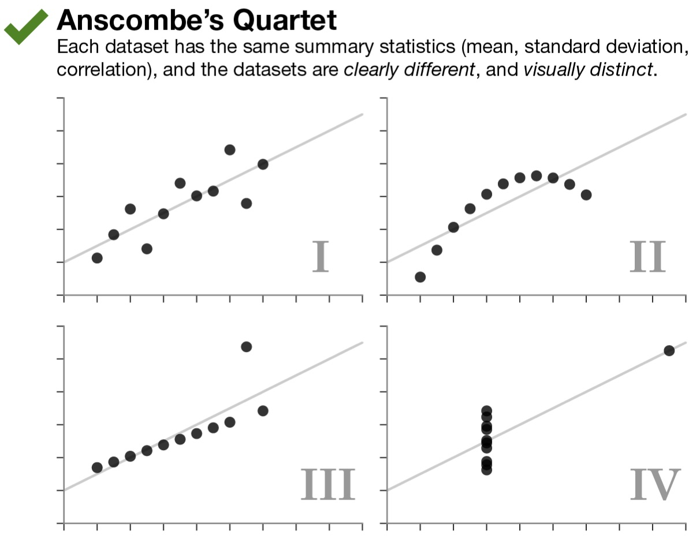
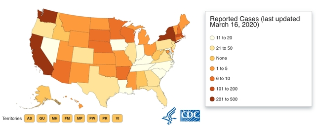
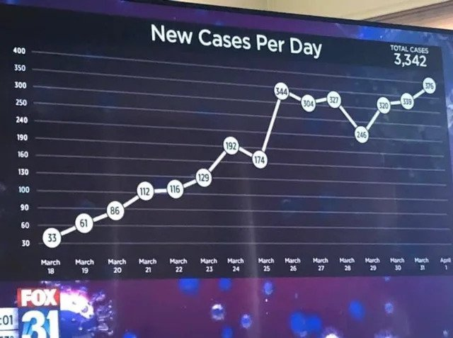
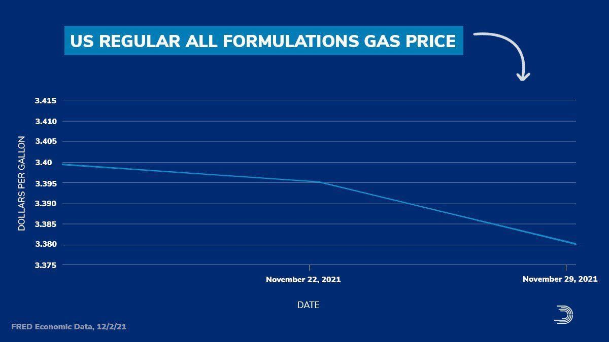
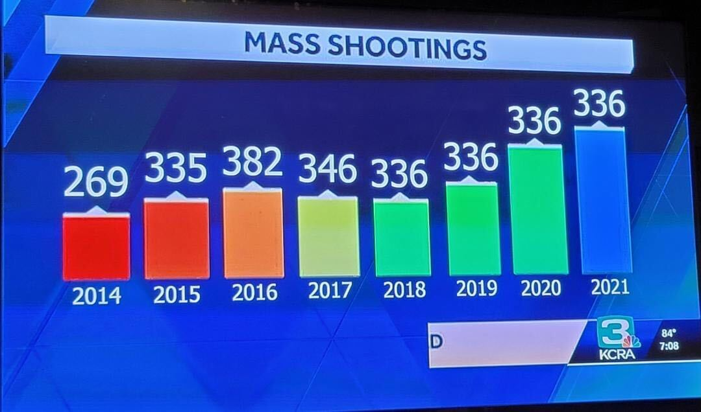
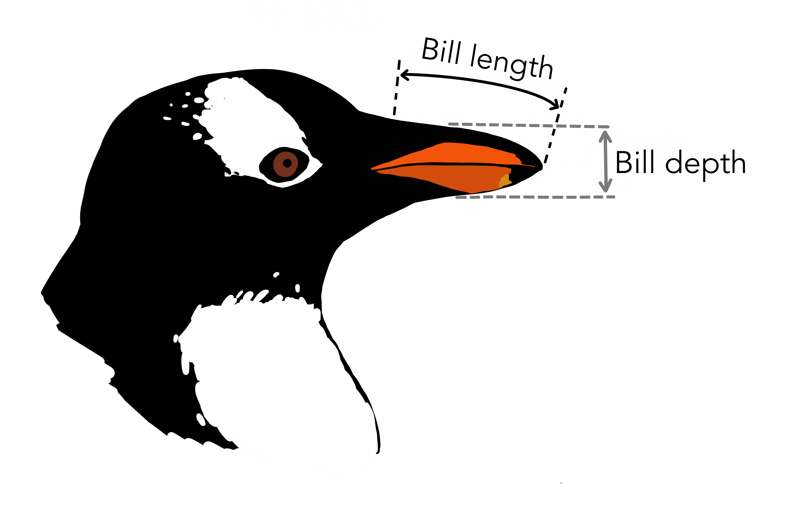

# (PART\*) Visualizations {-}

# Intro to ggplot2

```{r setup, include=FALSE}
knitr::opts_chunk$set(strip.white = TRUE)
```

```{r message=FALSE}
library(tidyverse)
library(palmerpenguins)
```

<!-- <a href="exercises/Exercise_Viz1.Rmd" download>Exercise Sheet</a> -->

> "The greatest value of a picture is when it forces us to notice what we never expected to see."<br>— John Tukey

>"There is no single statistical tool that is as powerful as a well‐chosen graph." (Chambers et al. 1983)

<span style="font-size:14.0pt"><b><u>Why Do We Care About Visualizing Our Data?</u></b></span>

Consider the following scenario:

There are two different datasets, each comprised of individuals measured on two outcomes (say height and weight). The mean and standard deviation of height and of weight are the same in both datasets. The correlation between height and weight is the same in both datasets as well. By every statistical metric, these datasets are the same. So, they must ***look*** similar, right?

Click the button below:

<button class="btn btn-primary" data-toggle="collapse" data-target="#BlockName"> Show/Hide </button>  
<div id="BlockName" class="collapse">  

```{r out.width = "100%", echo=FALSE}
knitr::include_graphics(c("figures/DinoSequential.gif"))
```

```{r out.width = "100%", echo=FALSE}
knitr::include_graphics(c("figures/datasaurus_dozen.jpeg"))
```
</div>
<br>

This collection of data is called the [datasauRus](https://github.com/jumpingrivers/datasauRus), and more information about how these were generated can be found in  [this](https://www.autodesk.com/research/publications/same-stats-different-graphs) technical paper. This is a modern version of the famous Anscombe's Quartet:

{Width=100%}

All four of these datasets have matching n's, means, standard deviations, and correlations. This means that the slope and intercept, and corresponding statistical tests, will all be equivalent. The data **clearly** look different though. (These data are built into R in an object called `anscombe`, which you can look at to test this for yourself!)

The key point here is that the summary statistics of some variables and their linear relationships inherently overlook some aspects of the data. This highlights the critical importance of visualizing your data, and not just relying on summary statistics alone. The point of a visualization, just like a summary statistic, is to understand a relationship or pattern in your data. However, by looking at the raw data itself, you do not run the risk of missing things the way you do by relying on summary statistics alone.

## When Visualizing Go Wrong

It is easy enough to just say, "Look at your raw data! Create a visualization!" However, a bad visualization is often times worse than no visualization at all. One of the things that the Covid-19 pandemic brought with it originally was a plethora of data visualizations. Below are a few that were observed out in the real world over the last 2 years:

{width=100%}

{width=100%}

{width=100%}

{width=100%}

So, it is not enough to just make *some* visualization, it is important to also consider the principles that make a ***GOOD*** visualization. Over the next few lessons, both will be covered.

```{r, echo=FALSE,out.width="49%", out.height="20%", fig.cap="caption", fig.show='hold', fig.align='center'}

``` 

## ggplot2

Data visualization is one of the things that sets R apart from other programming languages that can be used for statistics, like Python. R still has the best data visualization capabilities, and it is one of the primary reasons it is used over Python in Social Sciences. This is also one of the first times you will get to see what coding can be all about. You are actually going to be creating stuff with your code!

In this class, the `ggplot2` package will be used to create visualizations. Graphs are constructed by mapping data to geometric objects (lines, bars, points, etc.) according to some aesthetic attributes (color, shape, size, etc.). `ggplot2` uses this to inform its grammar.
		
{width=100%}
<p style="font-size:6pt">Artwork by @allison_horst</p>

### Meet the Penguins

To create visualizations, you need some data to visualize! The `palmerpenguins` dataset from [Alison Horst](https://allisonhorst.github.io/palmerpenguins/) will be used to create examples throughout.

{width=207px}

This dataset contains measurements from `r nrow(penguins)` different penguins. Measurements include things like bill length and depth, sex, among others.

{width=100%}
<p style="font-size:6pt">Artwork by @allison_horst</p>
<br>

There are `r length(unique(penguins$species))` different species of penguins in this dataset, collected from `r length(unique(penguins$island))` islands in the Palmer Archipelago, Antarctica.

{width=100%}
<p style="font-size:6pt">Artwork by @allison_horst</p>

Use the `library(palmerpenguins)` call to load in the dataset.

## A Basic Graph

The most sensible place to start is building a basic graph. There are going to be <u>**LOTS**<u> of exercise breaks throughout.

<p class="text-info"> **<u>Note:</u> As you move forward with building your first graph, each new piece of code added will be accompanied by a literate programming portion, where you will describe in words what the code is doing.**</p>

All ggplot graphs are build using the `ggplot()` call. The first thing it needs is some data. The `%>%` will be used to pass in the `penguins` dataframe.

```{r}
penguins %>%
  ggplot()
```

> **Start by telling ggplot to use the `penguins` dataframe for the data**

Woo! This actually created something. A grey rectangle! Of course, the code above alone will not do anything. You have to tell ggplot what you want to plot. Hmm... As an example, consider how a penguin's `bill_length_mm` is related to its `flipper_length_mm`. You might imagine that bigger penguins would tend to have longer bills and flippers, but maybe not? That is why you create visualizations, to try and help answer questions you may have about your data (which consist of samples thought to be representative of the world at large)!

ggplot needs to be told what variables from your data should be mapped to the aesthetics you want to render on your graph. You will do that with the `aes()` call, and start with specifying what to display on each axis.

```{r}
penguins %>%
  ggplot(mapping = aes(y = flipper_length_mm,
                       x = bill_length_mm))
```

>"Start by telling ggplot to use the `penguins` dataframe for the data, **map flipper length to the y-axis and bill length to the x-axis.**"

Above, it was specified that `flipper_length_mm` should be on the y-axis, and `bill_length_mm` on the x-axis (it is good practice to specify *y* first and *x* second). All aesthetic mappings must be separated by a comma, and it does not matter the order you list them (though it is good practice to start with the axes first). As you can see, ggplot figured out how to label the axes on its own. 

<!-- <div class="panel panel-success"> -->
<!--   <div class="panel-heading">**EXERCISE 1**</div> -->
<!--   <div class="panel-body">Create your own graph using the `penguins` data and pick 2 of the following to put on your x and y axes: `bill_length_mm`, `bill_depth_mm`, `flipper_length_mm`, or `body_mass_g`.</div> -->
<!-- </div> -->
<!-- <br> -->
ggplot was told what the aesthetic mappings are (what data source to use), but not what it should render from those mappings! You want ggplot to use those mappings to construct some **geom**etric object, and the way you do that is by adding a *geom*, aptly named. There are a number of different geoms, which have the general syntax of `geom_X()`, where X usually refers to the specific geometric object you want to render. Here, you want a point on the graph for each penguin, so `geom_point()` will be used.

<p class="text-info"> **<u>Note:</u> There are a TON of different geoms. You will see many more later.**</p>

```{r}
penguins %>%
  ggplot(mapping = aes(y = flipper_length_mm,
                       x = bill_length_mm)) +
  geom_point()
```

> "Start by telling ggplot to use the `penguins` dataframe for the data, map flipper length to the y-axis and bill length to the x-axis. **Represent each observation with a point.**"

Okay, **NOW** we are talking! This looks like an actual real graph. Look at your very first ggplot masterpiece!

There are two important things to note here:

1. The `+` was used instead of `%>%` to add on a new function. The ggplot system is additive/layered, which is a very powerful idea that will be explained later. For now, it is enough to know that the `geom_point()` was being added to the code. You do not want to take the `penguins %>% ggplot(mapping = aes(y = flipper_length_mm, x = bill_length_mm))` code and use it as the argument for the `geom_point()` function, which is what would happen if a `%>%` was used to pipe it! You want to just add the points on top of the existing base that code created, which is why the `+` is used.

2. When running this code, in addition to creating the graph (in the "Plots" section of RStudio or inline under your code), the following showed up in the console: 

<p style="color:#A79BF0"> **Warning message:<br>Removed 2 rows containing missing values (geom_point).**</p>

Looking at your warnings and errors is always important, but especially so when creating visualizations! This says that it removed 2 rows of data, which may not seem like a big deal but you do not want your visualizations to be misleading. Especially when you start visualizing summary statistics (like means). If you look at your actual data though, you can verify that there are two penguins that do not have a measurement value for flipper length or bill length. So obviously without either or both of those, it cannot be included on the graph. In this case, this is okay, but it is important to always verify!

::: {.rmdtip}
<p style="font-size:10pt"><u>**NOTE:**</u> *moving forward, for pedagogical purposes this warning message will be hidden so the output from subsequent code is cleaner. However, those 2 rows are still being removed!*</p>
:::

Above, it was noted that the goal of a visualization is to understand a relationship, or pattern, in your data. For every visualization you make, a verbal description of the pattern seen (should one exist!) will be provided underneath. This will help develop an intuitive **graph literacy**. Being able to quickly and accurately interpret visualizations is an important skill, and one of the pillars of this course. 

::: {.rmdimportant}
<p style="font-size:10pt">*Things related to graph literacy and comprehension will appear in boxes like this moving forward!*</p>

In the visualization it can be seen that, generally speaking, penguins with greater flipper length tend to have greater bill length as well. There seems to be a positive linear relationship between bill length and flipper length such that, as flipper length increases, bill length increases in turn.
:::

<p class="text-info"> **<u>Note:</u> You have to use a lot of tentative language and include many qualifiers here. No formal statistical analyses have been done to afford the ability to state any relationship or effect definitively.**</p>

<!-- <div class="panel panel-success"> -->
<!--   <div class="panel-heading">**EXERCISE 2**</div> -->
<!--   <div class="panel-body">Update your graph above by telling ggplot you want it to render a point for each observation in the penguins dataset. Describe the pattern/relationship you see.</div> -->
<!-- </div> -->

## References:

Horst AM, Hill AP, Gorman KB (2020). palmerpenguins: Palmer Archipelago (Antarctica) penguin data. R package version 0.1.0. https://allisonhorst.github.io/palmerpenguins/
