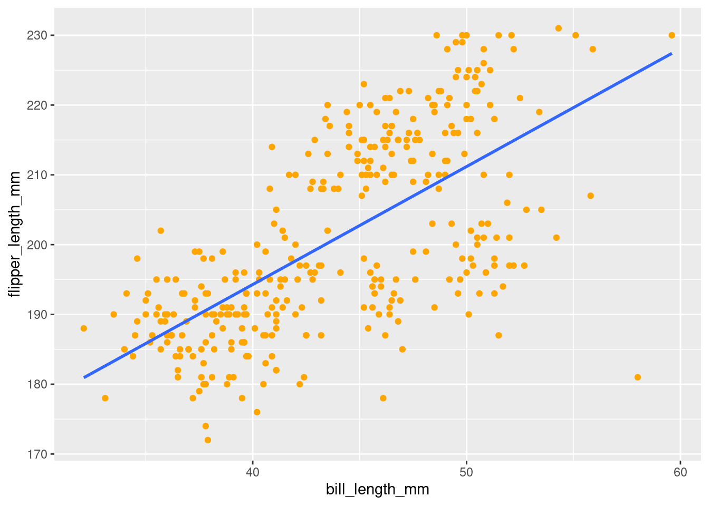
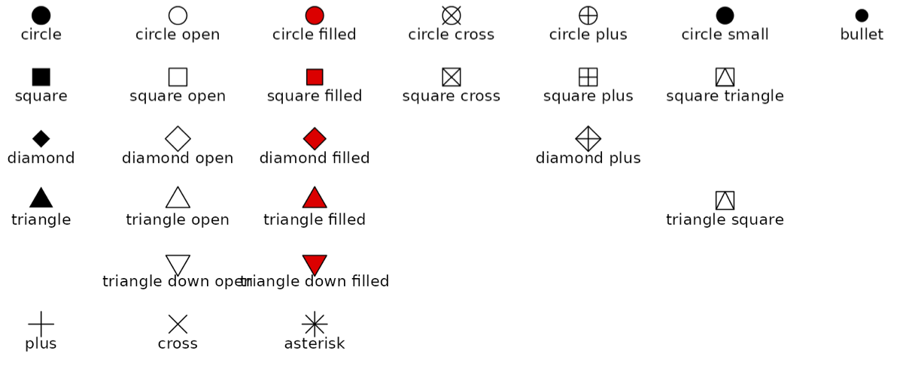
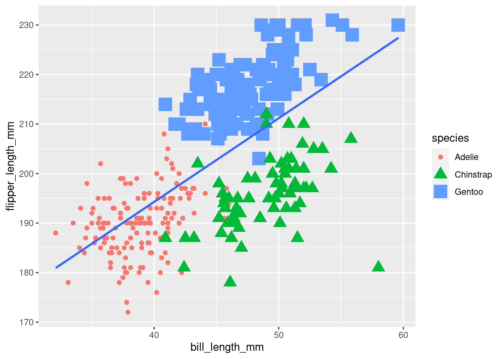

# Aesthetics


```r
library(tidyverse)
library(palmerpenguins)
```

## Color


In looking at the graph created in the last section (shown above), it kind of seems like there may be different groups or clusters of penguins in this data. When you notice a pattern like this, it is worth looking into further and considering what variables you have in our data that could be related.

One way the penguins seem to be grouped is with a cluster at the top and another at the bottom:


This might correspond to the `sex` variable in the dataset! Maybe it is the case that the bigger penguins were males, and the smaller ones were females?


This idea could be explored if there was some way to visually indicate which of the observations on the graph were from male penguins and which were from female. Specifically, you want the *color* of the points to different based on the value for that observation's `sex`. In fact... you can do just that! One of the best parts about coding is, you can always just try to run some code and see what happens!

::: {.rmdwarning}
<p style="font-size:10pt">It is often helpful to declare formal predictions. To do so, you specify two mutually exclusive alternatives that you *could* see when exploring some idea.</p>

* "If it is the case that the differences in penguin size could be explained by what sex they are (e.g., bigger penguins were males and the smaller ones were females), then all the points in the cluster at the top would be one color and all the points in the cluster at the bottom would be a different color. If it is not the case that the differences in penguin size could be explained by what sex they are, the points in each of the two clusters would not have distinct colors."
:::


```r
penguins %>%
  ggplot(mapping = aes(y = flipper_length_mm,
                       x = bill_length_mm),
         color = sex) +
  geom_point()
```


Uh... okay. So, that did not work. OH! Remember from above that `aes()` is used to tell ggplot what variables from the data should be *mapped* to the aesthetics you want to render on your graph? Color needs to be passed as another argument to the aesthetics of the plot via `aes()`. 


```r
penguins %>%
  ggplot(mapping = aes(y = flipper_length_mm,
                       x = bill_length_mm,
                       color = sex)) +
  geom_point()
```


> "Start by telling ggplot to use the `penguins` dataframe for the data, map flipper length to the y-axis and bill length to the x-axis. Represent each observation with a point, **and map sex to the color of each point.**"

That is more like it! This does not really look like what you may have thought it might though. It is consistent with the other possible outcome, where sex does not explain the differences in penguin size. However, after looking at this more carefully, it actually kind of looks like there are 3 distinct clusters, not 2.


This might correspond to the `species` variable in the dataset! Maybe it is the case that different penguin species differ in size? That actually makes a lot more sense. This idea can be tested as well!

::: {.rmdwarning}
* "If it is the case that the differences in penguin size could be explained by what species they are, then all the points in each cluster would have distinct colors. If it is not the case that the differences in penguin size could be explained by what species they are, the points in each of the clusters would not have distinct colors."
:::


```r
penguins %>%
  ggplot(mapping = aes(y = flipper_length_mm,
                       x = bill_length_mm,
                       color = species)) +
  geom_point()
```


> "Start by telling ggplot to use the `penguins` dataframe for the data, map flipper length to the y-axis and bill length to the x-axis. Represent each observation with a point, **and map *species* to the color of each point.**"

::: {.rmdimportant}
In the visualization it can be seen that, generally speaking, penguins with greater flipper length tend to have greater bill length as well. There seems to be a positive linear relationship between bill length and flipper length such that, as flipper length increases, bill length increases in turn. **Additionally, penguins of the same species tend to have similar flipper and bill lengths, which are distinct from other species. Adelie penguins tend to have the shortest lengths, and Gentoo the longest. Chinstrap penguins seem to have shorter flippers but longer bills.**
:::

Hot dang, looks like this could be a promising explanation for how penguins differ in size! There would obviously need to be some kind of formal statistical analysis to know for sure, but visualizing your raw data in ways like this allow you to quickly get insights into different questions you may want to use your data to answer.

<!-- <div class="panel panel-success"> -->
<!--   <div class="panel-heading">**EXERCISE 1**</div> -->
<!--   <div class="panel-body">Think about what patterns you notice in the visualization you created, and test whether `sex` or `species` might explain those patterns. Make a prediction, test that prediction, and then describe what you see.</div> -->
<!-- </div> -->


### Global vs Local Aesthetics

When first describing This visualization, one of the things noted was that, *"There seems to be a positive linear relationship between bill length and flipper length such that, as flipper length increases, bill length increases in turn."* It can be helpful to add the line of best fit to actually see this linear relationship. You can do this by using `geom_smooth()`. A few arguments need to be set within `geom_smooth()`, but you do not have to worry much about those.

The code from above will be copy/pasted and the new `geom_smooth()` call can be added directly to it. By doing so the best fitting line for all of the data will be displayed.


```r
penguins %>%
  ggplot(mapping = aes(y = flipper_length_mm,
                       x = bill_length_mm,
                       color = species)) +
  geom_point() +
  geom_smooth(method = "lm", se = FALSE)
```


>"Start by telling ggplot to use the `penguins` dataframe for the data, map flipper length to the y-axis and bill length to the x-axis. Represent each observation with a point, and map *species* to the color of each point. **Add a line of best fit for the data.**"

Hey, wait, that is not quite what was expected... Instead of there being one line for all of the data, it looks like there is a line for each species. What is happening here is highlighting the difference between a **<u>global</u>** aesthetic (those put in the `ggplot()` call and apply to ALL added parts of your graph) and a **<u>local</u>** aesthetic (those put in individual geoms and apply only to those individual ones).

Color should be moved into the `geom_point()` call, because that is the only thing that should be mapped to the values of `species` in the data.


```r
penguins %>%
  ggplot(aes(y = flipper_length_mm,
             x = bill_length_mm)) +
  geom_point(aes(color = species)) +
  geom_smooth(method = "lm", se = FALSE)
```


Alright! The points are still colored by species, but there is just the one line for all the data, as was originally intended. You will also notice that a `mapping=` was not specified in `geom_point()`, and it was removed from the `ggplot()` as well! It actually is not necessary to specify that. Once you have the hang of things, you can leave that part out.

<!-- <div class="panel panel-success"> -->
<!--   <div class="panel-heading">**EXERCISE 2**</div> -->
<!--   <div class="panel-body">Add in the line of best fit to your graph with `geom_smooth()`, making sure that your code produces a single line that is fit to ***all*** your data.</div> -->
<!-- </div> -->


### Setting vs Mapping Aesthetics

Above, to change the color of your points (and inadvertently our line of best fit), the `color` argument was specified in the `aes()` call to map the values to the `species` variable in the data. What if you did not want to map something to a variable in your data? What if you just want to set the value of something yourself? You might think, "maybe I just take it out of the `mapping = aes()` part?" And you would be right, because you are smart! Look at the example below that does just that to try and change all the points to orange (so they have a good contrast with the line).


```r
penguins %>%
  ggplot(aes(y = flipper_length_mm,
             x = bill_length_mm)) +
  geom_point(color = orange) +
  geom_smooth(method = "lm", se = FALSE)
#> Error in layer(data = data, mapping = mapping, stat = stat, geom = GeomPoint, : object 'orange' not found
```

Well, okay, this obviously is not right because it results in an error:

<p style="color:#A79BF0"> **Error in layer(data = data, mapping = mapping, stat = stat, geom = GeomPoint, : object 'orange' not found**</p>

By writing `orange` like this, R thinks it is a variable in the `penguins` dataset that was piped in to ggplot! To tell R that this **is NOT** a variable/object that is defined, and instead just the color orange, you use quotes.


```r
penguins %>%
  ggplot(aes(y = flipper_length_mm,
             x = bill_length_mm)) +
  geom_point(color = "orange") +
  geom_smooth(method = "lm", se = FALSE)
```



Much better! You can do this for any geom:


```r
penguins %>%
  ggplot(aes(y = flipper_length_mm,
             x = bill_length_mm)) +
  geom_point(color = "orange") +
  geom_smooth(method = "lm", se = FALSE, color = "purple")
```


<p class="text-info"> **<u>Note:</u> Aesthetic settings can only be set locally, not globally. Aesthetic mappings can be local OR global.**</p>


```r
penguins %>%
  ggplot(aes(y = flipper_length_mm,
             x = bill_length_mm),
         color = "orange") +
  geom_point() +
  geom_smooth(method = "lm", se = FALSE)
```


### Setting Colors

When setting a color, this can be done by name, as was done above, or by hexcode:


```r
penguins %>%
  ggplot(aes(y = flipper_length_mm,
             x = bill_length_mm)) +
  geom_point(color = "#9FE2BF") +
  geom_smooth(method = "lm", se = FALSE, color = "#FFBF00")
```


A neat thing you can do is to set your colors based on some logical operation! For example, if you wanted to color penguins with flipper lengths *greater* than 200 as one color, and those with flipper lengths *not great* than 200 another color, you could do the following:


```r
penguins %>%
  ggplot(aes(y = flipper_length_mm,
             x = bill_length_mm)) +
  geom_point(aes(color = flipper_length_mm > 200)) +
  geom_smooth(method = "lm", se = FALSE, color = "#FFBF00")
```


Notice that the color was just set to be equal to a simple logical test! This is still a mapped aesthetic, because it will be based on values of a variable in your data.

<!-- You can also set colors by using palettes from different packages. We will talk more about this later, but one package we will use often is `viridis`. -->

<!-- ```{r warning=FALSE, message=FALSE} -->
<!-- penguins %>% -->
<!--   ggplot(aes(y = flipper_length_mm, -->
<!--              x = bill_length_mm)) + -->
<!--   geom_point(aes(color = species)) + -->
<!--   geom_smooth(method = "lm", se = FALSE)+ -->
<!--   scale_color_viridis_d() -->
<!-- ``` -->

<!-- >"Start by telling ggplot to use the `penguins` dataframe for our data, map flipper length to the y-axis and bill length to the x-axis. Represent each observation with a point, and map species to the color of each point. Add a line of best fit for our data, **and use the viridis color palette for our discrete mapped variable.**" -->

There are tons of good color guides you can find on google. Here are couple:

* [one](figures/ggplot_colors.png)
* [two](https://github.com/EarlGlynn/colorchart/raw/master/ColorChart.pdf)
* [three](figures/ggplot_colors2.png)<br>

More on colors will be covered in a later lesson.

<!-- <div class="panel panel-success"> -->
<!--   <div class="panel-heading">**EXERCISE 3**</div> -->
<!--   <div class="panel-body">Use R code to recreate the graphs below: -->
<!-- <br> -->
<!-- A. Make a visualization to investigate the relationship between bill length (on the y-axis) and bill depth (on the x-axis).  -->

<!-- ```{r echo=FALSE, include=FALSE, results='hide', warning=FALSE, message=FALSE} -->
<!-- penguins %>% -->
<!--   ggplot(aes(y = bill_length_mm, x = bill_depth_mm)) +  -->
<!--   geom_point() -->
<!-- ``` -->


<!-- B. -->

<!-- ```{r warning=FALSE, echo=FALSE} -->
<!-- penguins %>% -->
<!--   ggplot(aes(y = bill_length_mm, x = bill_depth_mm, -->
<!--              color = species)) +  -->
<!--   geom_point() -->
<!-- ``` -->


<!-- C. Make a visualization to investigate the relationship between between body mass and flipper length. In doing so, make the geometric figure rendering the observations appear in blue. -->

<!-- ```{r echo=FALSE, include=FALSE, results='hide', warning=FALSE} -->
<!-- penguins %>% -->
<!--   ggplot(aes(y = body_mass_g, x = flipper_length_mm)) +  -->
<!--   geom_point(color = "blue") -->
<!-- ``` -->

<!-- D. -->

<!-- ```{r warning=FALSE, echo=FALSE, message=FALSE} -->
<!-- penguins %>% -->
<!--   ggplot(aes(y = body_mass_g, x = flipper_length_mm)) +  -->
<!--   geom_point(color = "blue") +  -->
<!--   geom_smooth(method = "lm", se = FALSE, color = "black") -->
<!-- ``` -->

<!-- E. -->

<!-- ```{r warning=FALSE, echo=FALSE, message=FALSE} -->
<!-- penguins %>% -->
<!--   ggplot(aes(y = body_mass_g, x = flipper_length_mm)) +  -->
<!--   geom_point(aes(color = flipper_length_mm > 210)) +  -->
<!--   geom_smooth(method = "lm", se = FALSE, color = "black") -->
<!-- ``` -->
<!-- </div></div> -->

## Shape

### Mapping

Color is one of the aesthetics you can change, but there are many others too! Another one is shape. Like color, shape can be mapped to a variable in your data. In addition to changing the color of the points by `species`, the code below will change their shape too!


```r
penguins %>%
  ggplot(aes(y = flipper_length_mm,
             x = bill_length_mm)) +
  geom_point(aes(color = species,
                 shape = species)) +
  geom_smooth(method = "lm", se = FALSE)
```


>"Start by telling ggplot to use the `penguins` dataframe for the data, map flipper length to the y-axis and bill length to the x-axis. Represent each observation with a point, and map species to the color of each point. Add a line of best fit for the data **and change the shape of each point to be mapped to species.**"

However, you do not have to map the same aesthetic. The shape could be mapped to a different aesthetic too! Consider what happens when mapping it to `island` instead.


```r
penguins %>%
  ggplot(aes(y = flipper_length_mm,
             x = bill_length_mm)) +
  geom_point(aes(color = species,
                 shape = island)) +
  geom_smooth(method = "lm", se = FALSE)
```


You will now notice instead of each coloring having one shape, as when you mapped them to the same variable, now the colors can have multiple shapes! Mapping another variable to a different aesthetic visualizes even more data and patterns in your dataset! It can quickly become overwhelming and difficult to interpret though, so it is often best to try to just communicate one main relationship or pattern in your visualizations. For practice though, you can go nuts!

### Setting

There are a number of different shapes you can choose from when setting yourself. These can be selected by number:

{width=100%}

or by name:

{width=100%}
<p style="font-size:8pt">Source: [ggplot documentation](https://ggplot2.tidyverse.org/articles/ggplot2-specs.html#point)</p>

You will notice that for several shapes, there appear to be different versions. For example, there appears to be 3 different kinds of triangles. Their differences are compared below:

* 17 or 'triangle'
    + Solid color shape
    

```r
penguins %>%
  ggplot(aes(y = flipper_length_mm,
             x = bill_length_mm)) +
  geom_point(aes(color = species),
             shape = 17) +
  geom_smooth(method = "lm", se = FALSE)
```


* 2 or 'triangle open'
    + Colored shape outline with hollow center
    

```r
penguins %>%
  ggplot(aes(y = flipper_length_mm,
             x = bill_length_mm)) +
  geom_point(aes(color = species),
             shape = 2) +
  geom_smooth(method = "lm", se = FALSE)
```


* 24 or 'triangle filled'
    + Colored shape outline with center that can be filled with another color
    

```r
penguins %>%
  ggplot(aes(y = flipper_length_mm,
             x = bill_length_mm)) +
  geom_point(aes(color = species),
             shape = 24,
             fill = 'darkgrey') +
  geom_smooth(method = "lm", se = FALSE)
```


This introduces another way to change colors in ggplot! When changing the color of something, some geoms have a 'color' argument, some have a 'fill' argument, and some, like here, have both! 'color' often refers to the outline/outside, while 'fill' often refers to... well, the fill!

<!-- <div class="panel panel-success"> -->
<!--   <div class="panel-heading">**EXERCISE 4**</div> -->
<!--   <div class="panel-body"><u>Part 1:</u><br>Take the code you produced for Exercise 2 and 1. Change the shape to be solid color squares mapped to the `species` variable. 2. Change the shape to be hollow squares mapped to the `species` variable. 3. Change the shape to be filled squares mapped to the `species` variable, and fill with a color of your choosing. -->
<!--   <br> -->
<!--   <br> -->
<!--   <u>Part 2:</u><br> -->
<!--   Use R code to recreate the graphs below: -->
<!--   <br> -->
<!-- 1.  -->

<!-- ```{r warning=FALSE, echo=FALSE, message=FALSE} -->
<!-- penguins %>% -->
<!--   ggplot(aes(y = flipper_length_mm, x = bill_length_mm)) +  -->
<!--   geom_point(aes(color = species, -->
<!--                  shape = island)) +  -->
<!--   geom_smooth(method = 'lm', se = FALSE) -->
<!-- ``` -->

<!-- 2.  -->

<!-- ```{r warning=FALSE, echo=FALSE, message=FALSE} -->
<!-- penguins %>% -->
<!--   ggplot(aes(y = body_mass_g, x = bill_depth_mm)) +  -->
<!--   geom_point(aes(color = species), -->
<!--              shape = 4) -->
<!-- ``` -->

<!-- 3.  -->

<!-- ```{r warning=FALSE, echo=FALSE, message=FALSE} -->
<!-- penguins %>% -->
<!--   ggplot(aes(y = bill_length_mm, x = body_mass_g)) +  -->
<!--   geom_point(color = 'green', -->
<!--              fill = 'red', -->
<!--              shape = 23) -->
<!-- ``` -->
<!-- </div></div> -->

## Size

### Mapping

So, it was actually kind of hard to see some of those shape differences, wasn't it? The points on the graph were just too small. It would be helpful if the *size* could be changed. Wouldn't you know it, `size` happens to be another aesthetic! Below is an example of mapping *size*:


```r
penguins %>%
  ggplot(aes(y = flipper_length_mm,
             x = bill_length_mm)) +
  geom_point(aes(color = species,
                 shape = species,
                 size = species)) +
  geom_smooth(method = "lm", se = FALSE)
```



>"Start by telling ggplot to use the `penguins` dataframe for the data, map flipper length to the y-axis and bill length to the x-axis. Represent each observation with a point, and map species to the color of each point. Add a line of best fit for the data, change the shape of each point to be mapped to species **and do the same with corresponding size changes.**"

Well, this looks pretty shitty, but it gets the point across! One other thing this does is demonstrate what is meant by saying, **"ggplot is additive/layered"**.`geom_smooth()` was the last geom added here. That means, quite literally, it is added *on top* of the graph rendered by the previous code. It gets put on top, which is why it runs over and covers up some of the observations. 

Think about what the graph would look like if you were to have added the `geom_smooth()` first and `geom_point()` second, then click the button below to find out:

<button class="btn btn-primary" data-toggle="collapse" data-target="#BlockName"> Show/Hide </button>  
<div id="BlockName" class="collapse">  

Since the points were added last, they were added on top of the line. Parts of the line are thus covered by the points on top of it!


</div>
<br>
This concept is very important to keep in mind when creating your visualizations. **Order matters!**

### Setting

Maybe instead of mapping this... you should just change the size yourself. For example, you could take one of the graphs from above and make the shapes a little bit larger.


```r
penguins %>%
  ggplot(aes(y = flipper_length_mm,
             x = bill_length_mm)) +
  geom_point(aes(color = species),
             shape = 24,
             fill = 'darkgrey',
             size = 4) +
  geom_smooth(method = "lm", se = FALSE)
```


Wow, okay, this shows the fill a lot better than before! You can actually do some pretty neat things by playing around with different size values. For example:


```r
penguins %>%
  ggplot(aes(y = flipper_length_mm,
             x = bill_length_mm)) +
  geom_point(aes(color = species)) +
  geom_point(aes(color = species),
             size = 4,
             shape = 6) +  
  geom_smooth(method = "lm", se = FALSE)
```


<!-- <div class="panel panel-warning"> -->
<!--   <div class="panel-heading">**BONUS CHALLENGE:**</div> -->
<!--   <div class="panel-body">See if you can think of a way to use what we demonstrated above to take your code from the Exercise 4, part 2, question 3, and give each observation a thicker outside border. The result should look like the graph below:</div> -->
<!--   <br> -->
<!-- ```{r class.source="graph-out", warning=FALSE, echo=FALSE, message=FALSE} -->
<!-- penguins %>% -->
<!--   ggplot(aes(y = bill_length_mm, x = body_mass_g)) +  -->
<!--       geom_point(color = 'green', -->
<!--              shape = 23, -->
<!--              size = 5) + -->
<!--       geom_point(color = 'green', -->
<!--              shape = 23, -->
<!--              size = 4) + -->
<!--   geom_point(color = 'green', -->
<!--              fill = 'red', -->
<!--              shape = 23, -->
<!--              size = 3) -->
<!-- ``` -->
<!-- </div> -->
<!-- <br> -->

## Alpha

### Mapping

The alpha aesthetic changes how translucent vs opaque something is.


```r
penguins %>%
  ggplot(aes(y = flipper_length_mm,
             x = bill_length_mm)) +
  geom_point(aes(color = species,
                 shape = species,
                 size = species,
                 alpha = species)) +
  geom_smooth(method = "lm", se = FALSE)
```


>"Start by telling ggplot to use the `penguins` dataframe for the data, map flipper length to the y-axis and bill length to the x-axis. Represent each observation with a point, and map species to the color of each point. Add a line of best fit for the data, change the shape of each point to be mapped to species, and do the same with corresponding size changes **and alpha changes.**"

As you can see, using alpha as a mapped aesthetic is not particularly useful. There are few, if any, instances where you would want to do this.

### Setting

More often, you will want to set the alpha levels of different elements of your graphs yourself. Alpha values range from 0-1, with 0 being completely transparent and 1 being completely opaque.

Compare the two graphs below and note their alpha levels:


```r
penguins %>%
  ggplot(aes(y = flipper_length_mm,
             x = bill_length_mm)) +
  geom_point(aes(color = species,
                 shape = species),
             size = 3,
             alpha = 0.8) +
  geom_smooth(method = "lm", se = FALSE)
```


```r
penguins %>%
  ggplot(aes(y = flipper_length_mm,
             x = bill_length_mm)) +
  geom_point(aes(color = species,
                 shape = species),
             size = 3,
             alpha = 0.3) +
  geom_smooth(method = "lm", se = FALSE)
```


While you are working with a (relatively) small dataset here, you may already see how alpha changes could be extremely useful when working with larger datasets:


Looking at the observations highlighted with red circles, you can notice that they are darker in color than other observations from the same species. This means there are multiple observations with the same values, being rendered in the same spot on your graph. When the observations are completely opaque (no alpha), some may be obscured by others occupying the same space! 

This is even more clear when looking at an example from the built in `diamonds` dataset:


Even with a very low alpha (look how faint the points outside the center cluster are), you can see just how many observations are overlapping! You will see better ways to visualize data like this later.

<!-- <div class="panel panel-success"> -->
<!--   <div class="panel-heading">**EXERCISE 5**</div> -->
<!--   <div class="panel-body">Update the main graph you have been working with throughout the exercises to make the observations more translucent. First try doing so by mapping it to `island`. Then, create another graph where you set the alpha yourself. Try to pick the value you think makes the graph most legible and effective.</div> -->
<!-- </div> -->

## References:

Horst AM, Hill AP, Gorman KB (2020). palmerpenguins: Palmer Archipelago (Antarctica) penguin data. R package version 0.1.0. https://allisonhorst.github.io/palmerpenguins/
