# Different Geoms and When To Use Them


```r
library(tidyverse)
library(palmerpenguins)
```

<!-- <a href="exercises/Exercise_Viz2.Rmd" download>Exercise Sheet</a> -->

Previously, it was stated that the point of a visualization is to explore and understand a relationship or pattern in your data (often between a response/outcome variable and one or more explanatory/predictor variables). It is important to know how to best graphically represent your data based on the types of variables (categorical vs continuous) you have and the relationships or patterns you are trying to visualize. There are a number of ways you can visualize specific types of relationships. Some are better than others, and sometimes what is "best" depends on the specific context. 

What follows here is an overview of a number of different ways you can visualize different data and relationships, as well as recommendations as to which are best and when. 

## One Categorical

Graphing one categorical variable is used to show counts or proportions.

### Bar

One good way of visualizing a single categorical variable is with a bar chart.

Think about the following question:

> "How many penguin observations do we have from each island?"

Let's create a visualization that has a bar for each island, and that bar's height corresponds to the number of penguins recorded on that island. To do so, we will use `geom_bar()`.


```r
penguins %>%
  ggplot(aes(x = island)) + 
  geom_bar()
```


If you wanted the bars to represent the *proportion* of all observations that came from each island instead of the raw counts, you would need some way of telling R this. The proportions are not something that already exist in the data, but could be easily computed. The proportion of observations from each island would simply be: 

$$\frac{nObservationsFromIslandX}{sumOfObservationsFromAllIslands}$$

If the **count**'s were on the y-axis before, then you would just want each `..count..` (numerator above) divided by the sum of all the `..count..`s (denominator above). Luckily, you can just give that to R!


```r
penguins %>%
  ggplot(aes(x = island)) + 
  geom_bar(aes(y = (..count..)/sum(..count..)))
```


<p class="text-info"> **<u>Note:</u> Proportions must sum to 1! If your bars ever do not sum to one, there is an issue!**</p>

<!-- <div class="panel panel-success"> -->
<!--   <div class="panel-heading">**EXERCISE 1**</div> -->
<!--   <div class="panel-body">Create bar plots to explore both the count and proportion of penguins of each species. Try out different aesthetic **<u>settings</u>**, and see how they change the graph (if you want to try an aesthetic **<u>mapping</u>**, only use the singular variable on your x-axis).</div> -->
<!-- </div> -->

### Pie

The less good way of doing this is with a pie chart. You do not have to worry about understanding this code, because for the most part you should not use it. You may, unfortunately, find yourself working with a particularly intransigent PI or collaborator. I include this code here so you have a template for those scenarios.


```r
penguins %>%
  ggplot(aes(x = 1,
             fill = species)) +
  geom_bar() +
  coord_polar("y", start = 0)
```


::: {.rmdcaution} 
**When you are creating a visualization to communicate something about a single categorical variable, you really should just use a table and not a graph at all.**
:::

## One Continuous

**Looking at distributions**

Being able to understand and characterize distributions is an integral part of the Social/Data Scientists toolbox. When you want to know more about the distribution of a particular numerical variable in your dataset, you have a few options available to you.

### Histogram

One of the most powerful tools you have for examining distributions is the **histogram.** In a histogram, values of the variable of interest are separated into different bins on the x-axis.

The y-axis of a histogram will most often represent the *frequency* or *count* of some value or range of values in the distribution. However, it can also represent the *proportion* of a distribution that had some value. So pay attention to the scale of the y-axis!


```r
penguins %>%
  ggplot(aes(x = flipper_length_mm)) +
  geom_histogram()
#> `stat_bin()` using `bins = 30`. Pick better value with
#> `binwidth`.
```


In the histogram above, the height of the bars does not correspond to how long a penguin's flipper was, but rather the number of penguins in this sample with flipper lengths of a particular range/value. For example, it looks like ~28 penguins in this sample had flipper lengths around 190mm.

It is a little difficult to tell the difference between each individual bar though. Giving them an outline would help with this tremendously. You can do this with the color aesthetic. Remember, *'color'* often refers to the outline/outside, while *'fill'* often refers to the inside.


```r
penguins %>%
  ggplot(aes(x = flipper_length_mm)) +
  geom_histogram(color = 'black')
#> `stat_bin()` using `bins = 30`. Pick better value with
#> `binwidth`.
```


#### Bins

You may have noticed a weird message coming out with the histograms so far:

<p style="color:#A79BF0"> **stat_bin() using bins = 30. Pick better value with binwidth.**</p>

"**bins**" refers to the actual number of bins (bars) in your histogram. "**binwidth**" refers to the width of each bin (bar), in other words how many units in x wide each bin (bar) is. Setting a value for "**binwidth**" will override the number of "**bins**", which is why R is suggesting you change that value. 

In a histogram, the difference of binwidth size can significantly impact how your graph looks. This, in turn, will influence what kind of impressions and inferences you make. For this reason it is **very important** to explore different bin settings and verify whether the patterns you notice are truly a feature of your data or just an artifact of your bin settings!

Consider the example below:
  

```r
penguins %>%
  ggplot(aes(x = flipper_length_mm)) +
  geom_histogram(color = 'black',
                 bins = 5)
```


```r
penguins %>%
  ggplot(aes(x = flipper_length_mm)) +
  geom_histogram(color = 'black',
                 bins = 15)
```


In the first histogram you would probably say this is a unimodal distribution with most of the flipper lengths around 190mm (+/- a few). However, when looking at the second histogram, you would probably say this distribution looks more bimodal, with one cluster around 190mm and another around 210mm. The same data, visualized using the same type of graph, but two different stories based on choices that you made. You have to be very careful to make sure you are telling the **<u>data's</u>** story, not *your* story!

<!-- <div class="panel panel-success"> -->
<!--   <div class="panel-heading">**EXERCISE 2**</div> -->
<!--   <div class="panel-body">Make a histogram to explore the distribution of `body_mass_g` scores in your dataset. Try out different aesthetic **<u>settings</u>** and see how they change the graph. Also, try different bin settings (size and width) and see how they change your interpretation/understanding of the data.</div> -->
<!-- </div> -->

### Density

**density plots**, in short, are a smoothed histogram. If you are particularly stats-minded and want further information, you click below for some further info. 

<button class="btn btn-primary" data-toggle="collapse" data-target="#BlockName"> Advanced </button>  
<div id="BlockName" class="collapse">  
Density plots show probability density (not *actual* probability!) on the y-axis. What does that mean exactly? Well, it is a little complicated. In short, a continuous curve (aka kernel) is fit to each individual data point. The kernel is usually a gaussian. All the gaussians from each individual data point are summed and that forms the curve fit by the density plot. For those interested in more info, check [here](https://towardsdatascience.com/histograms-and-density-plots-in-python-f6bda88f5ac0) for a fairly approachable explanation.
</div>
<br>
Use `geom_density()` for a density plot.


```r
penguins %>%
  ggplot(aes(x = flipper_length_mm)) +
  geom_density()
```


To better understand the density plot, it helps to see how it overlays the histogram:


```r
penguins %>%
  ggplot(aes(x = flipper_length_mm)) +
  geom_density(size = 1)+
  geom_histogram(aes(y=..density..), color="black", alpha=0.2)
```


You can see that, by smoothing, density plots obscure some of the noisiness (variability) in your data.

### vlines

One thing you may want to do with a histogram is mark specific parts or regions of your data. This can be done by adding *vertical lines* with `geom_vline()`. To add a vertical line you must specify where on the x-axis that line should cross. Since you are doing something to the axis, you must make the specification in an `aes()` call.


```r
penguins %>%
  ggplot(aes(x = flipper_length_mm)) +
  geom_histogram(color = 'black',
                 bins = 15) +  
  geom_vline(aes(xintercept=180),color="black", size=1) +
  geom_vline(aes(xintercept=200),color="black", size=1)
```


<!-- <div class="panel panel-success"> -->
<!--   <div class="panel-heading">**EXERCISE 3**</div> -->
<!--   <div class="panel-body">Take your plot from Exercise 2 and add a colored line approximately where you think the mean would be. Add another line in a different color where you think the mode would be.</div> -->
<!-- </div> -->

## Continuous ~ Continuous

**Relationships**

When exploring the relationship between two continuous variables, there are two main visualizations you can work with: **scatter plots** and **2d histograms**. The main difference between which one you pick will be how large the dataset your are trying to visualize is.

### Scatter plot

As you will recall from previous lessons, you use `geom_point()` for scatter plots. In a scatter plot each point on the visualization represents an observation in your data.


```r
penguins %>%
  ggplot(aes(y = body_mass_g, x = bill_depth_mm)) +
  geom_point()
```


Use scatter plots for datasets with **lower n’s only**. You also saw before that, even with some alpha adjustments, datasets with large n's can look pretty gnarly:


```r
diamonds %>%
  ggplot(aes(y = table, x = depth)) +
  geom_point(alpha = 0.1)
```


<!-- <div class="panel panel-success"> -->
<!--   <div class="panel-heading">**EXERCISE 4**</div> -->
<!--   <div class="panel-body">Create a visualization to explore the relationship between a penguin's `bill_length_mm` and their `flipper_length_mm`. Try out different aesthetic **<u>settings</u>**, and see how they change the graph.</div> -->
<!-- </div> -->

### 2d Histogram

Alternatively, when working with a dataset that has a **large n**, you can use a 2d histogram with `geom_bin2d()`.


```r
penguins %>%
  ggplot(aes(y = body_mass_g, x = bill_depth_mm)) +
  geom_bin2d()
```


Like a scatter plot, each point represents an observation. However, you also are given some information about how many observations may be occupying the same/similar space. In this example, the lighter the spot, the more concentrated the observations in that spot.

A twist on the 2d Histogram is to make a hexbin plot, which is essentially the same thing but uses hexagons instead of squares. Everything else is the same, but you use `geom_hex()`. Which also gives the added benefit of making you feel like you are casting a hex on the data (sometimes when you're coding, you have to look for all the little fun you can).
  

```r
penguins %>%
  ggplot(aes(y = body_mass_g, x = bill_depth_mm)) +
  geom_hex()
```


The conclusions you draw from the two should be identical. The choice between the two should largely be personal preference.

<!-- <div class="panel panel-success"> -->
<!--   <div class="panel-heading">**EXERCISE 5**</div> -->
<!--   <div class="panel-body">Create a visualization to explore the relationship between a penguin's `bill_length_mm` and their `flipper_length_mm`. Specifically, create a visualization if you had anticipated having a large n. Try out different aesthetic **<u>settings</u>**, and see how they change the graph.</div> -->
<!-- </div> -->

### Adding Conditional Means

It can sometimes be a good idea to include a line of best fit to show the trend of your data. This can aid in seeing patterns in your data. You can do this with `geom_smooth()`. 

The two main arguments of relevance for now are `method=` and `se=`. The `method=` argument gets set to "lm", saying you want to fit a line from the linear model. `se=` refers to whether or not to show the Standard Error of the line.


```r
penguins %>%
  ggplot(aes(y = body_mass_g, x = bill_depth_mm)) +
  geom_point() +
  geom_smooth(method = 'lm', se = FALSE)
```

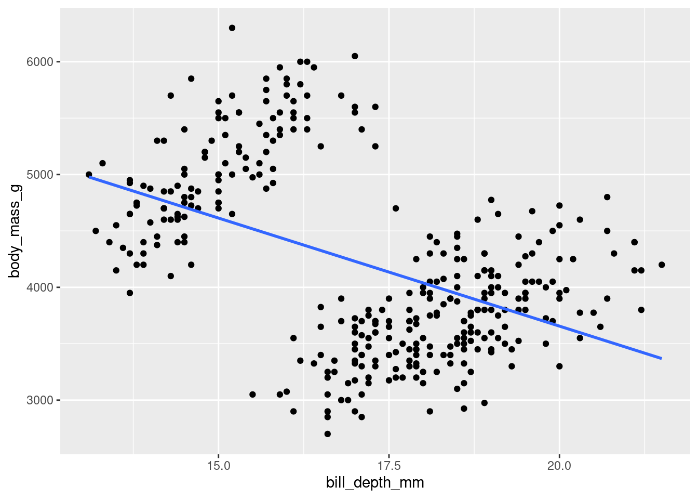

Well... Hang on. This... okay yes it **IS** a line, but this may not be what you were expecting to see. This highlights an important point: <u>**Just because you CAN fit a line to something does not always mean you should.**</u> 

<!-- <div class="panel panel-success"> -->
<!--   <div class="panel-heading">**EXERCISE 6**</div> -->
<!--   <div class="panel-body">Take your visualization from Exercise 5 and add a line of best fit for your data. Try out different aesthetic **<u>settings</u>**, and see how they change the graph.</div> -->
<!-- </div> -->

### Rugs and Margins

Another neat trick you can do is to add some information about each individual distribution in the margins of your visualization.

One way to do this is by adding a "rug" to your scatter plots. You can do this with `geom_rug()`.


```r
penguins %>%
  ggplot(aes(y = body_mass_g, x = bill_depth_mm)) +
  geom_point()+
  geom_rug(alpha=0.1, size=1.5)
```


Another way to do so is by showing the individual histograms for each of the continuous variables. You can do this by using `ggMarginal()` from the `ggExtra` package (`ggExtra::ggMarginal()`).


```r
(penguins %>%
  ggplot(aes(y = body_mass_g, x = bill_depth_mm)) +
  geom_point()) %>%
ggExtra::ggMarginal(type = "histogram")
```


<p class="text-info"> **<u>Note:</u> `ggMarginal` is not part of ggplot proper, so it is not added on like other geoms. Instead, you have to pipe your ggplot graph in. In doing so, you must wrap the ggplot code in parentheses. This way, the entire visualization gets piped in and not just the last piece!**</p>

<!-- <div class="panel panel-success"> -->
<!--   <div class="panel-heading">**EXERCISE 7**</div> -->
<!--   <div class="panel-body">Take your visualization from exercise 6 and try to add some extra information to the margins. Try out different aesthetic **<u>settings</u>**, and see how they change the graph.</div> -->
<!-- </div> -->

## Continuous ~ Categorical

**Comparisons**

Arguably, the most common thing you will create a graph to visualize is the comparison of data from many different conditions (or levels) of some variable. Specifically, to compare some summary statistics between them. For example: 

> How does the average weight (`body_mass_g`) of the penguins compare across islands (`island`)?

Maybe it is the case that some islands have better food sources that others, and the penguins there can gorge themselves into a food coma all day long while the penguins on other islands are not as lucky.

There are a **<u>LOT</u>** of options for how to visualize comparisons of this kind. In the examples, you will also see some important guidelines to implement or follow.

<p class="text-info"> **<u>Note:</u> When looking at how the values of one continuous variable compare across levels of a categorical variable, it is helpful to first examine how the values of the continuous variable vary to begin with.**</p>


```r
penguins %>%
  ggplot(aes(x = body_mass_g)) +
  geom_histogram(color = 'black')
```


### `stat_summary()`

The `stat_summary()` function is an extremely powerful and versatile function which can be used to create a visualization summarizing the y values for each unique x value. The `fun =` argument specifies what type of summary you want to visualize for the y values. The `geom =` argument specifies how you want those results to be visualized. In short, you tell it what you want to visualize and how.

The summary function you will use most often is likely the "mean" (or average), but you can also use a number of others including "median", "max", "min", "sd" (standard deviation), etc., to compare several different summary statistics between the groups on your x-axis variable. **All examples that follow will use the mean.**

Just as there are several summary statistics you can use, there are several ways you can visualize those summary statistics...

#### Bar

The canonical visualization is the bar chart, using the "bar" geom.

<p style="font-size:10pt">Going forward, the habit of making predictions for and/or summarizing the visualizations create will be brought back. A formal prediction will first be declared by specifying two mutually exclusive alternative patterns that *could* be observed in the visualizations. The same idea (hypothesis) will be worked with, so subsequent predictions can just refer to that hypothesis rather than explicitly stating it. After making the visualization, a <u>short</u> summary of what the visualization shows will be written.</p>

::: {.rmdwarning}
* "If it is the case that the differences in penguin weight could be explained by what island they live on (e.g., penguins on some islands are heavier on average than penguins on other islands), then some bars should be higher or lower than the others. If it is not the case that the differences in penguin weight could be explained by what island they live on, the bars should all have roughly equivalent heights."
:::


```r
penguins %>%
  ggplot(aes(y = body_mass_g, x = island)) +
  stat_summary(fun = "mean", geom = "bar")
```


::: {.rmdimportant}
In the visualization you can see that, generally speaking, penguins on Biscoe island seem to be the heaviest and heavier on average than penguins on either Dream or Torgersen island. The penguins on Dream and Torgensen island seem to have similar weight. You can see this pattern by noticing that the bar representing Biscoe island is higher than the bars for Dream and Torgersen islands (which are both about the same height).
:::

Unlike a histogram, the height of each bar here shows the *mean* of the levels of your categorical variable, not *counts* of observations.

#### Point

Instead of representing the means with a bar geom, you could do the same with a **"point"**.


```r
penguins %>%
  ggplot(aes(y = body_mass_g, x = island)) +
  stat_summary(fun = "mean", geom = "point")
```


Compared to when the means were represented with bars, the difference between the average weight of penguins on Biscoe island to the other two islands looks *much* more drastic. Why is that? It is the same data, just visualized differently. You will note that the scale of the y-axis has changed here. Instead of running from 0 - 5000 like in the bar chart, it runs from 3750 - 4750. Modifying axis scales will be covered later, but for now this is a reminder to be mindful of scales when making your interpretation, and how the scale might skew the interpretations someone makes from your visualization!

#### Line

Another way to visualize this is with a line instead of bars or points.


```r
penguins %>%
  ggplot(aes(y = body_mass_g, x = island)) +
  stat_summary(fun = "mean", geom = "line")
#> geom_path: Each group consists of only one observation.
#> Do you need to adjust the group aesthetic?
```


Hm, okay, this did not work. R is telling you something here though:

<p style="color:#A79BF0"> **geom_path: Each group consists of only one observation. Do you need to adjust the group aesthetic?**</p>

What this is telling you is that the line that R is trying to make needs to know what points you are trying to connect. It does not know how you want the individual pieces of the visualization (here, the `mean body_mass_g` for each level of `island`) grouped together, as each group only has one observation. R even gave you a recommendation on how to fix this by asking if you need to adjust the ***group*** aesthetic! This is a new aesthetic that will be covered more later.

For now, R needs to know that all the levels in `island` should be treated as coming from the same group. This can be done by simply telling R there should be one group:


```r
penguins %>%
  ggplot(aes(y = body_mass_g, x = island, group = 1)) +
  stat_summary(fun = "mean", geom = "line")
```


`island` (the x-axis variable) is categorical, so ggplot will try to draw individual lines for each level by default. However, here, there is only one value for each factor level and at least two points are needed to create a line!

There are a number of different styles of line you can use by changing the `linetype`:

{width=100%}


```r
penguins %>%
  ggplot(aes(y = body_mass_g, x = island, group = 1)) +
  stat_summary(fun = "mean", geom = "line", linetype = "dashed")
```

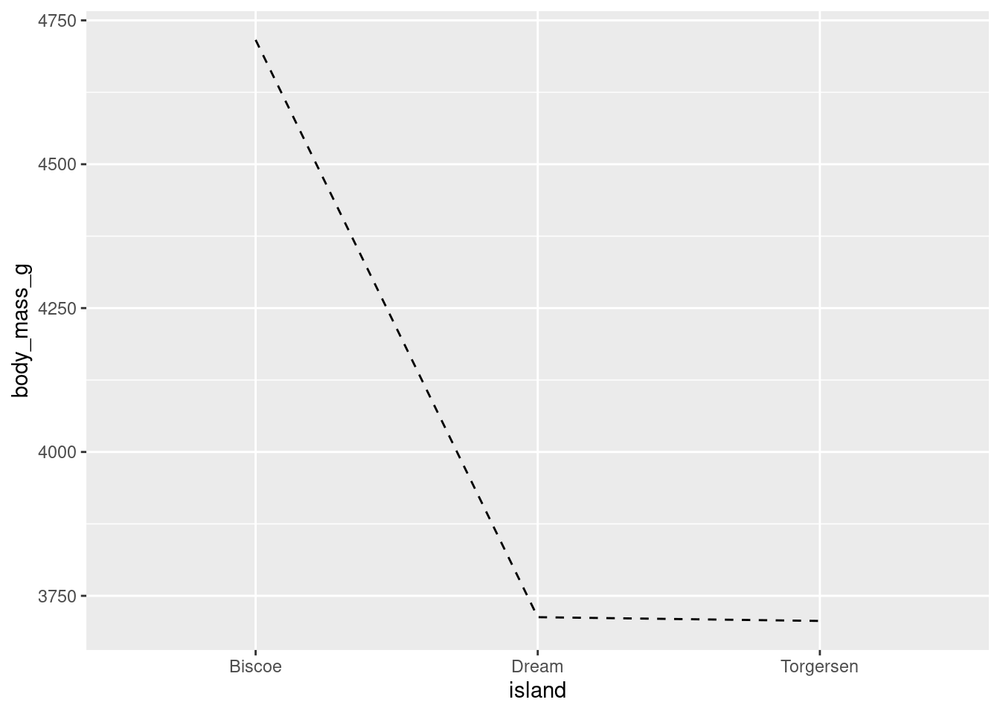

Different geoms can also be combined. For example, both point and lines to make the line plot look a little cleaner.


```r
penguins %>%
  ggplot(aes(y = body_mass_g, x = island, group = 1)) +
  stat_summary(fun = "mean", geom = "point") +
  stat_summary(fun = "mean", geom = "line")
```


While you can use this here, line plots are best used for time series data.

<!-- <div class="panel panel-success"> -->
<!--   <div class="panel-heading">**EXERCISE 8**</div> -->
<!--   <div class="panel-body">Create 3 visualizations to explore how the average penguin `flipper_length_mm` varies across the different `species` of penguins. Use a different shape for the mean in each visualization. Try out different aesthetic **<u>settings</u>**, and see how they change the graph (if you want to try an aesthetic **<u>mapping</u>**, only use the singular variable on your x-axis).</div> -->
<!-- </div> -->

### Error bars

You want your visualizations to be as informative as possible. Keeping this in mind, you will most often want to give an appreciation for how much variability there is in the data (not **only** showing the mean). This is accomplished by including error bars (either confidence intervals (CI) or Standard Error of the Mean (SEM)) around your summary statistics. You will use the SEM in this course.

While you COULD manually compute the upper and lower values of the error bars for each mean, fortunately ggplot2 has a number of built in ways to do this for you! Even more convenient, it is just another extension of `stat_summary()`. Here, you want the **s**tandard **e**rror of your **mean** ("mean_se"), and want that represented by error bars ("errorbar").


```r
penguins %>%
  ggplot(aes(y = body_mass_g, x = island)) +
  stat_summary(fun = "mean", geom = "bar") +
  stat_summary(fun.data = "mean_se", geom = "errorbar")
```

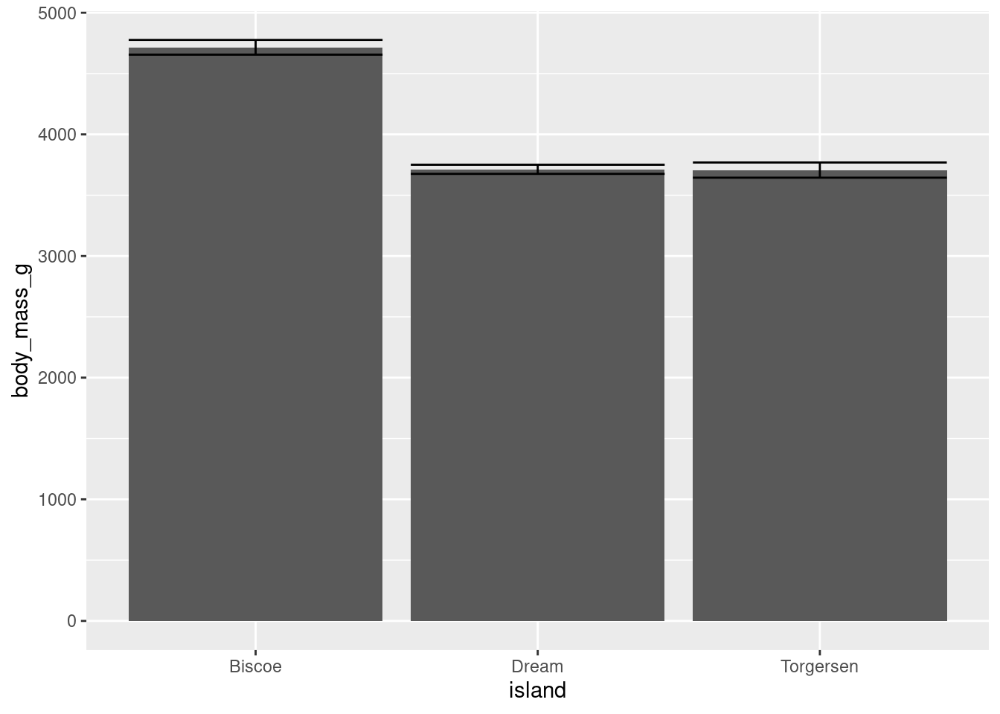

You do not have to change anything about your raw data or create new dataframes, `stat_summary()` will just do everything for you! 

The one difference you will note is that you have to use `fun.data = ` instead of `fun = `. "mean_se" will give you the mean, upper, and lower SE boundaries. Since you are getting multiple pieces of information for each x-axis value, you have to use a slightly different argument.

Another thing you may note is how ugly this looks. The error bars are far too wide. You can change this with the `width` aesthetic.


```r
penguins %>%
  ggplot(aes(y = body_mass_g, x = island)) +
  stat_summary(fun = "mean", geom = "bar") +
  stat_summary(fun.data = "mean_se", geom = "errorbar",
               width = 0.3)
```

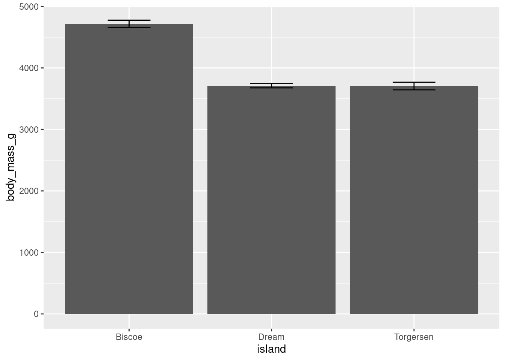

This looks a bit better, and more like what you would see in a published peer-reviewed journal article.

Error bars can be added to other geoms:


```r
penguins %>%
  ggplot(aes(y = body_mass_g, x = island)) +
  stat_summary(fun = "mean", geom = "point") +
  stat_summary(fun.data = "mean_se", geom = "errorbar", width = 0.2)
```


And can also be rendered with different shapes:


```r
penguins %>%
  ggplot(aes(y = body_mass_g, x = island)) +
  stat_summary(fun = "mean", geom = "point") +
  stat_summary(fun.data = "mean_se", geom = "linerange")
```


As a shortcut, the "pointrange" geom can be used to create a point for the mean and a line for the error bars:


```r
penguins %>%
  ggplot(aes(y = body_mass_g, x = island)) +
  stat_summary(fun.data = "mean_se", geom = "pointrange")
```


This gives basically the same graph as above, but only uses one `stat_summary()` call! The only downside here is you have slightly less control over customizing the line and point separately.

<!-- <div class="panel panel-success"> -->
<!--   <div class="panel-heading">**EXERCISE 9**</div> -->
<!--   <div class="panel-body">Take your 3 visualizations created from Exercise 8 and add error bars around the means. Try out different aesthetic **<u>settings</u>**, and see how they change the graph.</div> -->
<!-- </div> -->

### Boxplots

Another way to get a sense for the distribution of the data is to use box plots.


You can create a boxplot using `geom_boxplot()`


```r
penguins %>%
  ggplot(aes(y = body_mass_g, x = island)) +
  geom_boxplot()
```


<!-- <div class="panel panel-success"> -->
<!--   <div class="panel-heading">**EXERCISE 10**</div> -->
<!--   <div class="panel-body">Create a boxplot to compare how `flipper_length_mm` varies across penguin `species`. Try out different aesthetic **<u>settings</u>**, and see how they change the graph (if you want to try an aesthetic **<u>mapping</u>**, only use the singular variable on your x-axis).</div> -->
<!-- </div> -->

### Problem With Summary Stats

In the [first lesson][Intro to ggplot2] on visualizations, you saw how many different datasets and distributions were consistent with the same summary statistics (the datasauRus dozen and Anscombe's quartet). This was the rationale for why visualizations are so important. However, including nothing but summary statistics in your graphs is not much better than only reporting the summary statistics as numbers! You never know what your summary statistics could be hiding about your data:

{width=100%}
<p style="font-size:6pt">Artwork by @allison_horst</p>

While boxplots give you a better sense of a distribution by providing more information than just a bar for the mean and SEM does, many datasets can be consistent with the same boxplot too!

{width=100%}
<p style="font-size:8pt">Source: [Same Stats, Different Graphs...](https://www.autodeskresearch.com/publications/samestats)</p>

::: {.rmdcaution} 
**While bar charts and boxplots are conventionally the most common way to represent your data, you have just seen who problematic this can be. It is always recommended to visualize the distribution of your data! This is the only way to be transparent and accurately communicate the patters in your data. For this reason, it is <u>strongly</u> advised to not use bars to represent means.**
:::

The graphs outlined below will help you achieve the goals of both visualizing summary statistics **AND** the raw distributions of individual participant data in your dataset.

### Violin Plots

If your dataset is large and/or you are creating a visualization with a lot of observations, violin plots can be helpful. They are similar to boxplots but show a little less information and are more sensitive to changes in a distribution of raw data.

{width=100%}
<p style="font-size:8pt">Source: [Same Stats, Different Graphs...](https://www.autodeskresearch.com/publications/samestats)</p>

You can create a violin plot with `geom_violin()`


```r
penguins %>%
  ggplot(aes(y = body_mass_g, x = island)) +
  geom_violin()
```


The width of a section of the violin plot corresponds to the number of observations in that area. Violin plots can also pair nicely with a boxplot!


```r
penguins %>%
  ggplot(aes(y = body_mass_g, x = island)) +
  geom_violin() +
  geom_boxplot(width = 0.2)
```


This way, you get all the benefits of a boxplot but are also conveying more information about the underlying distribution. Since ggplot is an additive/layered system, you can combine different geoms and elements to make particularly effective visualizations!

<!-- <div class="panel panel-success"> -->
<!--   <div class="panel-heading">**EXERCISE 11**</div> -->
<!--   <div class="panel-body">Take your visualization from Exercise 10 and put a violin underneath to give more information about the distribution of `flipper_length_mm`. Try out different aesthetic **<u>settings</u>**, and see how they change the graph (if you want to try an aesthetic **<u>mapping</u>**, only use the singular variable on your x-axis).</div> -->
<!-- </div> -->

### Jitter Plots

If you wanted to actually show the full distribution of your data, you might think to use `geom_point()` like you did to create a scatter plot. However, since the x-axis is a categorical variable, all the data points will have the same value:


```r
penguins %>%
  ggplot(aes(y = body_mass_g, x = island)) +
  geom_point()
```


You can add some noise (space) to your data by using `geom_jitter()` and jitter your data points. Jitter plots are especially good for variables with small n’s. They can start to be a little messy and difficult to read with larger n’s though.


```r
penguins %>%
  ggplot(aes(y = body_mass_g, x = island)) +
  geom_jitter()
```


When your dataset is not too large, jitter plots can be paired with a number of other geoms and summary statistics to create very effective visualizations. Consider the examples below:

Combine jitter with the mean and SE:


```r
penguins %>%
  ggplot(aes(y = body_mass_g, x = island)) +
  geom_jitter(height = 0, width = 0.2, 
              size = 1, alpha = 0.5,
              color = "darkgreen") +
    stat_summary(fun.data = "mean_se",
               geom = "pointrange",
               color = "black",
               fill = "red",
               shape = 21,
               size = 0.5)
```


```r
penguins %>%
  ggplot(aes(y = body_mass_g, x = island)) +
  geom_jitter(alpha = 0.4, height = 0, width = 0.2, size = 1) +
    stat_summary(fun.data = "mean_se",
               geom = "errorbar",
               color = "orange",
               width = 0.1,
               size = 1) +
  stat_summary(fun = "mean",
               geom = "point",
               color = "red",
               size = 2)
```

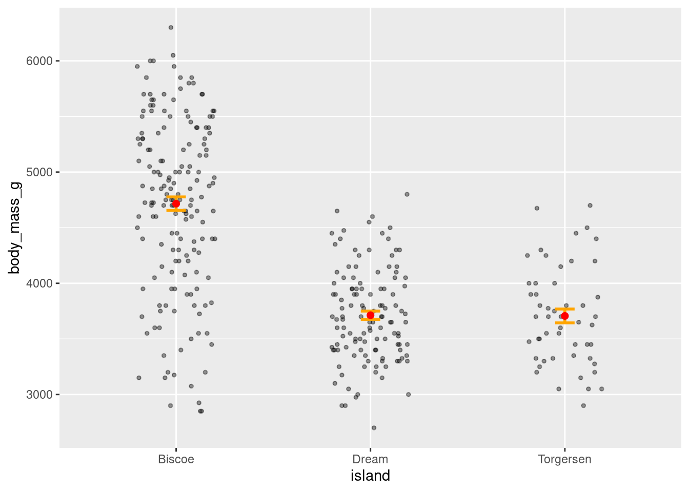

Combine jitter and boxplots:


```r
penguins %>%
  ggplot(aes(y = body_mass_g, x = island)) +
  geom_boxplot(width = 0.6) +
  geom_jitter(height = 0, width = 0.1,
              alpha = 0.5, color = "seagreen")
```


Or jitter and violin plots:


```r
penguins %>%
  ggplot(aes(y = body_mass_g, x = island)) +
  geom_violin() +
  geom_jitter(alpha = 0.4, width = 0.05) +
  stat_summary(fun = "mean",
               geom = "point",
               color = "red")
```


<!-- <div class="panel panel-success"> -->
<!--   <div class="panel-heading">**EXERCISE 12**</div> -->
<!--   <div class="panel-body">Create 2-3 jitter plots to explore the relationship between a penguin's `bill_length_mm` and their `flipper_length_mm`. Think about which you think is best and why. Try out different aesthetic **<u>settings</u>**, and see how they change the graph (if you want to try an aesthetic **<u>mapping</u>**, only use the singular variable on your x-axis).</div> -->
<!-- </div> -->

#### Limits

There are 3 very important things to be mindful of when creating a jitter plot.

1. By adding noise, you can quite literally change the data being visualized. This is not a problem for a categorical variable, like you have here on the x-axis, because small shifts in position will not change the value associated with the point. On continuous variables, like you have on the y-axis, this **will**. For this reason, it is recommended to only jitter along a categorical variable. Since your y-axis here is continuous, you do not want the height of the points to change. You can tell ggplot not to do this with the `height` argument. This will preserve the actual y-axis value, so your visualization will represent the true values in your dataset.


```r
penguins %>%
  ggplot(aes(y = body_mass_g, x = island)) +
  geom_jitter(height = 0)
```


2. The jitter added to a visualization is random. Every time you make a jitter plot, or even rerun the code for the same jitter plot, the jitter that is added is random and the visualization will look slightly different!

3. When running code to generate a jitter plot, sometimes your code may work and produce a graph that seems normal but be accompanied by some text output in the console:

<p style="color:#A79BF0"> **Warning messages: 1: Removed `X` rows containing non-finite values (stat_smooth). 2: Removed `X` rows containing missing values (geom_point).**</p>

It is <u>**CRITICALLY**</u> important to be mindful of these types of errors. What is happening there is that your visualization is not actually showing all your data! That message means that **X** data points are being removed from the dataset when generating the graph. This can be particularly problematic when you are visualizing summary statistics, like means and error bars, because they would not be reflecting the true values of your dataset!!!

The most common reason for receiving this error is that there are some data points with values not captured by your axes limits. This can either be because you have manually limited the axis to not contain a known value, or because a value has been jittered past the axis limit. More on both of these later, but for now the take home point is to look always check your code for warning/error messages (in general, but especially when jittering).

### Variations on Jitter

#### Strip Chart

A strip chart is a variation on a jitter plot. It basically IS a jitter plot but represents the mean with a small horizontal line (using the "crossbar" geom).


```r
penguins %>%
  ggplot(aes(y = body_mass_g, x = island)) + 
  geom_jitter(height = 0, width = .1, 
              color = "darkmagenta",
              alpha = .5) + 
  stat_summary(fun = "mean", 
               geom = "crossbar", 
               width = 0.3)
```


<!-- <div class="panel panel-success"> -->
<!--   <div class="panel-heading">**EXERCISE 13**</div> -->
<!--   <div class="panel-body">Create a strip chart to compare the mean `flipper_length_mm` between different `species` of penguins. Try out different aesthetic **<u>settings</u>**, and see how they change the graph (if you want to try an aesthetic **<u>mapping</u>**, only use the singular variable on your x-axis).</div> -->
<!-- </div> -->

#### Beeswarm/Dot Plot

Another variation on jitter plots is the Beeswarm or Dot plot


```r
penguins %>%
  ggplot(aes(y = body_mass_g, x = island)) +   
  geom_dotplot(stackdir = "center", 
               binaxis = "y", 
               binwidth = 80,
               stackratio = 1,
               fill = "cyan3", 
               color = "cyan3")
```


The settings can be quite temperamental, and you have to play around with the binwidth, stackratio, and dotsize, but once dialed in they can make some nice looking visualizations. Especially so when paired with a boxplot:


```r
penguins %>%
  ggplot(aes(y = body_mass_g, x = island)) +  
  geom_boxplot() + 
  geom_dotplot(binaxis = 'y', 
               stackdir = 'center', 
               stackratio = 1, 
               binwidth = 80,
               binpositions = "all",
               dotsize = 1,
               alpha = .45, 
               fill = "cyan3", 
               color = "cyan3")
```


<!-- <div class="panel panel-success"> -->
<!--   <div class="panel-heading">**EXERCISE 14**</div> -->
<!--   <div class="panel-body">Create a modified beeswarm/dot plot to compare the `flipper_length_mm` between different `species` of penguins. Try to see how changes to the different settings in the `dotplot()` call effect your graph.</div> -->
<!-- </div> -->

### Ridgeline Plot

Ridgeline plots, formerly known as joy plots, allows you visualize the distributions of a numerical variable for the different levels of a categorical variable. An important distinction is that ridgeline plots require the continuous variable to be on the x-axis and the categorical variable to be on the y-axis. You can create a ridgeline plot using the `geom_density_ridges()` function from the `ggridges` package (`ggridges::geom_density_ridges()`).


```r
penguins %>%
  ggplot(aes(x = body_mass_g, y = island)) +
  ggridges::geom_density_ridges(scale = 0.9)
```


Using the `scale` argument gives some space between each distribution.

Like jitter plots, they serve as the foundation of several different visualizations. For example, a popular extension of the ridgeline plot is to make a raincloud plot:


```r
penguins %>%
  ggplot(aes(x = body_mass_g, y = island)) +  
  ggridges::geom_density_ridges(jittered_points = TRUE, 
                      position = "raincloud",
                      scale = 0.4)
```


Or variations on raincloud plots that have lineranges (which look better when there is more variability -- example [here](https://www.nature.com/articles/s41562-021-01142-4#Sec2)), etc.:


```r
penguins %>%
  ggplot(aes(x = body_mass_g, y = island)) +
  ggridges::geom_density_ridges(scale = 0.9) +
  stat_summary(fun.data = "mean_se", geom = "pointrange")
```


<!-- <div class="panel panel-success"> -->
<!--   <div class="panel-heading">**EXERCISE 15**</div> -->
<!--   <div class="panel-body">Create a ridgeline plot to compare the `flipper_length_mm` across the different `species` of penguins. Try out different settings and aesthetics to see how they change your graph (if you want to try an aesthetic **<u>mapping</u>**, only use the singular variable on your y-axis).</div> -->
<!-- </div> -->

## New Arguments and Functions

### Faceting

Any plot of data you have may contain data from several different variables at the same time.


```r
penguins %>%
     ggplot(aes(y = body_mass_g, x = bill_depth_mm)) +
     geom_point()
```


While you can help differentiate different subsets of data by adding aesthetics, sometimes you may want to just separate them entirely into different graphs. This is known as "faceting" *(not to be confused with facetuning)*, and can be done using `facet_grid()`. Faceting allows you to apply the same ggplot code to different subsets of data, generating multiple graphs at the same time. 

In `facet_grid()`, you must specify what **var**iable(**s**) you want to facet by, and whether you want those graphs spread across different **col**umn**s**


```r
penguins %>%
    ggplot(aes(y = body_mass_g, x = bill_depth_mm)) +
    geom_point() + 
    facet_grid(cols = vars(island))
```


or spread across different **rows**.


```r
penguins %>%
    ggplot(aes(y = body_mass_g, x = bill_depth_mm)) +
    geom_point() + 
    facet_grid(rows = vars(island))
```


For larger datasets, you can facet across rows by one variable and columns by another. This is a quick, easy, and yet very powerful way to explore larger datasets and the conditional relationships that may exist between certain variables.


```r
penguins %>%
    ggplot(aes(y = body_mass_g, x = bill_depth_mm)) +
    geom_point() + 
    facet_grid(rows = vars(island),
               cols = vars(species))
```

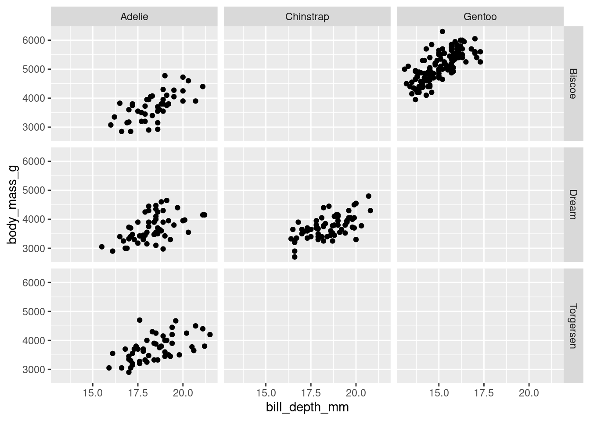

<!-- <div class="panel panel-success"> -->
<!--   <div class="panel-heading">**EXERCISE 16**</div> -->
<!--   <div class="panel-body">Take your scatter plot exploring the relationship between a penguin's `bill_length_mm` and their `flipper_length_mm` and do the following:<br> -->
<!--   1. Facet by `species`. -->
<!--   2. Facet by `sex`. -->
<!--   3. Facet by both `species` and `sex`.</div> -->
<!-- </div> -->

### Groups

Previously, when you made a line plot that looked something like this:


```r
mtcars %>%
    ggplot(aes(y = wt, x = factor(gear), group = 1)) +
    stat_summary(fun = "mean", geom = "line")
```


It was noted that since `gear` (the x-axis variable) is categorical, ggplot will try to draw individual lines for each level by default. Since, there was only one value for each factor level (the mean), and at least two points are needed to create a line, you had to tell ggplot that each group only had 1 data point by using the ***group*** argument. 

This notion of grouping is very powerful and is another way you can plot subsets of data without having to make changes to, or manually compute summaries from, your raw data.

For example, you can look at how the `wt` changes across `gear` for cars with different `cyl`inders by grouping by `cyl`.


```r
mtcars %>%
    ggplot(aes(y = wt, x = factor(gear), 
               group = factor(cyl), color = factor(cyl))) +
    stat_summary(fun = "mean", geom = "line")
```


<!-- <div class="panel panel-success"> -->
<!--   <div class="panel-heading">**EXERCISE 17**</div> -->
<!--   <div class="panel-body">Create a line plot to visualize the compare how `flipper_length_mm` varies across penguin `species`, and whether there are any differences between the sexes of each species (think about what the graph would look like to best visualize this). Try out different aesthetic **<u>settings</u>**, and see how they change the graph.</div> -->
<!-- </div> -->

Very often in studies implementing within-subjects designs (where there are multiple measurements from the same subject -- and particularly in developmental/infant studies), you will see figures that look like this:


This is very easily accomplished simply by adding group aesthetic!


```r
weight_example %>%
  ggplot(aes(y = Weight, x = Season)) + 
  geom_boxplot() +
  geom_point() +
  geom_line(aes(group = ID))
```

When you are grouping your data in your visualization code, you may run into some instances where your graph winds up looking funky. Most often this is the result of overlapping geoms.

To fix that, you will have to think about positions...

### Positions


No, nothing to do with Ariana Grande... <p style="font-size:10pt">**(great album though!)**</p>

ggplot2 has a number of position/adjustment arguments that can be used in these cases. In fact, you have already used one! Jittering is a position adjustment. So, while you can create a jitter plot using `geom_jitter()`, you also could accomplish the same thing using `geom_point()` and setting a position argument. e.g.,

`geom_point(position = "jitter")` or `geom_point(position=position_jitter())`

These in effect do the same thing. However, if you want to include any specific arguments (e.g., specify how much vertical or horizontal jitter to have), you can only do so by using the longer `position_*()` format. This helps create reproducible graphs, as the jitter is otherwise random every time the code is ran to create the graph! Changing the positional adjustments can drastically alter the visualization you generate.

Here are a few quick examples of graphs that came out looking funky, and how using positional adjustments can fix that.

#### Identity

Most things start with "identity" as their default position argument. Identity just overlaps the elements:


```r
penguins %>%
 ggplot(aes(x = island, fill = species)) +
  geom_bar(position = "identity")
```


This often results in some elements of your visualization being hidden (which definitely seems counterproductive).

#### Dodging

`position = “dodge”` places overlapping objects directly beside one another. This makes it easier to compare individual values.


```r
penguins %>%
  ggplot(aes(x = island, fill = species)) +
  geom_bar(position = position_dodge())
```


```r
penguins %>%
  ggplot(aes(x = island, fill = species)) +
  geom_bar(position = position_dodge2())
```


<p class="text-info"> **<u>Note:</u> The difference between *dodge* and *dodge2* is that the latter creates a bit of space between the elements. You will also notice that, compared to *identity*, the scale of the y-axis for both of these graphs changed.**</p>

This is useful for geoms other than bars as well:


```r
penguins %>%
 ggplot(aes(y = body_mass_g, x = island, fill = species)) +
     geom_point(shape = 21)
```

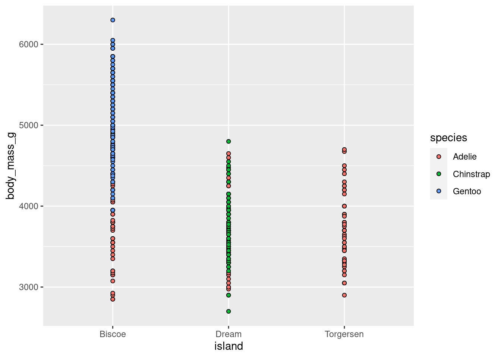

```r
penguins %>%
 ggplot(aes(y = body_mass_g, x = island, fill = species)) +
     geom_point(shape = 21, position = position_dodge(width = .75))
```


Probably the most common use case for this will be with error bars and CIs. Observe the following. By default, they are often come out looking funky:


```r
data.frame(
  x = c("a","a","b","b"),
  y = 2:5,
  g = rep(1:2, 2)
) %>%
  ggplot(aes(x, y, group = g)) +
  geom_col(position = "dodge", fill = "grey50", color = "black")+
  geom_errorbar(
  aes(ymin = y - 1, ymax = y + 1),
  width = 0.2,
  position = "dodge"
)
```


Adding some position adjustments corrects this!


```r
data.frame(
  x = c("a","a","b","b"),
  y = 2:5,
  g = rep(1:2, 2)
) %>%
  ggplot(aes(x, y, group = g)) +
  geom_col(position = "dodge", fill = "grey50", color = "black")+
  geom_errorbar(
    aes(ymin = y - 1, ymax = y + 1),
    width = 0.2,
    position = position_dodge(width = 0.9)
)
```


Sometimes you will want to simultaneously dodge and jitter. You can do both with `jitterdodge`.


```r
penguins %>%
ggplot(aes(x = island, y = body_mass_g, fill = species)) +
    geom_boxplot(outlier.size = 0) +
    geom_point(shape = 21)
```


```r
penguins %>%
ggplot(aes(x = island, y = body_mass_g, fill = species)) +
    geom_boxplot(outlier.size = 0) +
    geom_point(shape = 21, 
               position = position_jitterdodge(jitter.width = 0.3))
```


This is still quite cluttered and needs more work, but way better than before!

#### Stacking

`position = “fill”` works like stacking, but makes each set of stacked bars uniform in height. This makes it easier to compare proportions across groups.


```r
penguins %>%
ggplot(aes(x = island, fill = species)) +
  geom_bar(position = position_fill())
```


However, this can be misleading. Recall that the total number of `species` == "Gentoo" penguins is much greater than `species` == "Chinstrap", even though they do not look *TOO* different here. So while you can compare the proportions easily, those proportions may correspond to drastically different raw numbers.

## Categorical ~ Categorical

This is a variation on visualizations for one categorical variable, just adding a second variable to the x-axis with an aesthetic mapping.


```r
# Counts
penguins %>%
  ggplot(aes(x = island, fill = species)) + 
  geom_bar(stat = "count")
```


```r
# Proportions
penguins %>%
  ggplot(aes(x = island, fill = species)) + 
    geom_bar(position = position_fill())
```

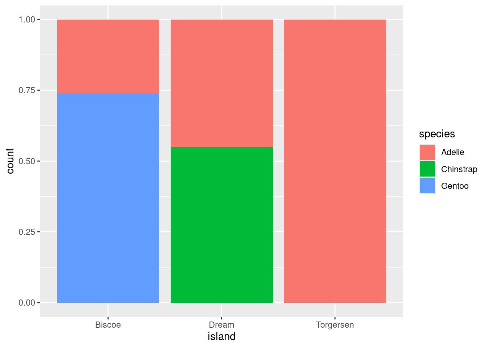

All you do here is add the `fill=` mapping aesthetic and set it equal to `species` (the other categorical variable in the data). As you can see, these are kind of hard to parse, and likely would not be used in practice other than as a quick glimpse for yourself or collaborators.

### Cont ~ Cat + Cat

Add another aesthetic to any Cont ~ Cat


```r
penguins %>%
  ggplot(aes(y = body_mass_g, x = island)) +
  geom_jitter(#height = 0, width = 0.2, 
              size = 1, alpha = 0.7,
              #color = "darkgreen",
              aes(fill = species),
              pch = 21,
              position = position_jitterdodge()) +
    stat_summary(fun.data = "mean_se",
               geom = "pointrange",
               color = "black",
               #fill = "red",
               shape = 21,
               size = 0.5,
               aes(shape = species,
                   fill = species),
               position = position_dodge(width = 0.7))
```

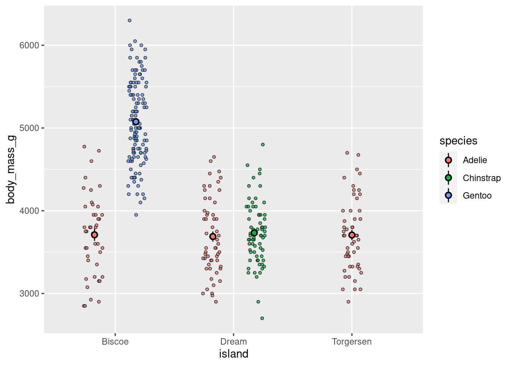

or facet


```r
penguins %>%
  ggplot(aes(y = body_mass_g, x = island)) +
  geom_jitter(height = 0, width = 0.2, 
              size = 2, alpha = 0.4,
              pch = 21,
              aes(shape = island,
                   fill = island)) +
    stat_summary(fun.data = "mean_se",
               geom = "linerange",
               color = "black",
               size = 2) +
      stat_summary(fun = "mean",
               geom = "point",
               color = "black",
               shape = 21,
               size = 2.5,
               aes(fill=island))+
  facet_grid(cols = vars(species))
```


<!-- <div class="panel panel-success"> -->
<!--   <div class="panel-heading">**EXERCISE 18**</div> -->
<!--   <div class="panel-body">Pick your favorite visualization you created that compares `flipper_length_mm` across the different `species` of penguins, and show how that comparison varies by `sex`. You can do this by adding a new aesthetic or faceting. Which do you think looks better and why? Try out different aesthetics to see how they change your graph.</div> -->
<!-- </div> -->

#### Raster

These are useful for looking how a variable of interest varies as a function of two other variables. Particularly when your categorical variables have many levels.

<!-- For example, when we are trying to fit a model with two parameters, we might be interested to see how well the model does for different combinations of these two parameters. Here, we'll plot what carat values diamonds of different color and clarity have. -->


```r
penguins %>%
  ggplot(aes(x = island,
             y = species,
             z = body_mass_g)) +
  stat_summary_2d(fun = "mean", geom = "tile")
```


Looks way better when there are more levels to your variables, for example:


```r
diamonds %>%
  ggplot(aes(x = color,
             y = clarity,
             z = carat)) +
  stat_summary_2d(fun = "mean", geom = "tile",
                  color = "black")
```


<!-- I’ve added some outlines to the tiles by specifying color = "black" in geom_tile() and I’ve changed the scale for the fill gradient. I’ve defined the color for the low value to be “white”, and for the high value to be “black.” Finally, I’ve changed the lower and upper limit of the scale via the limits argument. Looks much better now! We see that diamonds with clarity I1 and color J tend to have the highest carat values on average. -->

#### Extras

You may be asked to make visualizations like the following. You should not, but here is code in case it is needed.

Bars:


```r
penguins %>%
  drop_na() %>%
  ggplot(aes(x = island,
             y = body_mass_g,
             group = sex,
             fill = sex)) +
  stat_summary(fun = "mean",
               geom = "bar",
               position = position_dodge(width = 0.9),
               color = "black") +
  stat_summary(fun.data = "mean_se",
               geom = "linerange",
               position = position_dodge(width = 0.9))
```


Lines:


```r
penguins %>%
  drop_na() %>%
  ggplot(aes(x = island,
             y = body_mass_g,
             group = sex,
             color = sex)) +
  stat_summary(fun = "mean",
               geom = "line",
               size = 1) +
    stat_summary(fun.data = "mean_se",
               geom = "pointrange")
```

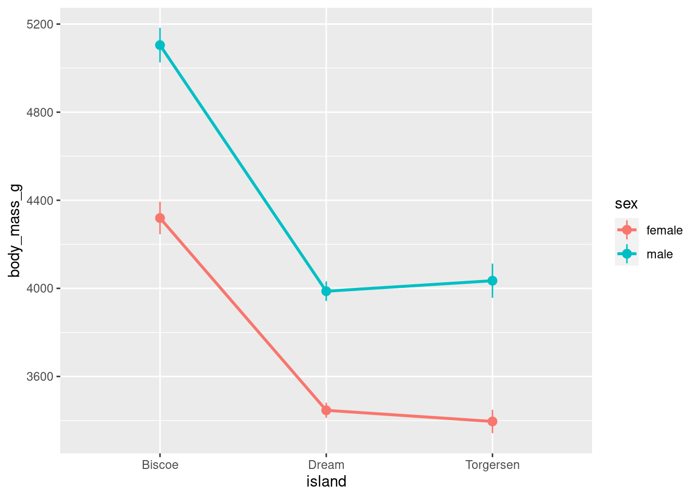

Fancier lines:


```r
penguins %>%
  drop_na() %>%
  ggplot(aes(x = island,
             y = body_mass_g,
             group = sex,
             color = sex)) +
  stat_summary(fun = "mean",
               geom = "line",
               size = 2) +
    stat_summary(fun.data = "mean_se",
               geom = "pointrange",
               size = 1) +
    geom_vline(xintercept = seq(from = 0.5,
                              by = 1,
                              length.out = 3.5),
             linetype = 2,
             color = "gray20")
```


### Cont ~ Cont + Cat

Faceting scatter plots:


```r
penguins %>%
  ggplot(aes(y = body_mass_g, x = bill_depth_mm)) +
  geom_point()+
  facet_grid(cols = vars(species))
```

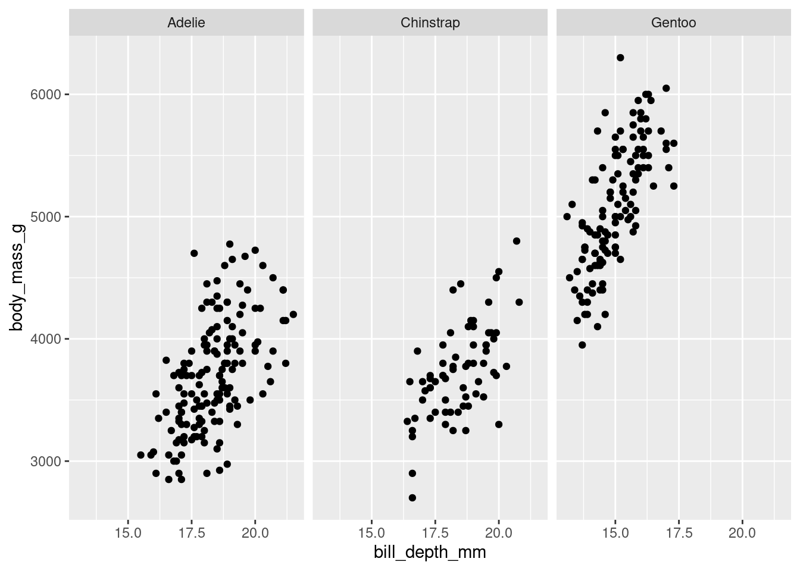

<!-- <div class="panel panel-success"> -->
<!--   <div class="panel-heading">**EXERCISE 19**</div> -->
<!--   <div class="panel-body">Take the visualization you created above to explore the relationship between a penguin's `bill_length_mm` and `flipper_length_mm`, and see if this relationship varies based on which `island` a penguin lives.</div> -->
<!-- </div> -->

### Cont ~ Cont + Cont

Similar to a 2d histogram except instead of counts, the z-axis shows values on a continuous variable.


```r
penguins %>%
  ggplot(aes(y = body_mass_g,
             x = bill_depth_mm,
             z = flipper_length_mm)) +
  stat_summary_2d(color = "black")
```


```r
penguins %>%
  ggplot(aes(y = body_mass_g,
             x = bill_depth_mm,
             z = flipper_length_mm)) +
  stat_summary_hex(color = "black")
```


## Custom geoms

With one exception, all the visualizations covered above use the geoms built in with ggplot2. However, as you saw from that one exception, there are packages that contain many other geoms to use with ggplot! In addition to loading new geoms from packages, you can use code to create them yourself. Code is included here to create 2 geoms that can be used to make 2 visualizations that are currently pretty popular:

### Split Violin Plot

A split violin plot allows you to easily compare two groups (and across the levels of another variable). 


```r
source("geom_split_violin.R")
```


```r
penguins %>%
ggplot(aes(x = island, y = body_mass_g, fill = species)) +
  geom_split_violin(trim = FALSE, alpha = .4)+
  geom_boxplot(width = .2, alpha = .6, 
               fatten = NULL, show.legend = FALSE) +
  stat_summary(fun.data = "mean_se", geom = "pointrange", 
               show.legend = F, 
               position = position_dodge(.175))
```


<p class="text-info"> **<u>Note:</u> This only works if you are comparing two groups! You could imagine how it would be difficult to create this visualization if each island had measurements from more than 2 species. It would not be possible for 3 violins and 3 box plots to work.**</p>

### Raincloud

Raincloud plots were mentioned in passing above. However, they can be extremely effective ways of communicating a lot of information. Below is an example and template code for a more fleshed out version.


```r
source("geom_flat_violin.R")
```


```r
rain_height <- .1

penguins %>%
ggplot(aes(x = "", y = body_mass_g, fill = species)) +
  # clouds  
  geom_flat_violin(position = position_nudge(x = rain_height+.05),
                   alpha = 0.4, trim = FALSE) + 
  # rain
  geom_point(aes(color = species), size = 2, 
             alpha = .5, show.legend = FALSE, 
              position = position_jitter(width = 0.05, height = 0)) +
  # boxplots
  geom_boxplot(width = 0.05, alpha = 0.4, 
               show.legend = FALSE, outlier.shape = NA,
               position = position_nudge(x = -rain_height*2)) +
  # mean and SE point in the cloud
  stat_summary(fun.data = mean_cl_normal, mapping = aes(color = species), 
               show.legend = FALSE,
               position = position_nudge(x = rain_height * 3)) +
  # adjust layout
  scale_x_discrete(name = "", expand = c(rain_height*3, 0, 0, 0.7)) +
  scale_y_continuous(limits = c(2000, 7000)) +
  coord_flip()
```


## Best Practices:

Below are some guidelines and best practices that should be considered when designing your visualizations.

* Graphs should be EASILY readable, first and foremost. This should be the top design philosophy when constructing your graphs. 
  + Label everything (axes, titles, legends, anything else) and make labels intuitive.
  + Follow conventions: y = response variable, x = predictor, be mindful of variable types, etc.
  + People should not need to review the caption to understand what the visualization is showing.

* Graphs should be purposeful
  + What is the specific relationship or trend in your data that you are trying to communicate with this visualization?

* Graphs should facilitate quantitative interpretation and comparison, and allow for inferential statistics by eye.
  + Represent variability (show the full distribution, include error bars or confidence intervals).
  + Show relationship trends, means, etc.

* Cool =/= best.
  + Just because you **<u>can</u>** make some crazy complex graph that visualizes a lot of different variables, or might even be interactive and show you a lot of information, does not mean that is the best thing to do. Just because you CAN do something does not always mean you SHOULD. Keep things simple and clean, following the conventions for that type of data or relationship.
    
* Make your visualization aesthetically pleasing but not at the cost of wasting ink.

## Extra Resources

* [ggplot2 reference](https://ggplot2.tidyverse.org/reference/)
* [R graphics cookbook](http://www.cookbook-r.com/Graphs/) 
* [ggplot2 book](https://ggplot2-book.org/) 
* [ggplot2 cheat sheet](https://rstudio.com/wp-content/uploads/2016/11/ggplot2-cheatsheet-2.1.pdf)
* [Help understand different types of graphs](https://datavizcatalogue.com/index.html)
* [Recommendations on best graphs for visualizing particular relationships](https://www.data-to-viz.com/)
* [r-specific information on how to construct graphs](https://www.r-graph-gallery.com/index.html)
* [More r-specific stuff. Top 50 ggplot geoms](http://r-statistics.co/Top50-Ggplot2-Visualizations-MasterList-R-Code.html)
* [Info on plotly](https://plotly-r.com/overview.html)
* [ggplot2 extensions](https://exts.ggplot2.tidyverse.org/gallery/)
* [Fundamentals of Data Visualization](https://serialmentor.com/dataviz/)

## Citations

As always, most illustrations by [@allison_horst](https://twitter.com/allison_horst)

Custom violin plots modified from source code [here](https://psyteachr.github.io/introdataviz/advanced-plots.html)
