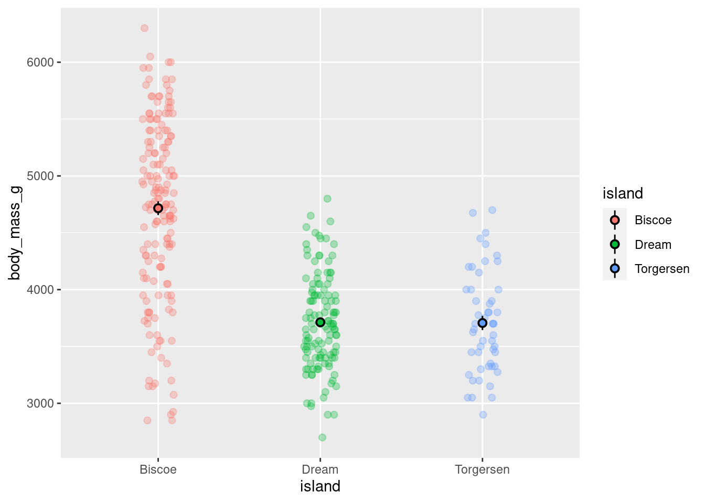
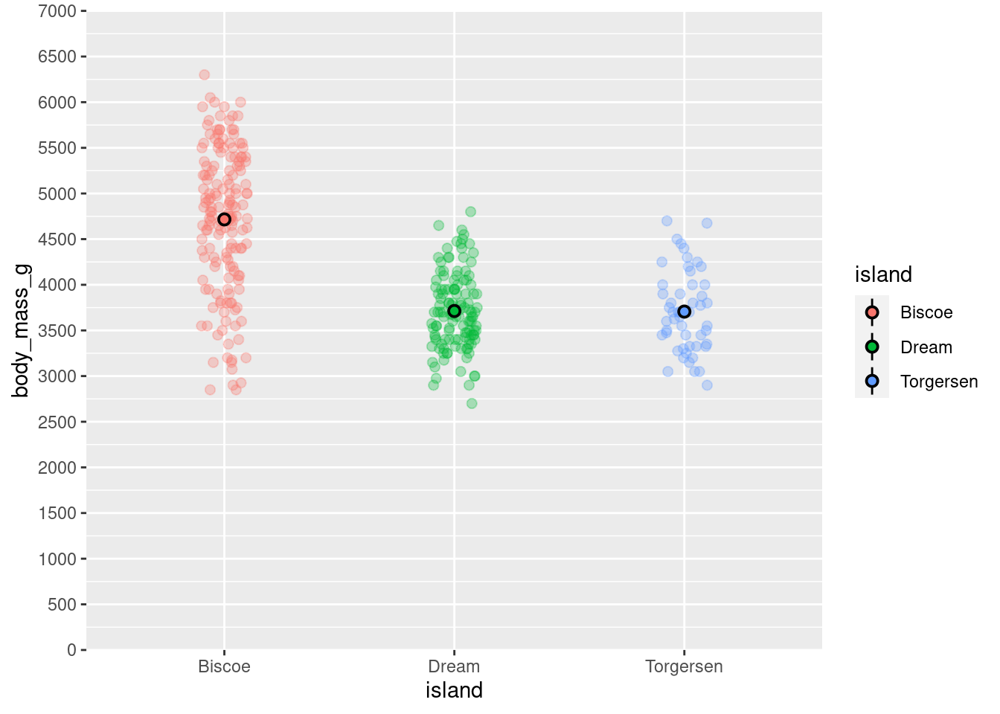
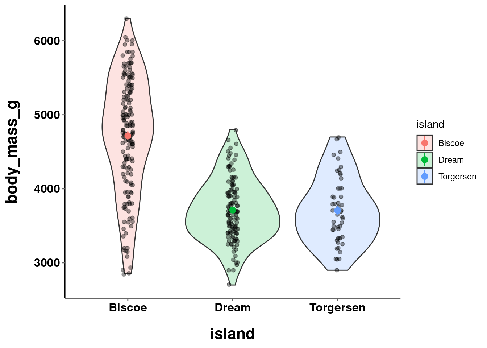
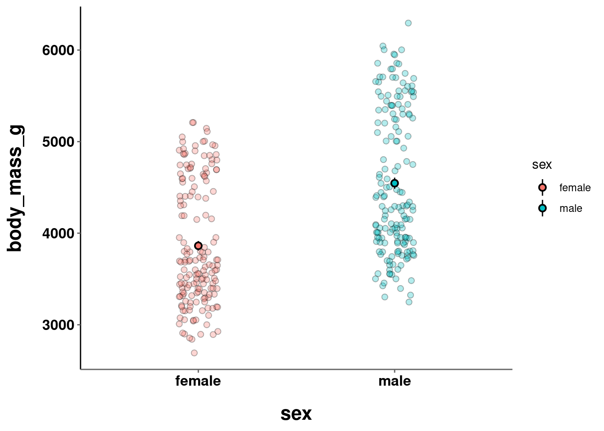

# Customization


```r
library(tidyverse)
library(palmerpenguins)
```

<!-- <a href="exercises/Exercise_Viz3.Rmd" download>Exercise Sheet</a> -->

You now have a number of different graphs in your toolkit to use when visualizing different types of relationships or comparisons in your data. You also learned a lot of ways to tinker with the geoms and their aesthetics. Now it is time to add some techniques and skills to customize the other elements of the graphs.

This will serve as a base plot to customize:


```r
base_plot = penguins %>%
  ggplot(aes(y = body_mass_g, x = island)) +
  geom_jitter(height = 0, width = 0.1, 
              size = 2, alpha = 0.3,
              aes(color=island)) +
    stat_summary(fun.data = "mean_se",
               geom = "pointrange",
               color = "black",
               aes(fill = island),
               shape = 21,
               size = 0.5)

base_plot
```



Saving the visualization to a variable prevents the need to copy/paste the entire code each time.

<!-- <div class="panel panel-success"> -->
<!--   <div class="panel-heading">**EXERCISE 1**</div> -->
<!--   <div class="panel-body">Use the `penguins` dataframe and create your own `base_plot`. Make sure to have a continuous variable on the y-axis and a categorical variable on the x-axis. -->
<!--   </div> -->
<!-- </div> -->

## Scaling The Axes

By default, ggplot will use axes settings that it thinks best highlight the data being visualized. Here,the y-axis runs from ~2000 - 7000 and has intervals of 1000 starting at 3000.

This can be changed using a `scale_*_*` function. The first `*` is replaced by which axis you want to modify, and the second with what type of data or scale you want it to have. Here, the y-axis is continuous, so `scale_y_continuous()` would be used. Its arguments can be used to modify what is shown on the axis. There are two reasons why you might want to change this.

1. Generally speaking, it is good practice to have your axes start at 0 and show the full scale. It can be misleading when parts of a scale are obscured and removed. 

2. You might have an issue with points being jittered past the scale and result in the Warning message covered in previous lessons. 


```r
base_plot +
  scale_y_continuous(breaks = seq(from = 0, to = 7000, by = 500),
                     labels = seq(from = 0, to = 7000, by = 500))
```


Hm. So it DID change the intervals from 1000 to 500, but it still only shows values from 3000 to 6000. This is because the actual range of the axis was not changed. Remember that all graphs are plotted with (x,y) **cartesian** **coord**inates. With this in mind, what needs to be modified are the limits of that coordinate system. This can be done with `coord_cartesian()`.


```r
base_plot +
  coord_cartesian(ylim = c(0,7000)) + 
  scale_y_continuous(breaks = seq(from = 0, to = 7000, by = 500),
                     labels = seq(from = 0, to = 7000, by = 500))
```


Changing the limits of the coordinate system changes the zoom of your visualization and not the underlying data. 

There are a number of other scale commands that override the default, such as `scale_y_log10()`, `scale_y_sqrt()`, and `scale_y_reverse()`, to quickly and easily change the scale. Instead of having to completely transform all your data, just adding a transform to the axis in your plot can be a big time saver and much safer!

<!-- <div class="panel panel-success"> -->
<!--   <div class="panel-heading">**EXERCISE 2**</div> -->
<!--   <div class="panel-body">Modify your `base_plot` so the scale is more appropriate and represents the full range. -->
<!--   </div> -->
<!-- </div> -->

### Get Rid Of Padding

Even though the y-axis starts at 0 now, there is a bit of space between the actual start of the graph and the 0. By default there will be a bit of padding. This can be particularly egregious when you have bars:


```r
penguins %>%
  ggplot(aes(y = body_mass_g, x = island)) + 
  stat_summary(fun = "mean", geom = "bar")
```


This can be eliminated with the `expand` argument.


```r
base_plot +
  coord_cartesian(ylim = c(0,7000)) + 
  scale_y_continuous(breaks = seq(from = 0, to = 7000, by = 500),
                     labels = seq(from = 0, to = 7000, by = 500),
                     expand = c(0,0))
```



<!-- <div class="panel panel-success"> -->
<!--   <div class="panel-heading">**EXERCISE 3**</div> -->
<!--   <div class="panel-body">Modify your `base_plot` so the padding is gone. -->
<!--   </div> -->
<!-- </div> -->

## Titles, Captions, and Labels, Oh My!

While it is the case that your visualization should be interpretable without reference to a title or caption, a good visualization should have a clear and informative title. Additionally, you may have noticed that ggplot uses the variable names and values as the x- and y-axis labels and values, respectively. It is often the case that the names that are easiest to work with for data manipulation/cleaning are not what you want displayed on your visualizations.

Fortunately, it is extremely easy to change all of these things! They are all different arguments that can be passed to the `labs()` function:


```r
base_plot +
  coord_cartesian(ylim = c(0,7000)) + 
  scale_y_continuous(breaks = seq(from = 0, to = 7000, by = 500),
                     labels = seq(from = 0, to = 7000, by = 500),
                     expand = c(0,0)) +
  labs(title = "How Does Penguin Weight Vary Across Islands?",
       subtitle = "Islands Contain Different Penguin Species",
       y = "Body Mass (grams)",
       x = "Island",
       tag = "Figure 1",
       caption = "Note: Error bars represent +/- 1 SEM")
```


The specific arguments used are pretty self explanatory. While this added more information to the visualization, it does not particularly look great. The size of the title and subtitle are too close together, and both rather small. In fact, all the text is pretty small. The titles should be centered while the footnote should be left-aligned. Adding more information just created more that needs to be customized! 

<p class="text-info"> **<u>Note:</u> Graphs here may look slightly different from those you generate with the same code. There is some hidden formatting in the back-end included to help the graphs render properly in the space constraint.**</p>

<!-- <div class="panel panel-success"> -->
<!--   <div class="panel-heading">**EXERCISE 4**</div> -->
<!--   <div class="panel-body">Modify your `base_plot` so that it has more appropriate titles for the y- and x-axis. Additionally, add an appropriate title, subtitle (if needed), figure tag, and caption. -->
<!--   </div> -->
<!-- </div> -->

## Themes

The **theme** of a visualization is where most of the nuanced customization will take place.

First, all the tweaks made thus far will be saved, again to prevent the need from more copy/pasting:

Again, to prevent the need for more copy/pasting and long code strings, all subsequent changes will just be added and saved to one variable. The full code will be displayed at the end.


```r
modified_plot = base_plot +
  coord_cartesian(ylim = c(0,7000)) + 
  scale_y_continuous(breaks = seq(from = 0, to = 7000, by = 500),
                     labels = seq(from = 0, to = 7000, by = 500),
                     expand = c(0,0)) +
  labs(title = "How Does Penguin Weight Vary Across Islands?",
       subtitle = "Islands Contain Different Penguin Species",
       y = "Body Mass (grams)",
       x = "Island",
       tag = "Figure 1",
       caption = "Note: Error bars represent +/- 1 SEM")
```

ggplot comes with a number of built in themes that have preset settings. Among the most common are `theme_minimal()`, `theme_bw()`, and `theme_classic()`.


```r
modified_plot +
  theme_minimal()
```


```r
modified_plot +
  theme_bw()
```


```r
modified_plot +
  theme_classic()
```


You should start to develop your own personal taste for which visualizations you find the most pleasing and informative. For the sake of illustration, subsequent figures will use `theme_classic()`.

<!-- <div class="panel panel-success"> -->
<!--   <div class="panel-heading">**EXERCISE 5**</div> -->
<!--   <div class="panel-body">Create a new variable called `modified_graph` that takes your `base_graph` and saves all modifications you've added thus far. Then, try applying some different themes to your `modified_graph`. -->
<!--   </div> -->
<!-- </div> -->

While using one of ggplot's built in themes serves as a good starting point, to make manual changes to the theme's settings, you use the `theme()` function. This function works as follows, generally speaking, you first specify the specific element of the visualization you want to modify, set that equal to what type of element it is with an `element_*()` call (e.g., text, line, blank, etc.), and then specify what part of that element you want to change and what value it should be equal to.

For example, if you wanted to change the title so the text had a size 18 font, you would add the following to your code:

`theme(plot.title = element_text(size = 18))`

You do not have to, and should not, commit to memory all the different visualization element names and arguments to modify! In fact, just check out [this](figures/ggplot_theme_cheatsheet.png) handy cheat sheet!

A few of the most common elements and ways in which you may want to modify them are highlighted below. These should be pretty intuitive, so there will not be a ton of explanation.

### Titles

Changing some of the the size, font face (by making some bold), and color, of text in your visualization will help improve its overall legibility.


```r
modified_plot = modified_plot +
  theme_classic() +
  theme(plot.title = element_text(size = 18),
        plot.subtitle = element_text(size = 10, 
                                     color = "grey50",
                                     face = "bold"),
        plot.tag = element_text(face = "bold"))

modified_plot
```


By default, most text in ggplot2 is left-aligned. To change the location of the text, you need to ad**just** its **v**ertical or **h**orizontal location in the coordinate system, using `vjust` or `hjust`, respectively. When adjusting:

* 0 == left-aligned
* 0.5 == centered
* 1 == right-aligned


```r
modified_plot = modified_plot +
  theme(plot.title = element_text(size = 18,
                                  hjust = 0.5,
                                  face = "bold"),
        plot.subtitle = element_text(size = 10, 
                                     color = "grey50",
                                     hjust = 0.5),
        plot.tag = element_text(face = "bold"))

modified_plot
```


<!-- <div class="panel panel-success"> -->
<!--   <div class="panel-heading">**EXERCISE 6**</div> -->
<!--   <div class="panel-body">Add some code to `modified_graph` to modify your visualization's titles and increase their legibility. -->
<!--   </div> -->
<!-- </div> -->

### Captions


```r
modified_plot = modified_plot +
  theme(plot.caption = element_text(hjust = 0,
                                    face = 'italic'))

modified_plot
```


<!-- <div class="panel panel-success"> -->
<!--   <div class="panel-heading">**EXERCISE 7**</div> -->
<!--   <div class="panel-body">Add some code to `modified_graph` to modify your visualization's caption and increase its legibility. -->
<!--   </div> -->
<!-- </div> -->

### Axes Titles

When there are multiple elements in your visualization (e.g., multiple axis titles), you can either change both simultaneously (e.g., using `axis.title`) or specify each individually (e.g., using `axis.title.x` and `axis.title.y`).


```r
modified_plot +
  theme(axis.title.x = element_text(size = 14,
                                    face = "bold"),
        axis.title.y = element_text(size = 14,
                                    face = "bold"))
```


As the text gets bigger, the axes titles seem too close to the tick mark values. There needs to be some breathing room to keep the different elements visually distinct and easy to parse. Otherwise, your visualization will be in **t****r**ou**b****l**e This can be achieved by modifying the text's margins -- the area to the **t**op, **r**ight, **b**ottom, and **l**eft of it.


```r
modified_plot = modified_plot +
  theme(plot.subtitle = element_text(size = 10, 
                                     color = "grey50",
                                     hjust = 0.5,
                                     margin = margin(b = 0.2, 
                                                     unit = "inch")),
        axis.title.x = element_text(size = 16,
                                    face = "bold",
                                    margin = margin(t = 0.2, 
                                                    unit = "inch")),
        axis.title.y = element_text(size = 16,
                                    face = "bold",
                                    margin = margin(r = 0.2, 
                                                    unit = "inch")))

modified_plot
```


Notice that the margins are in reference to the overall orientation of the graph. To add space between the y-axis title and the values, even though it is the "bottom" of the element, it is to the right of the overall graph. Thus, some "r" space is added in `margin()`.

<!-- <div class="panel panel-success"> -->
<!--   <div class="panel-heading">**EXERCISE 8**</div> -->
<!--   <div class="panel-body">Add some code to `modified_graph` to modify your visualization's axes titles and increase their legibility. -->
<!--   </div> -->
<!-- </div> -->

### Axes Values

You saw previously how the actual values on the axes could be modified with a `scale_*_*` function. The appearance of those values can also be customized. The values on the axis, as well as the tick marks and lines themselves!


```r
modified_plot = modified_plot +
  theme(axis.line.x = element_line(color = "gray40", size = 0.5),
        axis.ticks = element_line(color = "gray40", size = 0.5),
        axis.text = element_text(face = "bold",
                                 color = "black",
                                 size = 12))

modified_plot
```


<p class="text-info"> **<u>Note:</u> It is generally not recommended to change the color of your axis lines or tick marks. This is included for instructional purposes.**</p>

Now **THAT** is looking like a publication-worthy visualization!

<!-- <div class="panel panel-success"> -->
<!--   <div class="panel-heading">**EXERCISE 9**</div> -->
<!--   <div class="panel-body">Add some code to `modified_graph` to modify your visualization's axes values and increase their legibility. -->
<!--   </div> -->
<!-- </div> -->

### Setting a Default

So you have gone through and learned all these ways to customize your visualizations. You may have started to develop a sense of what you think looks best generally -- e.g., particular font sizes, spacing, etc. While individual visualizations will of course need some tweaks (like the correct titles), you may have some settings you think can serve as a good baseline.

Instead of having to include all the same `theme()` code for every single visualization you make:


```r
theme(plot.title = element_text(size = 18,
                                face = "bold",
                                hjust = 0.5),
      plot.subtitle = element_text(size = 10, 
                                   color = "grey50",
                                   face = "bold",
                                   hjust = 0.5,
                                   margin = margin(b = 0.2, 
                                                   unit = "inch")),
      plot.tag = element_text(face = "bold"),
      plot.caption = element_text(hjust = 0,
                                  face = 'italic'),
      axis.title.x = element_text(size = 16,
                                  face = "bold",
                                  margin = margin(t = 0.2, 
                                                  unit = "inch")),
      axis.title.y = element_text(size = 16,
                                  face = "bold",
                                  margin = margin(r = 0.2, 
                                                  unit = "inch")),
      axis.line.x = element_line(color = "gray40", size = 0.5),
      axis.ticks = element_line(color = "gray40", size = 0.5),
      axis.text = element_text(face = "bold",
                               color = "black",
                               size = 12))
```

You can just set a default that will automatically be applied to all visualizations you make with ggplot until you restart your R session. You can do this with `theme_set()`


```r
theme_set(theme_classic() + 
            theme(plot.title = element_text(size = 18,
                                face = "bold",
                                hjust = 0.5),
      plot.subtitle = element_text(size = 10, 
                                   color = "grey50",
                                   face = "bold",
                                   hjust = 0.5,
                                   margin = margin(b = 0.2, 
                                                   unit = "inch")),
      plot.tag = element_text(face = "bold"),
      plot.caption = element_text(hjust = 0,
                                  face = 'italic'),
      axis.title.x = element_text(size = 16,
                                  face = "bold",
                                  margin = margin(t = 0.2, 
                                                  unit = "inch")),
      axis.title.y = element_text(size = 16,
                                  face = "bold",
                                  margin = margin(r = 0.2, 
                                                  unit = "inch")),
      axis.line.x = element_line(color = "gray40", size = 0.5),
      axis.ticks = element_line(color = "gray40", size = 0.5),
      axis.text = element_text(face = "bold",
                               color = "black",
                               size = 12)))
```


Now all new visualizations will automatically have these settings applied by default!


```r
penguins %>%
  ggplot(aes(y = body_mass_g, x = island)) +
  geom_violin(aes(fill = island),
              alpha = 0.2) +
  geom_jitter(alpha = 0.4, width = 0.05) +
  stat_summary(fun.data = "mean_se",
               geom = "pointrange",
               aes(color = island),
               size = 0.5)
```



<!-- <div class="panel panel-success"> -->
<!--   <div class="panel-heading">**EXERCISE 10**</div> -->
<!--   <div class="panel-body">Use the code you've generated throughout the previous few examples to create a new default theme setting. -->
<!--   </div> -->
<!-- </div> -->

### Legends

Modifying the visualization's legend can be a bit tricky because there are a lot of changes you can make. One of the first options is to get rid of it altogether, since your graphs should not rely on a legend for comprehension:


```r
modified_plot +
  theme(legend.position = "none")
```


However, in certain cases, particularly if you are displaying information from another variable (e.g., indicating penguin `sex` by point `shape`), a legend is needed and customization may be useful.


```r
penguins %>%
  drop_na() %>%
    ggplot(aes(y = body_mass_g, x = island)) +
    geom_point(size = 2, alpha = 0.3,
               shape = 21,
                aes(fill = sex),
                position = position_jitterdodge()) +
    stat_summary(fun.data = "mean_se",
                 geom = "pointrange",
                 color = "black",
                 aes(fill = sex),
                 shape = 21,
                 size = 0.5,
                 position = position_dodge(width = 0.75)) +  
  coord_cartesian(ylim = c(0,7000)) + 
  scale_y_continuous(breaks = seq(from = 0, to = 7000, by = 500),
                     labels = seq(from = 0, to = 7000, by = 500),
                     expand = c(0,0)) +
  labs(title = "How Does Penguin Weight Vary Across Islands?",
       subtitle = "Islands Contain Different Penguin Species",
       y = "Body Mass (grams)",
       x = "Island",
       tag = "Figure 1",
       caption = "Note: Error bars represent +/- 1 SEM",
        # New code starts here:
       fill = "Sex" # Change Legend label with the name of the mapped aesthetic.
       ) +
  theme(legend.box.background = element_rect(color = "black", # Add a defined box around legend
                                             size = 2),
        legend.title = element_text(face = "bold"), # Modify the title
        legend.text = element_text(face = "bold"), # Modify text
        legend.title.align = 0.5, # Change alignment of legend title. Think of this like an hjust.
        legend.key = element_rect(fill = "white", colour = "black") # Add defined boxes around legend key graphic
        ) 
```


<!-- ## Text and Labels -->

## Combining Graphs

With these newly acquired data visualization skills, you will likely be creating more than a single visualization at a time. To combine and arrange multiple graphs into a single figure, you can use the `patchwork` package!

{width=100%}
<p style="font-size:6pt">Artwork by @allison_horst</p>

Take the following 3 graphs for example:


```r
a = penguins %>%
  ggplot(aes(y = body_mass_g, x = island)) +
  geom_jitter(height = 0, width = 0.1, 
              size = 2, alpha = 0.3,
              aes(color=island)) +
    stat_summary(fun.data = "mean_se",
               geom = "pointrange",
               color = "black",
               aes(fill = island),
               shape = 21,
               size = 0.5)
a
```


```r
b = penguins %>%
  ggplot(aes(y = body_mass_g, x = species)) +
  geom_jitter(height = 0, width = 0.1, 
              size = 2, alpha = 0.3,
              aes(color=species)) +
    stat_summary(fun.data = "mean_se",
               geom = "pointrange",
               color = "black",
               aes(fill = species),
               shape = 21,
               size = 0.5)
b
```


```r
c = penguins %>%
  drop_na() %>%
    ggplot(aes(y = body_mass_g, x = sex)) +
    geom_point(size = 2, alpha = 0.3,
               shape = 21,
                aes(fill = sex),
                position = position_jitter(width = 0.1)) +
    stat_summary(fun.data = "mean_se",
                 geom = "pointrange",
                 color = "black",
                 aes(fill = sex),
                 shape = 21,
                 size = 0.5)
c
```



Patchwork uses a pretty intuitive system to create different layouts when combining graphs by using the `+`, `/`, and `|` operators. 


```r
library(patchwork)
```

`+` combines graphs using the default layout (creating as square a grid as possible)


```r
a + b
```


`/` will stack graphs on top of each other


```r
b / c
```


`|` places graphs next to each other and can nest arrangements created with the other operators. For up to 3 graphs the result from using `|` is identical to `+`. Using `|` best communicates the intended layout.


```r
(c | (a / b))
```


<p class="text-info"> **<u>Note:</u> The format settings defined for a single graph may not be best for an arrangement of multiple graphs combined into a single visualization. In the visualizations above the axes titles and labels are a little too big, causing some of them to overlap and be unreadable.**</p>

<!-- <div class="panel panel-success"> -->
<!--   <div class="panel-heading">**EXERCISE 11**</div> -->
<!--   <div class="panel-body">Use patchwork to combine your `base_graph` and `modified_graph` to compare the two. Try arranging them in different layouts using different operators. -->
<!--   </div> -->
<!-- </div> -->

<!-- You can use the `plot_layouts()` function to specify the number of columns in the graph arrangement and have more manual control over the layout. Compare the two outputs below. -->

<!-- ```{r warning=FALSE} -->
<!-- a + b + c -->
<!-- ``` -->

<!-- ```{r warning=FALSE} -->
<!-- a + b + c +  -->
<!--   plot_layout(ncol = 1, -->
<!--               guides = "collect") -->
<!-- ``` -->

## Saving Graphs

Once you have created your masterpieces, you may want to export them so they can be added to manuscripts created outside of R, posters, or anything else. To save your ggplot graphs, you can use `ggsave()`. You have several file type options, but I would recommend pdf. It generally maintains a high resolution AND aspect ratio. In `ggsave()`, you must specify:

* the `filename` you want your graph to be saved with (which can/should include a relative file path)
* which `plot` you want to be saving
* the `width` and `height` of the file


```r
ggsave(plot = a, 
       filename = "visualizations/test_plot.pdf",
       width = 12,
       height = 8)
```

<!-- <div class="panel panel-success"> -->
<!--   <div class="panel-heading">**EXERCISE 12**</div> -->
<!--   <div class="panel-body">Save your `modified_graph` and include that graph file with your submission. -->
<!--   </div> -->
<!-- </div> -->

## Extra resources

* [Data Visualization -- A practical introduction (by Kieran Healy)](http://socviz.co/)
* [Graphics for communication](http://r4ds.had.co.nz/graphics-for-communication.html)
* [Patchwork source](https://github.com/thomasp85/patchwork)
* [Patchwork background](https://www.data-imaginist.com/2019/patch-it-up-and-send-it-out/)
* [ggplot theme cheat sheet](figures/ggplot_theme_cheatsheet.png)
