# Color Theory


Load Packages:

```r
library(palmerpenguins)
library(patchwork)
library(RColorBrewer)
library(colorspace)
library(viridis)
library(tidyverse)
```

Set Theme:

```r
theme_set(theme_classic() + 
            theme(plot.title = element_text(size = 18,
                                face = "bold",
                                hjust = 0.5),
      plot.subtitle = element_text(size = 10, 
                                   color = "grey50",
                                   face = "bold",
                                   hjust = 0.5,
                                   margin = margin(b = 0.2, 
                                                   unit = "inch")),
      plot.tag = element_text(face = "bold"),
      plot.caption = element_text(hjust = 0,
                                  face = 'italic'),
      axis.title.x = element_text(size = 16,
                                  face = "bold",
                                  margin = margin(t = 0.2, 
                                                  unit = "inch")),
      axis.title.y = element_text(size = 16,
                                  face = "bold",
                                  margin = margin(r = 0.2, 
                                                  unit = "inch")),
      axis.text = element_text(face = "bold",
                               color = "black",
                               size = 12)))
```


<!-- <a href="exercises/Exercise_Viz4.Rmd" download>Exercise Sheet</a> -->

At this point, you know why it is important to visualize your data, several types of graphs to use to create visualizations of different relationships and comparisons within your data, and how to customize some of the elements in those graphs. Changes to the specific type of graph you use, or its title and axes labels, are overt ways to impact the effectiveness of your visualization. However, there are other things that, while subtle, have a very significant impact as well. 

Visualizations are composed of different geometric shapes, lines, edges, contours, colors, etc. With this in mind, it is important to consider different aspects of visual perception and how they affect the way your graph will be perceived by a viewer. This final part of the section on Visualizations covers color and design principles. These are often overlooked when considering how to make an effective visualization, but very important!

The following graphs will serve as examples used throughout.

<p class="text-info"> **<u>Note:</u> these are not great visualizations, but will be useful to illustrate some different concepts.**</p>


```r
plot_bar = penguins %>%
  ggplot(aes(y = body_mass_g, x = island,
             fill = island)) +
  stat_summary(fun = "mean", geom = "bar") +
  scale_y_continuous(expand = c(0,0))

plot_bar
```


```r
plot_jitter = penguins %>%
  ggplot(aes(y = body_mass_g, x = island)) +
  geom_jitter(height = 0, width = 0.2, 
              size = 2, alpha = 0.5,
              aes(color = island)) +
    stat_summary(fun.data = "mean_se",
               geom = "pointrange",
               size = 0.5)

plot_jitter
```

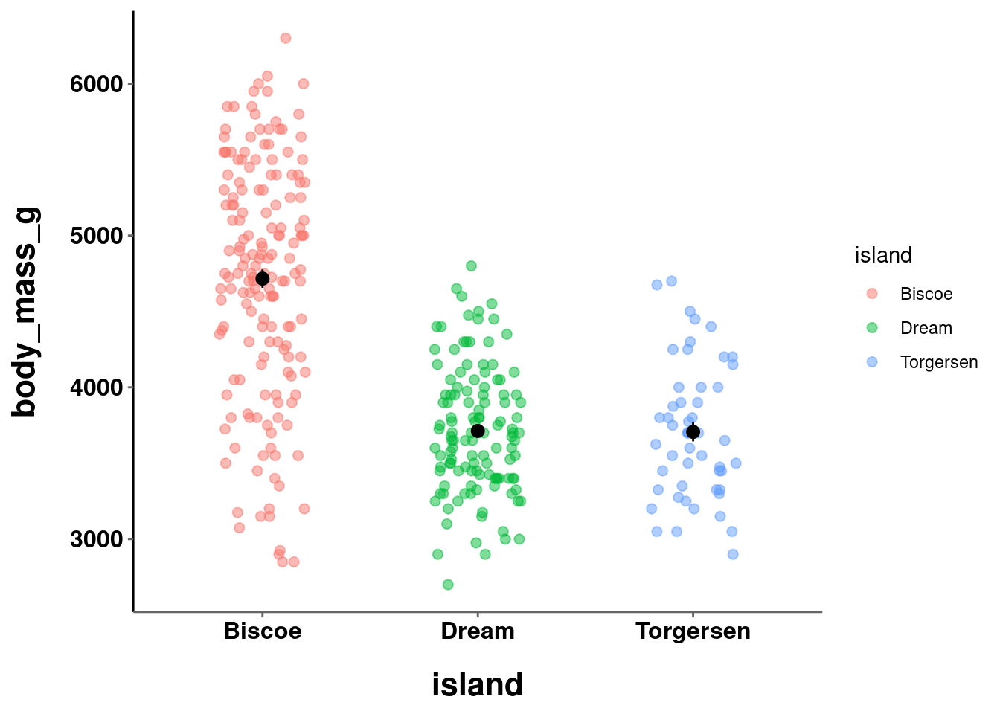

```r
plot_line = penguins %>%
  ggplot(aes(y = body_mass_g, x = bill_depth_mm, color = bill_depth_mm)) +
  stat_summary(fun = "mean", geom = "point", size = 2) +
  stat_summary(fun = "mean", geom = "line", size = 1)

plot_line
```


```r
plot_hex = penguins %>%
  ggplot(aes(y = body_mass_g,
             x = bill_depth_mm,
             z = flipper_length_mm)) +
  stat_summary_hex() +
  labs(fill = "Flipper Length")

plot_hex
```


In all of the visualizations you have created thus far the colors were either automatically chosen by R or manually, but arbitrarily, set. Color choices, like all aspects of your visualization, should be made intentionally and purposefully. What, then, are the things you should consider and factor into your decision making process?

## HCL and Color Theory

While discussing what should be considered when deciding color choices, a good starting place is to figure out what is meant by "color". There are many formal definitions and ways to quantify what a "color" is. For the purposes here, you can think of "color" as being composed of 3 parts.

### Hue

[Hue](https://en.wikipedia.org/wiki/Hue) is what is conventionally meant when describing something's color. e.g., red, blue, green, etc. Hues are organized along a color wheel and are defined by the angle (0&deg; - 360&deg;) on this wheel:


Different hues are not perceived as having an inherent order. For example, even though cyan corresponds to a degree of 180 and green of 120, cyan is not perceived to be "bigger" than green. Yellow (60&deg;) is not perceived to be in between red (0&deg;) and green (120&deg;). 

### Chrominance (Chroma)

Chroma is technically distinct from saturation, but functionally can be viewed the same. It is the degree of purity or intensity of a color. Chroma values range from a muted/grey to the fully vivid color. Unlike hue, chroma **is** perceived to be ordered. e.g., pink is viewed as being "between" white and red.

{width=100%}
<p style="font-size:8pt">Source: [Somewhere Over the Rainbow...](10.1175/BAMS-D-13-00155.1)</p>

### Luminance

Luminance is the brightness of a color. It ranges on a scale from black to white. Like chroma, and unlike hue, luminance is also perceived to be ordered. For example, grey is viewed as "between" black and white. 

{}
<p style="font-size:8pt">Source: [Somewhere Over the Rainbow...](10.1175/BAMS-D-13-00155.1)</p>


### Why Does This Matter?

To this point, this information may seem fairly irrelevant. Interesting, but disconnected. Why care about different components of "color"? It is a fair question, because most people do not. Consider, though, what you are doing when using color in a visualization. You are mapping specific colors that a viewer will observe to a specific quantity or category (depending on the variable type) in your data. You will, of course, want this mapping to accurately and meaningfully characterize the data it is representing. For example, the difference between two data points or summary statistics should be maintained when choosing values to define the colors used to represent them. Beyond this *numerical* accuracy, you want this difference to be maintained in a viewer's *perception* of those different colors.

However, this is where things start to get tricky. Consider the two graphs below:


In both, there are 5 bars of equal height which use a grey scale ranging from dark to light. Each numerically positioned bar has the same exact luminance as the corresponding bar on the other graph. In the graph where the bars are touching, the darker bars seem comparatively darker and the lighter bars comparatively lighter. These are known as "mach bands" and are a classic visual illusion. Luminance is an important property of "color", and our perception of luminance is based on *relative* rather than *absolute* judgments. Even though two things may have precisely the same luminance, the perceived color is influenced by the environment and surrounding objects! 

To make matters worse, even disregarding the impact that environmental factors may have on visual/color perception, the HCL color space itself is not even perceptually uniform! Two "colors" that are one unit apart in one area of HCL space may look very similar or very different, and this is not constant across the entirety of the space. 

The take home point is that <u>**color values that are *numerically* uniform may not be *perceptually* uniform**</u>. This needs to be considered when choosing color scales and palettes for your visualizations. Perception is the the most important thing, so scales and palettes should only be used if there is a perceptually uniform magnitude of change between each level. The type of color scale, and specific color palette, used depends on the type of data being visualized and the use case for your visualization.

## Categorical 

When visualizing categorical/discrete data, color is used as a tool to help a viewer easily distinguish different groups, levels, or categories. Importantly, it is most often the case that these groups, levels, or categories, **do not** have an inherent order. For example, different political parties, Hogwarts houses, UCSD colleges, pokemon types, etc. These are distinct groups, but do not have an inherent order (despite some subjective opinions...).

In such instances you use a <u>*qualitative*</u> color scale, which contains a specific set of perceptually distinct but equivalently different colors. The set of colors does not convey any particular ordering or salience of particular colors compared to the rest.

To change the color scale and/or palette used in your visualization, you will use another `scale_*_*()` command. The first asterisk gets replaced by what aesthetic you have mapped, `fill` or `color`. The second gets replaced by what type of scale you want to use or modify. For example, to manually set the HCL parameters of a color space, you would use `scale_*_hue()`. This function has 3 main arguments:

* `h` = range of hues to use 
  + (ranged from 0 - 360 -- default = (c(0,360) + 15))
* `l` = luminance 
  + (lightness; 0-100 -- default = 65)
* `c` = chroma 
  + (intensity of color -- maximum value varies depending on combination of hue and luminance).

Look at the examples below:


```r
((plot_bar +
  labs(title = "Baseline")) / (plot_bar + 
    scale_fill_hue(c = 200) +
    labs(title = "Change Chroma"))) | ((plot_bar + 
  scale_fill_hue(l = 80) +
  labs(title = "Change Luminance")) / (plot_bar + 
  scale_fill_hue(h = c(0, 60)) + 
  labs(title = "Change Hue Range")))
```


```r
((plot_jitter +
  labs(title = "Baseline")) / (plot_jitter + 
  scale_color_hue(c = 200) +
  labs(title = "Change Chroma"))) | ((plot_jitter + 
  scale_color_hue(l = 80) +
  labs(title = "Change Luminance")) / (plot_jitter + 
    scale_color_hue(h = c(0, 60)) + 
    labs(title = "Change Hue Range")))
```

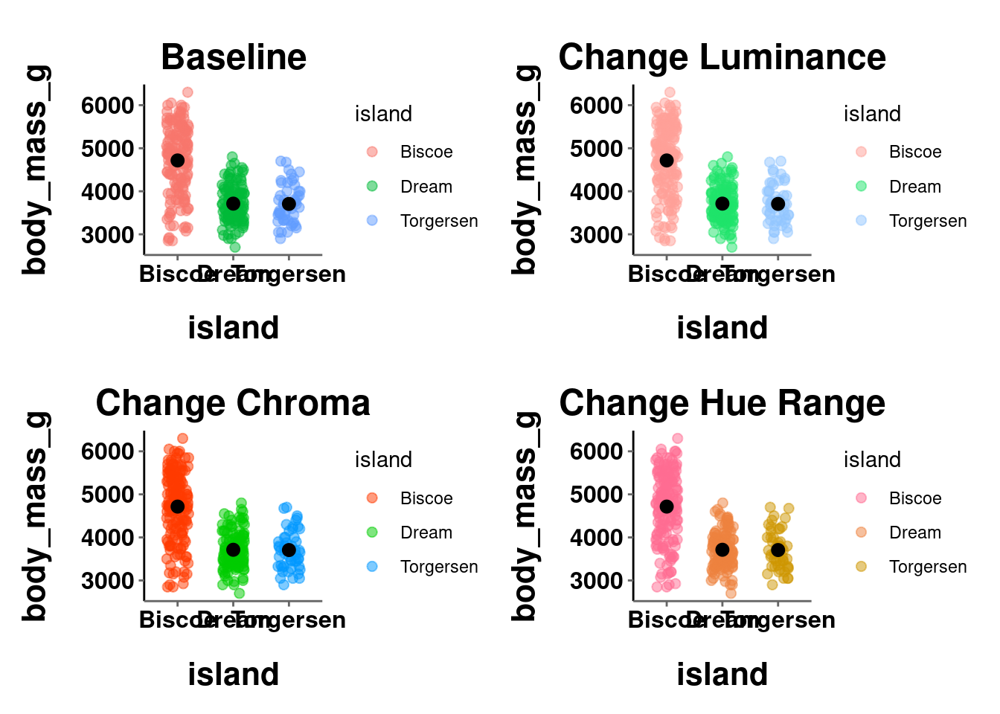

<!-- <div class="panel panel-success"> -->
<!--   <div class="panel-heading">**EXERCISE 1**</div> -->
<!--   <div class="panel-body">Practice changing the values for the 3 arguments in `scale_*_hue()` and see how they affect your visualization. Change multiple simultaneously and see how combinations work! -->
<!--   </div> -->
<!-- </div> -->
Instead of tweaking the HCL values, you may want to just manually choose the colors for yourself. This can be done using `scale_*_manual()`. The main argument here is `values`, which expects a vector of color names/codes to use.


```r
plot_bar +
  scale_fill_manual(values = c("cyan", "lightgreen", "orange4"))
```


```r
plot_jitter +
  scale_color_manual(values = c("magenta", "mediumpurple1", 
                                "lightskyblue"))
```


You can also specify which level of the mapped variable is associated with each specific color:


```r
plot_bar +
  scale_fill_manual(values = c("Torgersen" = "cyan",
                               "Biscoe" = "lightgreen",
                               "Dream" = "orange4"))
```


```r
plot_jitter +
  scale_color_manual(values = c("Torgersen" = "magenta",
                               "Biscoe" = "mediumpurple1",
                               "Dream" = "lightskyblue"))
```

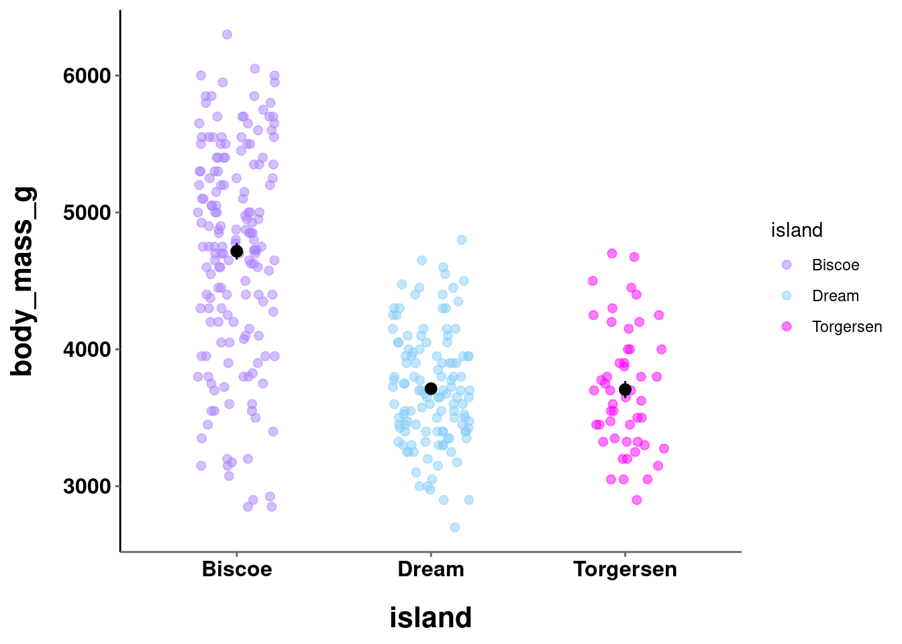

<!-- <div class="panel panel-success"> -->
<!--   <div class="panel-heading">**EXERCISE 2**</div> -->
<!--   <div class="panel-body">Change the colors in both graphs to manually set values. Find a combination of colors you think work well together and are perceptually uniform. -->
<!--   </div> -->
<!-- </div> -->

Where possible, you should choose colors that will be intrinsically informative and intuitive. While the colors in the second graph above are pretty, they are arbitrary. The colors in the first, on the other hand, may be informative. Biscoe might be a more water-based island, while Dream might have more greenery and Torgersen more flat earth terrain. It is easy to think of other examples where this could be useful. If you were visualizing something about Hogwarts houses, you would probably want to use a red color for Gryffindor and a green color for Slytherin. This also cuts down on the need for a viewer to consult the legend to parse your visualization.

It is important to consider what kind of latent information your color choices may be communicating, especially when unintentional! 

## Continuous 

### Sequential

When visualizing continuous data, color is used as a tool to represent the *actual* data values. Here, there **is** an ordering to the values. For example, a score of 80 on an exam is higher than a score of 70, a \$40k salary is more than a \$35k salary, etc. 

In such instances you use a <u>*sequential*</u> color scale, or color *gradient*, 
which contains a sequence of colors. Different colors in this sequence convey both which of two values is larger and additionally the relative distance between those two values. This, again, highlights the necessity for perceptual uniformity between adjacent colors in this scale. The function for this type of color scale in R is `scale_*_gradient()`. The main arguments needed are a `low` and `high` value over which to define the gradient.

A sequential scale can be defined over a single hue (the default is dark to light blue):


```r
plot_line +
  scale_color_gradient()
```


```r
plot_hex +
  scale_fill_gradient(low = "darkgreen", high = "palegreen")
```


or multiple hues:


```r
plot_line +
  scale_color_gradient(low = "lavender", high = "goldenrod4")
```


```r
plot_hex +
  scale_fill_gradient(low = "red", high = "yellow")
```


Remember, a sequential color gradient should create the perception that values have a meaningful sequential order. One way to help with this is keep a constant hue and only vary the chrominance and luminance. Another way is to only use gradients that are readily observed in the natural world (e.g., light yellow to dark red, dark brown to green, etc.)

When creating a scale based on multiple hues, you are not limited to just choosing a `low` and `high` end value. Using `scale_*_gradientn()` allows you to create a gradient over several colors. The argument `colors` takes a vector of colors over which to linearly create a gradient.


```r
plot_line +
  scale_color_gradientn(colors = c("red", "orange", "yellow", 
                                   "green", "blue"))
```


```r
plot_hex +
  scale_fill_gradientn(colors = c("red", "brown", "yellow"))
```

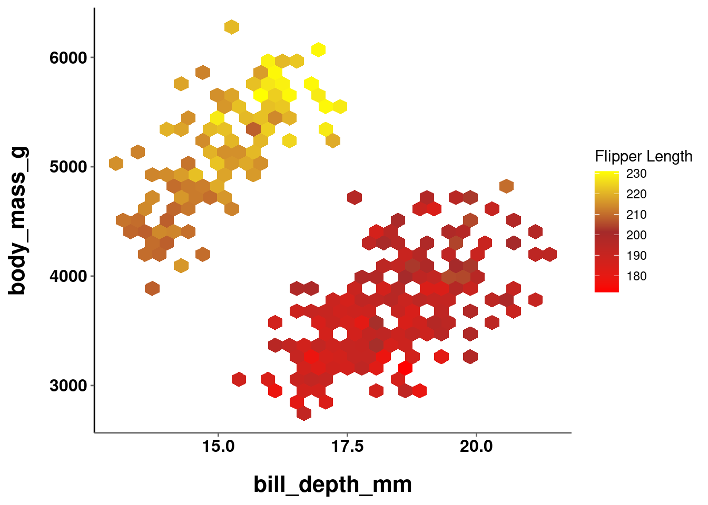

These are obviously terrible color schemes, and are just for illustrative purposes. Using `scale_*_gradientn()` can give you a bit more control over the exact gradient being used.

<!-- <div class="panel panel-success"> -->
<!--   <div class="panel-heading">**EXERCISE 3**</div> -->
<!--   <div class="panel-body">Create 2 single hue gradients that you think seem perceptually uniform. Then create 2 multiple-hue gradients (using either function to do so) that you think seem perceptually uniform. -->
<!--   </div> -->
<!-- </div> -->

### Divergent

Sometimes you may have data with a neutral point or true zero, where deviations in either direction from this midpoint become meaningful. For example, data that contains both positive and negative values, or visualizing deviations from the mean. In such instances, you would use a <u>*divergent*</u> scale. A divergent color scale is essentially two sequential scales appended to a single common point (0, the mean, etc.). Thus, the scale needs to make it readily apparent both in which direction the value is deviating **and** the magnitude of the deviation. It is important for the color gradients on both halves of the scale to be perceptually uniform and equivalent or the perceived magnitude of a value would be an artifact of how you defined the gradient. E.g., values above the neutral point might seem to have a large magnitude of change if the color deviations are more stark than those below it. 

To create a divergent color scale, you use `scale_*_gradient2()` -- which admittedly is a little counterintuitive since you define 3 values and not 2 (and hopefully this little inconsistency will now serve as a way to remember this :P). In addition to the `low` and `high` values that you specified above, you also need to specify a `mid` color. Additionally, you may want to specify what value in your data should serve as the `midpoint` between the two scales. This value is 0 by default.


```r
plot_hex +
  scale_fill_gradient2(low = "red", mid = "grey90", high = "yellow")
```

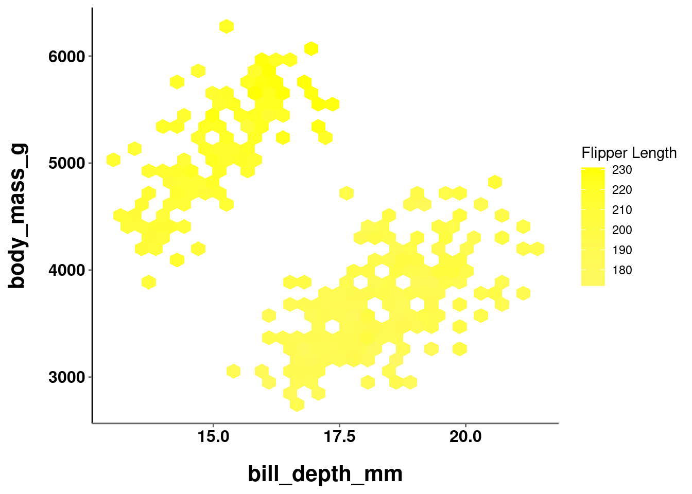

In the graph above, the `midpoint` argument was not set. The default value of 0 was used, but all values in the data fall above it!


```r
plot_hex +
  scale_fill_gradient2(low = "red", mid = "grey90", high = "yellow",
                       midpoint = mean(penguins$flipper_length_mm, na.rm = TRUE))
```


Here, the `midpoint` is set to the mean value for `flipper_length_mm`. You should note that this is not a particularly good scale to use. The midpoint appears to be at about 200, so values at 220 and 180 are equally different from the midpoint. However, because the low value (red) is darker than the high value (yellow), the 180 values are perceived to be more different.

<!-- <div class="panel panel-success"> -->
<!--   <div class="panel-heading">**EXERCISE 4**</div> -->
<!--   <div class="panel-body">Create 2 visualizations using divergent scales that you think are equally uniform in both directions from the midpoint. -->
<!--   </div> -->
<!-- </div> -->

## Pre-defined Color Scales

As you may have realized through the practice exercises, it can be quite difficult to create a good color scale from scratch that is both perceptually uniform and aesthetically pleasing. Fortunately, R has a number of pre-defined color scales that can be used. Some of these are built-in to base R and ggplot, and others can be added from other packages and libraries.

### Built-in

Base R comes with the following color scales:

{width=100%}

Each color scale can be used as a function that takes an argument `n` for the number of colors to sample from that color scale. 


```r
rainbow(n)
heat.colors(n)
terrain.colors(n)
topo.colors(n)
cm.colors(n)
```

This will return those colors' hexcodes, and can be passed in to any argument expecting a vector of color names:


```r
plot_hex +
    scale_fill_gradientn(colors = terrain.colors(4))
```


```r
plot_jitter +
  scale_color_manual(values = heat.colors(3))
```


### Brewer

By way of installing tidyverse and ggplot2, you also have access to RColorBrewer, which contains great pre-defined color scales and palettes. Info on all the palettes is stored in a dataframe called `brewer.pal.info`.


```r
brewer.pal.info
#>          maxcolors category colorblind
#> BrBG            11      div       TRUE
#> PiYG            11      div       TRUE
#> PRGn            11      div       TRUE
#> PuOr            11      div       TRUE
#> RdBu            11      div       TRUE
#> RdGy            11      div      FALSE
#> RdYlBu          11      div       TRUE
#> RdYlGn          11      div      FALSE
#> Spectral        11      div      FALSE
#> Accent           8     qual      FALSE
#> Dark2            8     qual       TRUE
#> Paired          12     qual       TRUE
#> Pastel1          9     qual      FALSE
#> Pastel2          8     qual      FALSE
#> Set1             9     qual      FALSE
#> Set2             8     qual       TRUE
#> Set3            12     qual      FALSE
#> Blues            9      seq       TRUE
#> BuGn             9      seq       TRUE
#> BuPu             9      seq       TRUE
#> GnBu             9      seq       TRUE
#> Greens           9      seq       TRUE
#> Greys            9      seq       TRUE
#> Oranges          9      seq       TRUE
#> OrRd             9      seq       TRUE
#> PuBu             9      seq       TRUE
#> PuBuGn           9      seq       TRUE
#> PuRd             9      seq       TRUE
#> Purples          9      seq       TRUE
#> RdPu             9      seq       TRUE
#> Reds             9      seq       TRUE
#> YlGn             9      seq       TRUE
#> YlGnBu           9      seq       TRUE
#> YlOrBr           9      seq       TRUE
#> YlOrRd           9      seq       TRUE
```

Palettes are grouped into 3 distinct categories:

1. Qualitative
2. Sequential
3. Divergent

Just like the 3 types of color scales outlined above! You can quickly visualize all the palettes with `display.brewer.all()` and specifying which `type` you want to see:


```r
display.brewer.all(colorblindFriendly = TRUE, type = "qual")
```


```r
display.brewer.all(colorblindFriendly = TRUE, type = "seq")
```


```r
display.brewer.all(colorblindFriendly = TRUE, type = "div")
```


Note that the `colorblindFriendly` argument was also used and set to `TRUE`. This filters the results to only show palettes that are colorblind friendly. There is almost no reason to ever not use a colorblind friendly palette. 

Each palette has a maximum number of colors in the scale, but you might be curious about how the palette would look with varying numbers of colors. If you only have 4 levels to your variable, maybe one scale will accommodate that number better than another. You can see the exact colors used for a given palette and number of colors using `display.brewer.pal()`.


```r
display.brewer.pal(n = 4, name = 'Reds')
```


```r
display.brewer.pal(n = 8, name = 'Reds')
```


The specific values of those colors can be identified with `brewer.pal()`.


```r
brewer.pal(n = 4, name = 'Reds')
#> [1] "#FEE5D9" "#FCAE91" "#FB6A4A" "#CB181D"
```

"Okay, cool, I get it, these are AWESOME. How do I ***USE*** them?!"

Fair question! The answer is: very easily! ggplot2 has built in functions to easily adopt the brewer color palettes. You can do so using `scale_*_brewer()` for categorical data and `scale_*_distiller()` for continuous. All you have to do is pass in the name of the specific `palette`.


```r
plot_hex +
    scale_fill_distiller(palette = "GnBu")

plot_line +
  scale_color_distiller(palette = "RdPu")

plot_jitter +
  scale_color_brewer(palette = "Dark2")

plot_bar +
  scale_fill_brewer(palette = "Set2")
```


As a side note, since you can use `brewer.pal()` to get a vector of color values from a specific palette, that can also be used the same way you were setting colors manually above.


```r
plot_hex +
    scale_fill_gradientn(colors = brewer.pal(n = 4, name = 'BuGn'))
```

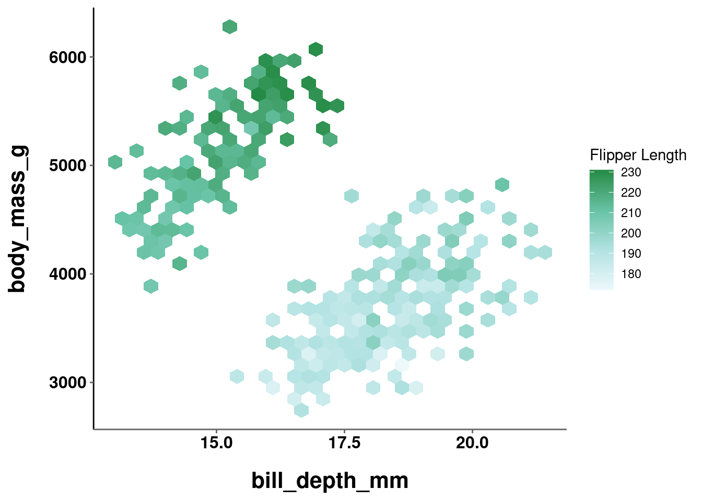

```r
plot_jitter +
  scale_color_manual(values = brewer.pal(n = 3, name = 'Set2'))
```


<!--

```r
plot_hex +
    scale_fill_gradientn(colors = brewer.pal(n = 4, name = 'Reds'))
```

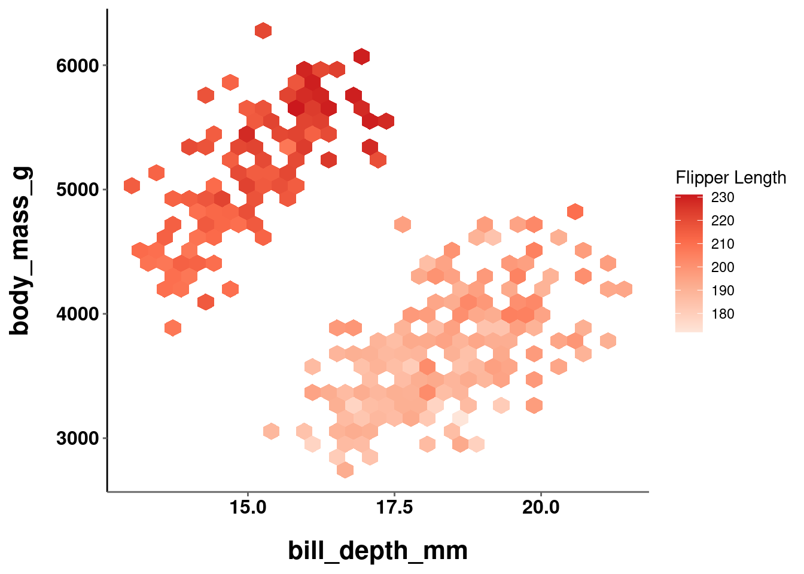

```r
plot_jitter +
  scale_color_manual(values = heat.colors(3))
```


-->

You may sometimes encounter an error like this:

<p style="color:#A79BF0"> **Error: Continuous value supplied to discrete scale**</p>

This is another one of the errors from R that are actually pretty helpful and intuitive. This most often means the function you are using does not map on to the type of data it is being applied to. In most instances like this, you just need to change the function you are using (e.g., brewer vs distiller).

However, while using the wrong function will throw you an error, using an inappropriate color scale may **NOT** give you an error. For example:


```r
plot_jitter +
  scale_color_brewer(palette = "Oranges")
```

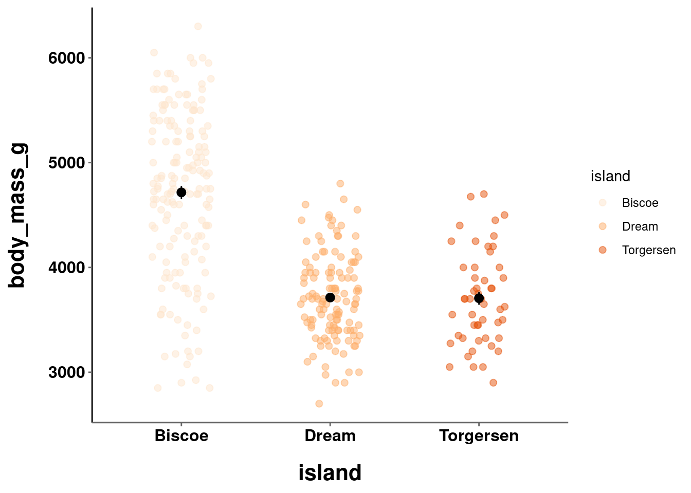

```r
plot_hex +
    scale_fill_distiller(palette = "Set3")
```


Thus, it is important to double check you are using the right type of scale for your data!

<!-- <div class="panel panel-success"> -->
<!--   <div class="panel-heading">**EXERCISE 5**</div> -->
<!--   <div class="panel-body">Try out some different palettes from RColorBrewer, pick your top 3, and modify your visualizations from above to use those palettes. -->
<!--   </div> -->
<!-- </div> -->

### Grey scale

For ink considerations, sometimes you may want to just use a grey scale. ggplot has a built in function to help with this for categorical data (as it is easy to do for continuous) called `scale_*_grey()`. The scale can be selected automatically, or you can specify the `start` and `end` values which range from 0 (dark) to 1 (light).


```r
plot_jitter + 
  scale_color_grey()

plot_bar + 
  scale_fill_grey()

plot_bar + 
  scale_fill_grey(start = 0, end = 0.5)

plot_bar + 
  scale_fill_grey(start = 0.5, end = 0.95)
```

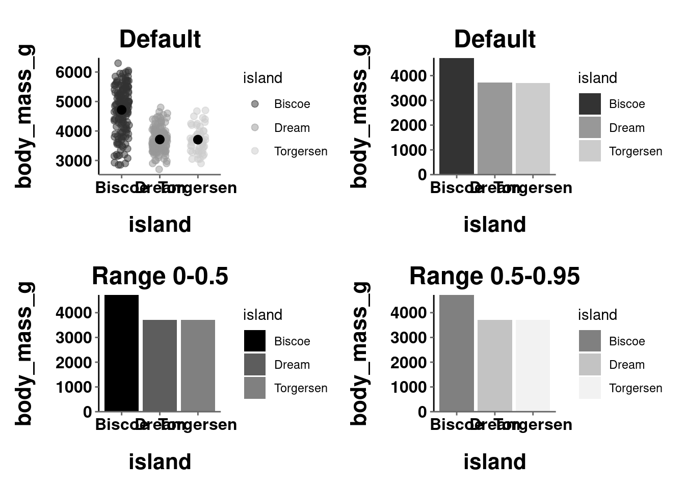

### Viridis

The issue of colorblind friendly palettes was mentioned above and how there is almost no good reason to ever not use a colorblind friendly palette. It can be hard to determine what palettes are colorblind friendly. There are some good resources to help you see how your visualization would look in different forms of colorblindness. One of them is called `cvd_emulator()` from the colorspace package (more on this below). Others are available [online](https://www.vischeck.com/vischeck/vischeckImage.php). 

An alternative to selecting a color palette and then checking to see whether it is colorblind friendly is to just choose a palette specifically designed to be interpretable and effective under a variety of different color vision types (typical and different forms of color blindness). These come from the `viridis` package, which was introduced earlier!

{width=100%}
<p style="font-size:8pt">Source: [viridis documentation](https://cran.r-project.org/web/packages/viridis/vignettes/intro-to-viridis.html)</p>

These palettes can be easily applied by using `scale_*_viridis()`. The specific palette is set with the `option` argument, and can be applied to categorical data by using the `discrete` argument


```r
plot_bar + 
  scale_fill_viridis(discrete = TRUE)

plot_jitter + 
  scale_color_viridis(discrete = TRUE, option = "plasma")

plot_line + 
  scale_color_viridis(option = "inferno")

plot_hex + 
  scale_fill_viridis()
```


You can also generate specific color codes from these palettes in the same way you can from the base R palettes (outlined above)


```r
viridis(n)
magma(n)
inferno(n)
plasma(n)
```

<!-- <div class="panel panel-success"> -->
<!--   <div class="panel-heading">**EXERCISE 6**</div> -->
<!--   <div class="panel-body">Take your code from Exercise 5 and replace the color palettes from RColorBrewer with ones from viridis. -->
<!--   </div> -->
<!-- </div> -->

### colorspace

colorspace is another package that, like RColorBrewer, comes by way of installing tidyverse and ggplot2. It also contains a number of pre-defined color scales and palettes. Info on all the palettes can be accessed with `hcl_palettes()`.


```r
hcl_palettes()
#> HCL palettes
#> 
#> Type:  Qualitative 
#> Names: Pastel 1, Dark 2, Dark 3, Set 2, Set 3, Warm, Cold,
#>        Harmonic, Dynamic
#> 
#> Type:  Sequential (single-hue) 
#> Names: Grays, Light Grays, Blues 2, Blues 3, Purples 2,
#>        Purples 3, Reds 2, Reds 3, Greens 2, Greens 3,
#>        Oslo
#> 
#> Type:  Sequential (multi-hue) 
#> Names: Purple-Blue, Red-Purple, Red-Blue, Purple-Orange,
#>        Purple-Yellow, Blue-Yellow, Green-Yellow,
#>        Red-Yellow, Heat, Heat 2, Terrain, Terrain 2,
#>        Viridis, Plasma, Inferno, Dark Mint, Mint,
#>        BluGrn, Teal, TealGrn, Emrld, BluYl, ag_GrnYl,
#>        Peach, PinkYl, Burg, BurgYl, RedOr, OrYel,
#>        Purp, PurpOr, Sunset, Magenta, SunsetDark,
#>        ag_Sunset, BrwnYl, YlOrRd, YlOrBr, OrRd,
#>        Oranges, YlGn, YlGnBu, Reds, RdPu, PuRd,
#>        Purples, PuBuGn, PuBu, Greens, BuGn, GnBu,
#>        BuPu, Blues, Lajolla, Turku, Hawaii, Batlow
#> 
#> Type:  Diverging 
#> Names: Blue-Red, Blue-Red 2, Blue-Red 3, Red-Green,
#>        Purple-Green, Purple-Brown, Green-Brown,
#>        Blue-Yellow 2, Blue-Yellow 3, Green-Orange,
#>        Cyan-Magenta, Tropic, Broc, Cork, Vik, Berlin,
#>        Lisbon, Tofino
```

You can also `plot` them to actually see the palettes themselves.


```r
hcl_palettes(type = "Qualitative", plot = TRUE)
```


```r
hcl_palettes(type = "Sequential (single-hue)", plot = TRUE)
```


```r
hcl_palettes(type = "Sequential (multi-hue)", plot = TRUE)
```


```r
hcl_palettes(type = "Diverging", plot = TRUE)
```


The way you actually use these palettes is quite similar to how you use `brewer.pal()` to use RColorBrewer palettes! Each type of scale has its own function, where you specify the `palette` and `n`umber of colors from it. That vector of colors can then be used in your ggplot code.


```r
qualitative_hcl(n = 3, palette = "Harmonic")
#> [1] "#C7A76C" "#5CBD92" "#7DB0DD"
sequential_hcl(n = 3, palette = "SunsetDark")
#> [1] "#7D1D67" "#F65A6D" "#FFD99F"
diverging_hcl(n = 3, palette = "Lisbon")
#> [1] "#E2FCFF" "#181818" "#FCFCD3"
plot_hex +
    scale_fill_gradientn(colors = sequential_hcl(n = 3, 
                                                 palette = "SunsetDark"))
```


You may have noticed when looking at the colorspace palettes that many of them seem similar to ones from RColorBrewer or viridis. That would be astute, because there are many that are similar or attempt to be identical palettes. The word "attempt" is doing a lot of work here though, because these palettes are often not actually identical.

Below, a color palette from brewer and viridis are compared to their colorspace counterpart:

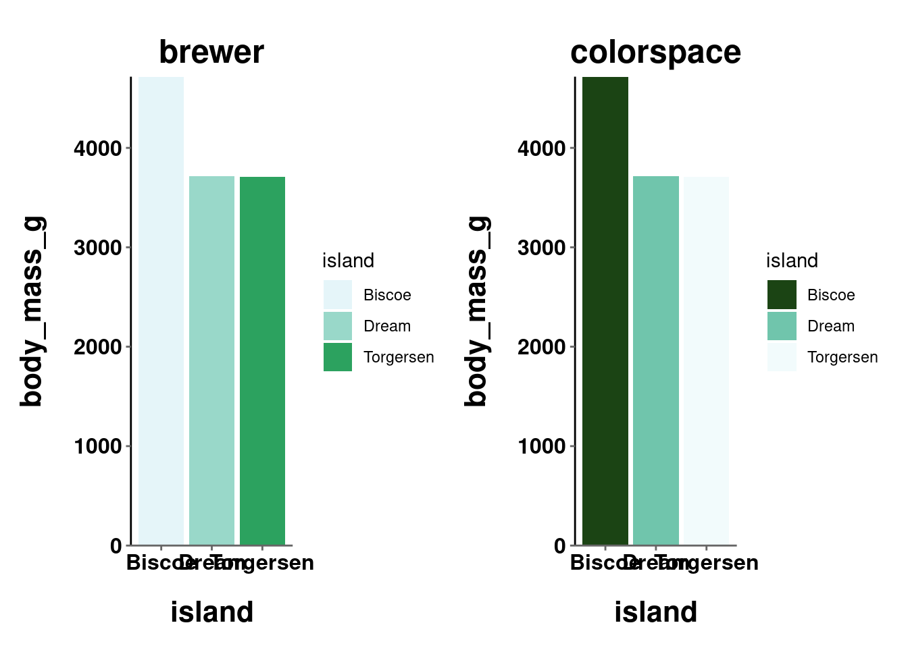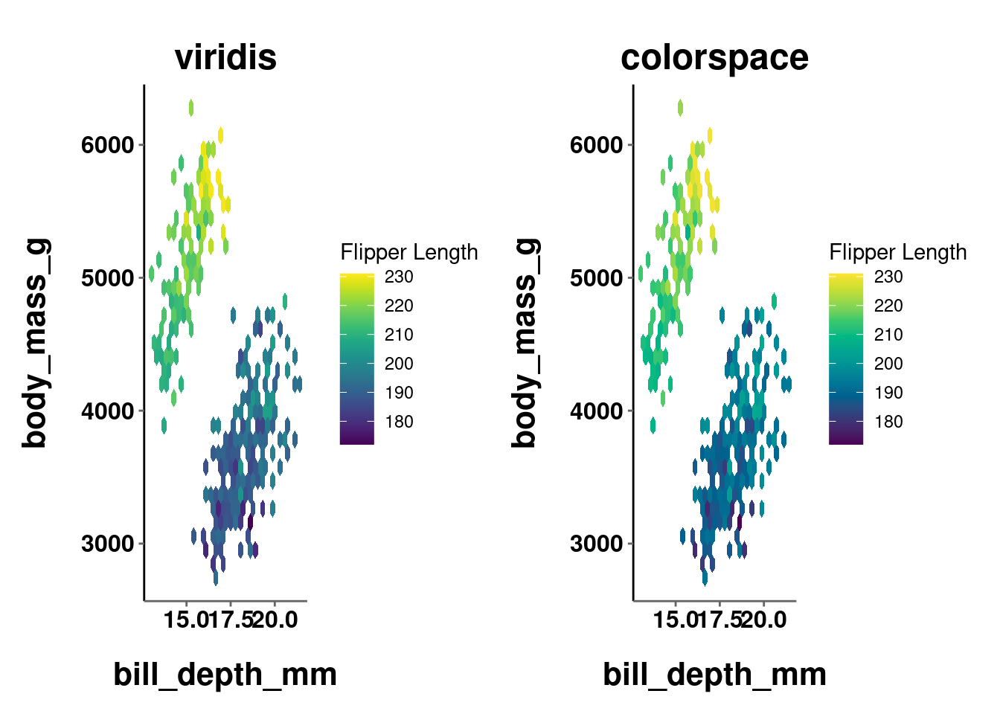

While more stark in the first comparison and more subtle in the second, it is clear in both that the palettes are similar but not quite exact. The take home point here is that <u>whenever there is a similar palette available from another package, probably go with that one</u>.

**"Why use colorspace at all then? You just showed me what it can do and then told me not to use it..."**

Great question! There are three noteworthy things you can do with colorspace that are important here. One will be universally useful, while the other two will probably only be useful if you are *REALLY* into color stuff. That is included here for those interested, but can be skipped by those who are not.

1. You can make quick and dirty demo plots to test out your color palettes with the `demoplot()` function.


```r
demoplot(sequential_hcl(n = 12, palette = "Peach"), "bar")
```


```r
demoplot(sequential_hcl(n = 7, palette = "Lajolla"), "scatter")
```


```r
demoplot(sequential_hcl(n = 8, palette = "SunsetDark"), "lines")
```


This can be helpful when you want to test out a color palette but not really think about what graph to apply it to.

Since `demoplot()` just needs a vector of colors, you can use colors generated from other packages (e.g., `viridis(n)`, `brewer.pal()`, etc.)!


```r
demoplot(terrain.colors(6), "lines")
```


```r
demoplot(viridis(5), "bar")
```


```r
demoplot(brewer.pal(6, "Dark2"), "scatter")
```


<button class="btn btn-primary" data-toggle="collapse" data-target="#BlockName"> Show/Hide </button>  
<div id="BlockName" class="collapse">
2. You can get some diagnostic and assessment information about a given color palette using `hclplot()` and `specplot()`, which both expect a vector of color values which define a particular palette. From the package repo on cran:
<br>
`hclplot()` - "converts the colors of a palette to the corresponding hue/chroma/luminance coordinates and displays them in HCL space with one dimension collapsed. The collapsed dimension is the luminance for qualitative palettes and the hue for sequential/diverging palettes."
`specplot()` - "also converts the colors to hue/chroma/luminance coordinates but draws the resulting spectrum in a line plot."


```r
hclplot(sequential_hcl(n = 7, palette = "Lajolla"))
```


```r
specplot(sequential_hcl(n = 7, palette = "Lajolla"))
```


3. You can manually adjust the chrominance and luminance from a pre-existing palette. These are arguments (*c* and *l* respectively) you can adjust in the `*_hcl()` functions.

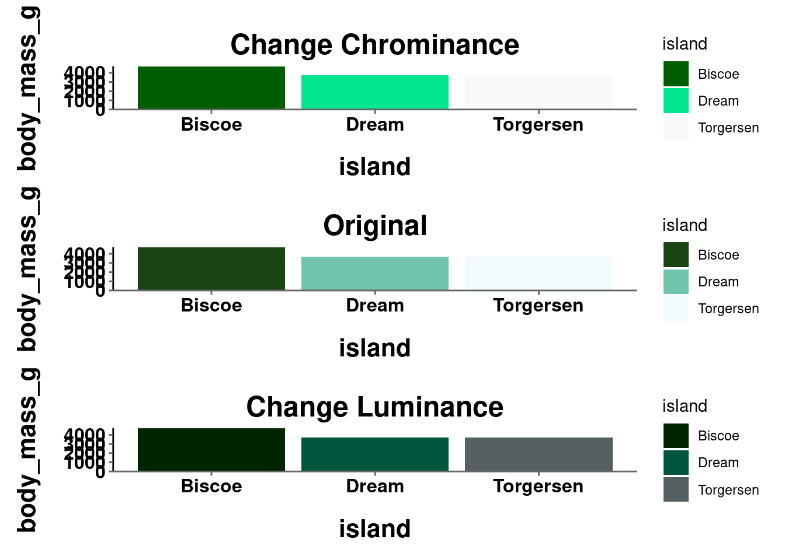
</div>

## Color and Design Resources

It is outside the scope of this course to get more into design principles in general and how they can be applied to visualizations, but there are several good resources for this. Here are a few:

* [Visualization Principles Cheatsheet (This is worth saving!!!)](figures/visualization_principles.pdf)
* [Kieran Healy's](https://socviz.co/lookatdata.html#lookatdata) book on data visualization, particularly chapter 1, covers a lot of different design principles and how they can be applied to graphs.
* [Claus Wilke's](https://clauswilke.com/dataviz/index.html) book is also great, particularly Part II. 
* [General Do's and Do Not's](https://guides.lib.uci.edu/datavis/do)

Here are some general color resources:

* [ggplot Colors](figures/ggplot_colors.png)
* [ggplot2 book](https://ggplot2-book.org/scale-colour.html)
* [colorspace info](https://cran.r-project.org/web/packages/colorspace/vignettes/colorspace.html)
	
## References

Stauffer, R., Mayr, G. J., Dabernig, M., & Zeileis, A. (2015). Somewhere over the rainbow: How to make effective use of colors in meteorological visualizations. *Bulletin of the American Meteorological Society, 96*(2), 203-216.

<!-- #### NAs -->

<!-- All functions outlined above for continuous color scales include an argument called **na.value** which sets the color used to represent NAs or missing values. The default value used is a grey. This can be changed to any other color, or set to "NA" to hide any such values. -->

<!-- ```{r} -->
<!-- plot_hex + -->
<!--   scale_fill_gradient(low = "red", high = "yellow", na.value = "black") -->

<!-- plot_hex + -->
<!--     scale_fill_gradient(low = "darkgreen", high = "palegreen", na.value = "red") -->

<!-- penguins %>% -->
<!--   ggplot(aes(y = body_mass_g, x = bill_depth_mm, color = bill_depth_mm)) + -->
<!--   geom_point(size = 2) + -->
<!--   scale_color_gradient(low = "darkgreen", high = "palegreen", na.value = "red") -->
<!-- ``` -->
