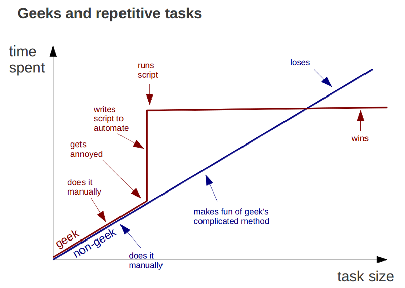
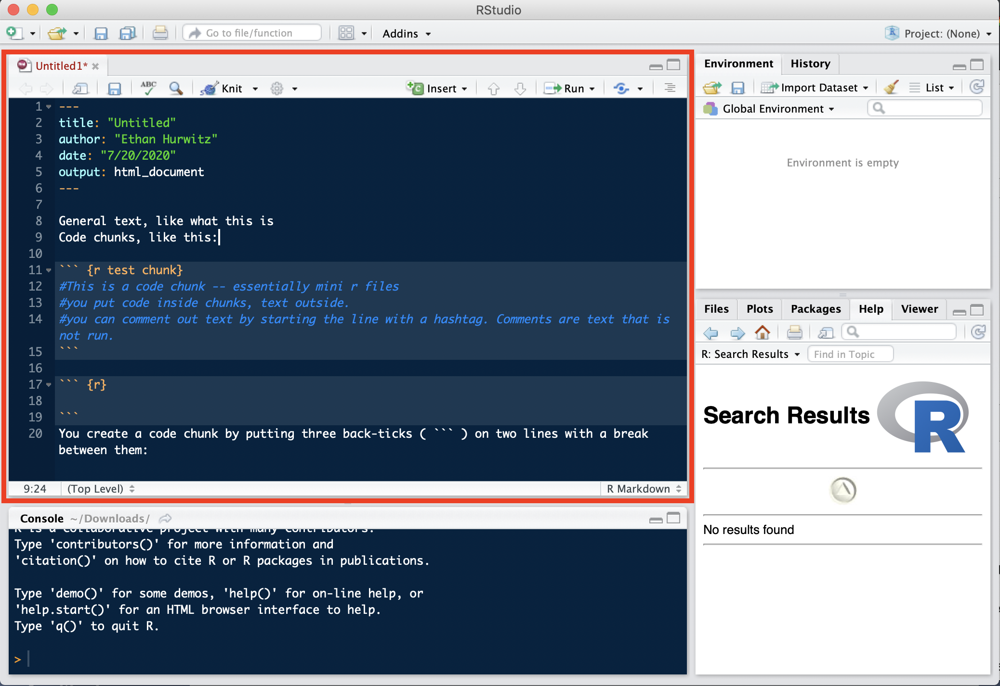
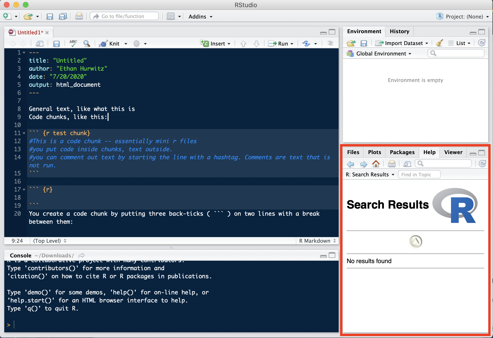
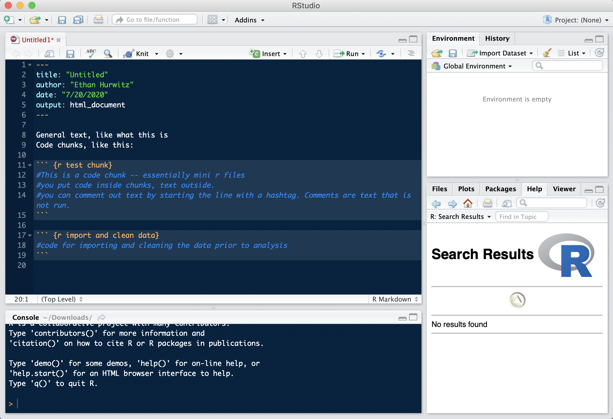

# (PART\*) R Basics {-}

# Why use R? 

Consider some of the main tasks done in Social Sciences. As in all sciences, you work with data. You **inspect** and **manipulate** that data in different ways, and modify it to make it amenable to **analysis** and **visualizations**. Visualizations and statistical analyses help to explore relationships you have observed in the real world and test for relationships in your experiments/studies. You then use these to **communicate** some findings to the general public.

So why would you want to use R or **any** programming language vs a Graphical User Interface (GUI) software like Excel, JMP, SPSS, or SAS, to do this?

To start, there are some simple and practical considerations:

1. R is free. Most other software is not.
2. R can handle very large datasets, GUI-based software struggle and often crash with these.
3. R is an open-source language, which means that anyone can contribute to it. This results in it constantly evolving and improving, increasing its capabilities.

{width=100%}
    
4. As a consequence of this, with R, you can perform **_MUCH_** more complex and sophisticated statistical analyses and data visualization. R was literally created for this very purpose!
    
{width=100%}

These are all important, however, one of the main reasons to use a programming language to accomplish your main tasks in Social Sciences is for *Reproducibility*.

Excel and the conventional statistics software like SPSS use a point-and-click GUI, and thus lack a simple way to document and share your analyses. This makes repeating or editing your work later very hard as you will need to rely on memory and repetition. **It is hard to work backwards from the end result and see how you arrived there because it is not documented anywhere.** You will have to "reinvent the wheel" to perform the same analysis across different data sets. R is an open-source interpreted *programming language*. Instead of pointing and clicking through some software to accomplish your tasks, you write code that will execute them. All the code you write is read and evaluated line by line in documents you save. This has some very practical consequences for you:

- Selfishly, it allows you to prepare your cleaning, analysis, and visualization code beforehand. As soon as you finish with data collection, you can just run all the code you've written and you will immediately be done!
- Also, it allows you to automate tasks for yourself. This way, you do not have to repeat the same process of clicking through the GUI and re-doing the same thing many times.
    
{width=100%}
<p style="font-size:6pt">Source: <a href="http://trendct.org/2015/06/12/r-for-beginners-how-to-transition-from-excel-to-r">trendct.org</a></p>
    
* Allows you to create literate programming documents (you will do this in markdown, more on that later) -- where you explain in English what your code is doing. This **drastically** helps you *communicate* your results by making your code be more interpretable, even when you re-visit it weeks/months/years down the line.
  + **"You are always working with at least one collaborator: Future you."<br>-Hadley Wickham**
* Often times you will be working with other non-you collaborators, and this makes doing so easier. People can build off the work (code writing) you have done and see step by step exactly what that work is. 
* Generally, this helps others be able to see exactly what you did and run the same analyses themselves. This is great practice for the open-science movement, and can actually help you fight back against any critiques or questions about your data/analyses.


{width=100%}
<p style="font-size:6pt">Artwork by @allison_horst</p>

So why R in particular instead of any other programming language?

"What about Python?" -- you might ask. You should learn that too! Python is great for advanced machine learning (neural networks and deep learning), fMRI and other image analyses, and lots of other advanced programming things. However, for data science tasks that social scientists and researchers are most often concerned with, R is preferable because it uses the same basic syntax and approach to everything. With Python, your toolbox may be bigger, but all the tools are very different.

{width=100%}
<p style="font-size:6pt">from Tobi Gerstenberg's *Statistical Methods for Behavioral and Social Sciences* class</p>
		
## R tools

### Base R vs RStudio

When talking about R, what is being referred to is the programming language R itself. You use RStudio to help write and use R code. RStudio is an Integrated Development Environment (IDE). Basically, it provides an interface to make writing and using R code easier.

* R itself can be downloaded [here](https://www.r-project.org/).
* RStudio can be downloaded [here](https://www.rstudio.com/products/rstudio/download/#download).
  + You <u>must</u> download R **before** RStudio.

### RStudio Tour

Generally speaking, you will see 4 sections in your RStudio window. To quickly overview each:

<span style="font-size:18.0pt"><u>**R file / document**</u></span>

This is the contents of your file where you write all of your code. This is usually the largest section and at the top left of this window.

{width=100%}

<span style="font-size:18.0pt"><u>**Console**</u></span>

This is where all code is executed/ran, and where the output of that code appears after running. You can run a line of code from your file by clicking on that line and pressing command+enter for OSX, or control+enter for windows.

{width=100%}

<span style="font-size:18.0pt"><u>**Environment**</u></span>

This is where all your defined objects are, more on this later.

{width=100%}

<span style="font-size:18.0pt"><u>**Extra/swiss army knife section**</u></span>

This is where any graphs/visualizations you make will appear (under **plots**), the list of your installed or loaded packages (under **Packages**), or any R Documentation or functions you look up (under **Help**).

{width=100%}

### Customize Your RStudio

Looking at a default white screen for a long time can put a lot of strain on your eyes. RStudio comes with a lot of different themes you can apply by going to:

preferences ->  appearance. I personally use a [custom theme](https://github.com/patrickshox/Mojave-Dark-RStudio-Theme) called "Mojave Dark" (the one you see in the screenshots is called "Cobalt"). What theme to use is personal preference.

Additionally, there are two other settings tweaks to make. Go to preferences and then...

1. R Markdown -> deselect "show output inline for all R markdown documents"
2. Code -> Display -> check Rainbow Parentheses

### Different types of files {#file-types}

There are three main types of R files. 

1. R scripts ("fileName.r") which contain only R code. 
2. R markdown notebooks ("fileName.rmd") which contain text, code, and outputs.
    
{width=100%}
<p style="font-size:6pt">Artwork by @allison_horst</p>

3. RData files ("fileName.RData"), which contain saved R objects/variables.
  
You will use markdown files in this class because they enable you to more easily annotate your code and create literate programming documents. They also allow you to easily abide by a general programming philosophy called **"separation of concerns,"** which says code should be organized into distinct sections, each handling a specific task. Doing this enables you to quickly navigate your code and know where to look if something is not working as intended. 

Markdown files can also be used to create documents that help communicate what you are doing in your data analysis pipeline. If you use Microsoft Word, then every time a figure or result changes, you have to go through and copy/paste a bunch of stuff, make a million changes throughout, save new files, it is a nuisance and often error prone. R Markdown files are living, breathing documents. Figures and results are automatically updated if the data is changed. Also, everything is in one place. In fact, what you are looking at here is the output of a markdown file!

{width=100%}

<p style="font-size:6pt">Artwork by @allison_horst</p>

### Components of a Markdown File

Markdown files themselves have 2 components:

1. General text, like what this is
2. Code chunks, like this:


```r
# This is a code chunk -- essentially mini r files
# You put R code inside chunks, text outside.
# You can comment out text by starting the line with a hashtag. 
  # Comments are text that is not run.
```

You put code inside chunks, text outside. You can comment out text by starting the line with a hashtag. Comments are text that is ignored by R when running your code.

You create a code chunk by putting three back-ticks ( ``` ) on two lines with a break between them,

And adding a set of curly brackets {} with an "r" in it next to the first set of back ticks: ```{r}

{width=100%}

You can also insert code chunks by pressing control+options+i on OSX or control+alt+i on windows (RStudio is full of nifty shortcuts!)

Generally speaking, you want to name your code chunks to help readily identify what task that section of code is handling. 

{width=100%}

## Resources

Here are some good resources that will help you throughout this class and your R learning journey. 

* [R Cheatsheets](https://github.com/rstudio/cheatsheets)

* [A particularly useful cheatsheet](https://sites.ualberta.ca/~ahamann/teaching/renr690/R_Cheat_Data.pdf)

* [Solutions to common problems](http://www.cookbook-r.com/)

* [Working with your console](https://support.rstudio.com/hc/en-us/articles/200404846-Working-in-the-Console)

* [Keyboard shortcuts](https://support.rstudio.com/hc/en-us/articles/200711853-Keyboard-Shortcuts)

* [More Keyboard shortcuts](https://appsilon.com/rstudio-shortcuts-and-tips/)

* [Tips for efficient code](https://www.datacamp.com/community/tutorials/five-tips-r-code-improve)

* [Functional Programming (Advanced)](https://github.com/rstudio/cheatsheets/blob/main/purrr.pdf)

